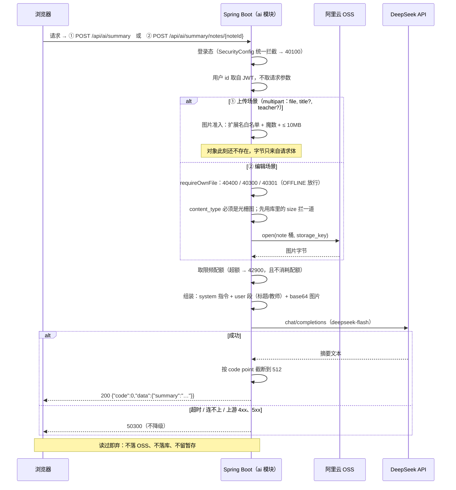

# 功能说明：AI 自动生成摘要

> **接口**：`POST /api/ai/summary` · `POST /api/ai/summary/notes/{noteId}` · **模块**：`ai`（主）+ `note`（编辑场景读附件）+ `storage`（读 OSS）
> **相关设计**：《概要设计》§5.8 接口、§6.8 调用机制、§7.1 配置基线、§8.4 已知限制、§0 决策 D9

---

## 1. 功能描述

上传或编辑笔记时，用户点「自动生成摘要」，服务端把笔记的图片交给模型，换回一段摘要文本填进简介输入框。**它只是一段建议**——用户可改、可弃，存不存由随后那次上传 / 编辑决定，本功能不写任何库表。

MVP **只支持图片类笔记**（jpg / png / gif / webp）。文档类摘要要先抽文本才能交给模型，列为 V2。

### 1.1 请求

**上传场景** 

```
POST /api/ai/summary
Authorization: Bearer <jwt>
Content-Type: multipart/form-data

file=@板书.png
title=高数期中复习        （可选）
teacher=张老师            （可选）
```

**编辑场景** 

```
POST /api/ai/summary/notes/123?title=高数期中复习&teacher=张老师
Authorization: Bearer <jwt>
```

### 1.2 处理流程



### 1.3 响应

成功（HTTP 200）：

```json
{ "code": 0, "message": "ok", "data": { "summary": "这是一份高数期中复习提纲，覆盖极限与导数。" } }
```

> `summary` 已按 `note.summary` 的列宽（512）截断，前端直接填进输入框即可。**空串是可能的返回**——模型明确表示图里没有可摘要的内容时，那不是错误。

失败错误码见《概要设计》§5.7：

| code | 场景 |
|---|---|
| 40001 | 没选文件（`data` 带字段明细 `field: file`） |
| 42200 | 图片类型不在白名单 / 超过 10MB / 扩展名与魔数不符；编辑场景附件不是图片 |
| 42900 | 调用过于频繁（按用户限频） |
| 50300 | 上游超时、连不上、返回错误 |
| 40300 / 40301 / 40400 | 编辑场景：非本人 / 笔记已删除 / 笔记不存在 |

### 1.4 涉及文件

| 层 | 文件 |
|---|---|
| 接口层 | `ai/AiSummaryController.java` · `ai/dto/AiSummaryRequest.java` · `ai/dto/AiSummaryResponse.java` |
| 业务层 | `ai/AiSummaryService.java` |
| 准入策略 | `ai/AiSummaryImagePolicy.java` · `common/FileMagic.java`（魔数共用） |
| 限频 | `ai/AiSummaryRateLimiter.java` |
| 配置 | `config/AiConfig.java` · `application.yaml` 的 `spring.ai.*`（§7.1） |
| 上游依赖 | `note/NoteService.java#requireOwnFile` · `note/NoteMapper.xml#selectFileOwnership` · `storage/StorageService.java#open`（后三者仅编辑场景） |
| 错误码 | `common/ErrorCode.java`（`42900` / `50300`） |

---

## 2. 核心逻辑及说明

### 2.1 两条链路的差异：文件从哪来

```java
// 上传场景：收 multipart
@PostMapping("/api/ai/summary")
public ApiResponse<AiSummaryResponse> summarizeUpload(
    @AuthenticationPrincipal AuthenticatedUser user,
    @Valid @ModelAttribute AiSummaryRequest request) { … }

// 编辑场景：按 id 自取
@PostMapping("/api/ai/summary/notes/{noteId}")                   
public ApiResponse<AiSummaryResponse> summarizeNote(
    @AuthenticationPrincipal AuthenticatedUser user,
    @PathVariable Long noteId,
    @RequestParam(required = false) String title,
    @RequestParam(required = false) String teacher) { … }
```

- **上传时对象还不存在**——§6.1 的顺序是校验 → 传 OSS → 落库，点按钮的这一刻这些都还没发生，文件**只在前端手上**。所以只能收 multipart。
- **编辑时对象早在 OSS**，`note_file.storage_key` 就是它的位置，服务端自己读回来，前端不必重传。

> `title` / `teacher` 在两条链路里都是**可选的上下文**，被拼进 prompt、帮模型判断这张图讲的是什么。编辑场景由前端按**表单当前值**传，而不是取库里存的——用户很可能刚改过标题、还没保存就点了“摘要生成”。


### 2.2 图片准入：白名单、魔数共用、先拦后读

这是本项目**第三条「扩展名 + 魔数」的准入链路**（另两条：`NoteFilePolicy` 管笔记附件、`AvatarFilePolicy` 管头像）。按 §6.7 的分工，白名单与上限是**调用方**的策略、三条各持一份；而「字节是什么类型」是同一个事实，共用 `common/FileMagic`，不复制。

```java
private static Map<String, Format> buildFormats() {
    Map<String, Format> formats = new LinkedHashMap<>();
    formats.put("jpg",  new Format("image/jpeg", FileMagic::jpeg));
    formats.put("jpeg", new Format("image/jpeg", FileMagic::jpeg));
    formats.put("png",  new Format("image/png",  FileMagic::png));
    formats.put("gif",  new Format("image/gif",  FileMagic::gif));
    formats.put("webp", new Format("image/webp", FileMagic::webp));
    return Map.copyOf(formats);
}
```

**这张表是 `NoteFilePolicy` 的真子集**：pdf / docx / zip 在笔记里合法，在这里不合法。放行它们不会带来安全风险，但会把一个**注定失败**的请求推给上游——模型的多模态输入压根不收这些格式（§6.8）——白花一次计费再拿回一个上游错误。所以这里必须挡住。

**与另两条链路不同，本策略不产出决策记录**：那两条的记录带 `extension`，是为了拼 OSS 对象键；AI 这一趟读完即弃、不生成任何对象键，唯一要带出去的是「该用哪个 MIME 交给模型」，所以 `inspect` 直接返回该 MIME 字符串。

#### 先拦后读

编辑场景**没有 multipart 的 size 可判**，所以 `selectFileOwnership` 特意带回了 `note_file.size`：

```java
private byte[] readObject(NoteFileOwnershipRow file) {
    if (file.getSize() != null && file.getSize() > AiSummaryImagePolicy.MAX_SIZE_BYTES) {
        throw new BusinessException(ErrorCode.FILE_INVALID, "图片超过 10MB，无法生成摘要");
    }
    try (InputStream content = storageService.open(Bucket.NOTE, file.getStorageKey())) {
        return content.readAllBytes();
    } catch (IOException e) { … }
}
```

不先拦的话，一个上百 MB 的对象会**先被整个读进堆里**再被拒掉。`StorageService` 只有「存 / 读 / 签 / 删」四件原语、没有 stat，所以唯一能拿到大小的地方就是库里那一列——这也是投影里为什么非要有 `size`。

> 上传场景的那一版是 multipart 自带的 `size`，在 `readAllBytes` 之前由策略拦下，同形。两处都靠「先知道大小、再决定要不要读」。

### 2.4 限频：防的是烧钱，不是撞库

```java
public void requireSlot(Long userId) {
    Instant now = Instant.now();
    windows.compute(userId, (key, existing) -> {
        Window base = (existing == null || existing.isExpired(now)) ? Window.fresh(now) : existing;
        if (base.count() >= MAX_REQUESTS) {
            throw new BusinessException(ErrorCode.AI_RATE_LIMITED, "生成过于频繁，请 %d 分钟后再试".formatted(…));
        }
        return new Window(base.count() + 1, base.windowStart());
    });
}
```

- **判断与计数在同一次 `compute` 里完成** 分成两步的话，两个并发请求可以同时读到”还没满“然后各记一次，把上限顶穿。
- 抛异常时映射不变（`compute` 的约定），因此**被拒的请求不消耗配额**——否则用户多点几下就把自己的额度耗光，而其中大部分根本没花到钱。
- 调用点在**本地校验之后、真正调用模型之前**，保证失败的请求不会吃掉一次配额。

### 2.5 一次模型调用：prompt 分段、失败归 50300、回程截断

```java
private String summarize(String contentType, byte[] image, String title, String teacher) {
    MimeType mimeType = MimeTypeUtils.parseMimeType(contentType);
    try {
        String raw = chatClient.prompt()
                .system(SYSTEM_PROMPT.formatted(MAX_SUMMARY_LENGTH))   // 指令
                .user(spec -> spec.text(contextText(title, teacher))   // 用户可控
                        .media(mimeType, new ByteArrayResource(image)))
                .call()
                .content();
        return truncate(raw);
    } catch (RuntimeException e) {
        log.error("调用摘要模型失败，contentType={}，bytes={}", contentType, image.length, e);
        throw new BusinessException(ErrorCode.AI_UNAVAILABLE);
    }
}
```

**指令放 `system` 段、用户可控的标题与教师放 `user` 段。** 这个划分不是风格问题——它让「用户输入没法伪装成指令」这件事由**协议结构**承担，而不是靠对字符串做转义。在此之上另有一道清洗：压掉换行与控制字符再截断，让一段本可以「伪造出下一行指令」的文本退化成一行普通文字。

> 这不是完备的提示注入防御，也不打算是。真正的隔离靠上面那层结构；而且产物只是一段建议文本，用户会看到它、编辑它，落库前必须经他本人确认（§5.8），所以「让模型跑偏」的最坏结果只是浪费一次调用。

**上游失败归 50300，不是 50000。** 两者含义不同：`50300` 是「上游不可用，稍后重试可能有救」，`50000` 是「我们的代码出了没预料到的错」。混成一个码，前端就只能给用户一句笼统的「服务器错误」，也无从判断该不该让他重试。**不做降级**——没有「读不出来就退回用元数据凑一段」这种兜底（那是 V2 文档类摘要的口径）。

日志只记 MIME 与字节数，**不记 prompt 正文**：那里面是用户上传的图片内容与标题。

**回程按 code point 截断到 512**：

```java
private static String truncate(String text) {
    String trimmed = text.strip();
    if (trimmed.codePointCount(0, trimmed.length()) <= MAX_SUMMARY_LENGTH) {
        return trimmed;
    }
    return trimmed.substring(0, trimmed.offsetByCodePoints(0, MAX_SUMMARY_LENGTH));
}
```

prompt 里已经要求模型不超过 512 字，但**不能指望模型守约**：一旦超了，用户点保存就撞上 §5.4 的 `@Size(max = 512)`，收到一个「简介不超过 512 个字符」的 40001——而那段字根本不是他自己打的。服务端截一次，把这个问题挡在回程。

按 **code point** 而不是 `String#length` 截：摘要里可能有 emoji，按 UTF-16 单元截会把一个代理对劈成两半，留下孤立的高位代理，前端渲染出来是乱码。

---

## 4. 测试过程与结果

### 4.1 运行前置

| 项 | 值 |
|---|---|
| JDK | 21（`java.specification.version=21`） |
| 数据库 | **本机 MySQL 8.x**，测试激活 `local` profile，连 `application-local.yaml` 的库 |
| 建表与初始数据 | 随应用启动自动执行 `schema.sql` + `data.sql`（均幂等） |
| 网络 | **不需要**——模型全程是 mock，一次真实调用都没有发生（见 §4.4） |
| AI API Key | **不需要**。`application.yaml` 给的是带空默认值的占位符 `${JOTANG_AI_API_KEY:}`，不配也照常启动（§7.1） |

### 4.2 结果

```
Tests run: 317, Failures: 0, Errors: 1, Skipped: 0
```

**那 1 个 error 与本功能无关**：`NoteDetailServiceTest#viewCountIsServedFromCacheWithinTtl` 报 `RedisConnectionFailure`——本机 Redis 未启动（3307 在监听、6379 不在）。它是既有用例，不碰 AI 这条链路。

**与本功能直接相关的 41 条，全部通过**：

| 测试类 | 用例数 | 覆盖层次 |
|---|---|---|
| `AiSummaryImagePolicyTest` | 12 | 图片准入与 `supports`（纯单元，无 Spring 上下文） |
| `AiSummaryRateLimiterTest` | 4 | 限频额度与原子性（纯单元） |
| `AiSummaryServiceTest` | 11 | 编排：什么情况下不调模型、以什么 MIME 调、失败与截断（外部依赖全 mock） |
| `AiSummaryControllerTest` | 8 | HTTP 层：鉴权、参数绑定、错误码映射（service 打桩） |
| `NoteFileAccessServiceTest` | 6 | `requireOwnFile` 的列映射与四条判门（起真库） |

### 4.3 用例明细

**A. 图片准入（`AiSummaryImagePolicyTest`，12 条）**

| 分组 | 用例 |
|---|---|
| 白名单放行 | `rasterImagesAreAcceptedAndMimeIsNormalized` · `extensionIsCaseInsensitive` · `pathInFileNameIsStrippedBeforeExtensionIsRead` |
| 应当拒绝 | `nonImageTypesValidForNotesAreRejectedHere`（pdf/docx/md/zip）· `svgAndHtmlAreRejected` · `extensionMustMatchMagicBytes` · `truncatedHeadIsRejected` · `missingOrHiddenExtensionIsRejected` |
| 大小 | `emptyFileIsRejected` · `sizeLimitIsTenMegabytesInclusive` |
| `supports`（编辑场景的判据） | `supportsAcceptsExactlyTheFourRasterTypes` · `supportsRejectsEverythingElseIncludingNull` |

**B. 限频（`AiSummaryRateLimiterTest`，4 条）**

`requestsUpToTheLimitAreAllowed` · `requestBeyondTheLimitIsRejectedWithRateLimitCode` · `rejectedRequestDoesNotConsumeAQuota` · `quotaIsPerUser`

后两条钉的是「原子性」这个看不见的性质：第 11 次被拒之后，另一个人仍该拿到额度。

**C. 编排（`AiSummaryServiceTest`，11 条）**

| 分组 | 用例 | 验证的规则 |
|---|---|---|
| 上传 | `uploadReturnsModelText` | 正常回显 |
| | `uploadSendsImageWithServerJudgedMime` | 图片以**服务端判定的 MIME** 进请求体 |
| | `uploadRejectsNonImageWithoutCallingModel` | 类型不合法时 `chatClient.prompt()` 一次都没被调用 |
| | `uploadRejectsOversizedImageWithoutCallingModel` | 同上，大小超限 |
| 截断 | `overlongSummaryIsTruncatedToTheColumnWidth` | 600 字 → 512 |
| | `truncationCountsCodePointsNotUtf16Units` | 600 个 emoji → 512 个 code point |
| 失败 | `upstreamFailureBecomesAiUnavailableNotServerError` | 上游异常 → **50300** 而非 50000 |
| 编辑 | `editScenarioReadsObjectFromNoteBucketAndSendsStoredMime` | 从 note 桶读、用库里的 MIME |
| | `editScenarioPropagatesOwnershipFailure` | 40300 原样上传，且**不碰 OSS** |
| | `editScenarioRejectsNonImageAttachmentWithoutTouchingOss` | 不是图片 → 不读 OSS、不调模型 |
| | `editScenarioRejectsOversizedObjectWithoutOpeningIt` | 超限 → **不打开对象**（先拦后读） |

**D. HTTP 层（`AiSummaryControllerTest`，8 条）**

`bothEndpointsRequireLogin` · `uploaderComesFromJwtNotFromRequest` · `uploadReturnsSummaryInTheCommonEnvelope` · `uploadWithoutFileReturnsFieldLevelParamError` · `editEndpointBindsNoteIdAndPassesOptionalContext` · `editEndpointWorksWithoutContext` · `upstreamFailureIsMappedTo503WithAiUnavailableCode` · `rateLimitIsMappedTo429WithItsOwnCode`

`uploaderComesFromJwtNotFromRequest` 把 userId 钉死在 token 里那个值上——否则调用方就能决定「按谁的配额限频、按谁计费」。

**E. 列映射与判门（`NoteFileAccessServiceTest`，6 条，起真库）**

`returnsStorageKeySizeAndContentTypeOfTheOwnNote` · `offlineNoteIsStillReadable` · `deletedNoteIsRejected` · `strangerIsForbidden` · `missingNoteIsNotFound` · `missingNoteIsReportedAsNotFoundEvenForAStranger`

**这一类单独起真库，是因为 C 组把 note 层整个 mock 掉了**，`selectFileOwnership` 这条 SQL 一次都不会被执行——列名映射错了没有任何测试会红。这类错误不报异常，只会安静地给出 `null`：`storage_key` 映射不上会让读 OSS 报一个不知所云的错；而 **`size` 映射不上意味着「读之前先拦一道」的守卫静默失效**，于是一个上百 MB 的对象会先被整个读进堆里再被拒。第一条用例就是冲着它写的。

### 4.4 未覆盖的部分（如实记录）

1. **一次真实模型调用都没有发生过。** 这是本功能最大的缺口：所有用例里的"模型"都是 mock 出来的。因此以下三件事全是纸面数字，未经任何验证——
   - **prompt 的实际产出质量**（措辞、字数遵从度、对非学习资料的判断），
   - **真实时延**（§7.1 的超时值定得合不合适），
   - **真实费用**，以及 §7.1 里图片上限 `10MB` 与限频 `10 次/小时` 这两个值的合理性。
2. **限流窗口的翻篇没有测试。** `AiSummaryRateLimiter` 没有可注入的时钟，用例只覆盖「窗口内」的行为；`Window#isExpired` 那条路径（一小时后额度恢复）只有构造上的正确性，没有被执行过。
3. **并发没有测试。** §2.4 说的「判断与计数在同一次 `compute` 里」目前只有单线程验证；`rejectedRequestDoesNotConsumeAQuota` 那条也换了用户来验，而不是真的并发。
4. **编辑场景读 OSS 的真实路径没有端到端覆盖。** `AiSummaryServiceTest` 里 `StorageService` 是 mock，而真打 OSS 的 `OssStorageServiceTest` 带 `@Tag("oss")`、在 pom 里被 `excludedGroups=oss` **默认排除**（理由同《功能说明：笔记上传》§4.4）。所以「从 OSS 真的读回一张图」这一段默认套件没有覆盖，覆盖的是「读之前校验对不对」和「从哪个桶、用哪个 key 读」。
5. **前端不在本仓库。** 按钮在哪些笔记上显示（应当只对图片笔记显示）、生成后如何填充与提示失败，属于前端实现，本文档只约定后端契约（§5.8：「前端控可见性、后端控可行性」）。
