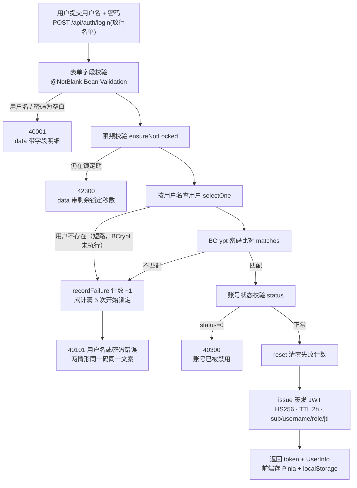

# 功能说明：登录校验

> **接口**：`POST /api/auth/login` · **模块**：`auth`（主）+ `common`(JWT 签发)
> **相关设计**：《概要设计》§5.1 认证、§6.3 登录限频（D3）、§6.4 认证与 JWT（D1）、§5.7 统一错误码

***

## 1. 功能描述

已注册用户提交用户名与密码，服务端依次做**限频校验 → 密码校验（BCrypt）→ 账号状态校验**三道检查，全部通过后清零失败计数并签发 HS256 JWT（TTL 2 小时），随 `UserInfo` 一并返回。前端拿到 token 后自行保存，用于后续请求的身份凭证。

### 1.1 请求

```
POST /api/auth/login
Content-Type: application/json

{
  "username": "zhangsan",
  "password": "Passw0rd!23"
}
```

### 1.2 处理流程



### 1.3 响应

成功（HTTP 200）：

```json
{
  "code": 0,
  "message": "ok",
  "data": {
    "token": "eyJhbGciOiJIUzI1NiJ9...",
    "user": {
      "id": 1,
      "username": "zhangsan",
      "nickname": "zhangsan",
      "collegeId": 3,
      "avatarUrl": null,
      "role": "USER"
    }
  }
}
```

> token 即服务端签发的 JWT，由前端保存供后续请求携带

### 1.4 涉及文件

| 层       | 文件                                                                                          |
| ------- | ------------------------------------------------------------------------------------------- |
| 接口层     | `auth/AuthController.java` · `auth/dto/LoginRequest.java` · `auth/dto/LoginResponse.java`   |
| 业务层     | `auth/AuthService.java`                                                                     |
| 限频      | `auth/LoginAttemptLimiter.java`                                                             |
| 令牌签发    | `common/JwtTokenProvider.java` · `auth/dto/UserInfo.java`                                   |
| 异常与错误码  | `common/ErrorCode.java` · `common/GlobalExceptionHandler.java`（登录期业务异常在此翻译）                 |
| 持久层     | `user/UserMapper.java` · `entity/User.java`                                                 |

***

## 2. 核心逻辑及说明

### 2.1 三道校验的顺序

`AuthService#login`的顺序是：**限频 → 密码 → 状态** ---> 清零 ---> 签发。

1. **限频在最前** —— 锁定判定只读一个内存 Map，不查库、不做 BCrypt。锁定期内的账号在一切昂贵操作之前就被挡下，这与上传功能「先校验后碰 OSS」是同一个「先便宜的、后昂贵的」原则。
2. **状态检查在密码之后** —— 「账号已被禁用」是管理语义, 密码通过后才需要它。

### 2.2 「用户不存在」与「密码错误」是同一个错误——防账号枚举

`AuthService.java:107-110`：

```java
if (user == null || !passwordEncoder.matches(request.getPassword(), user.getPasswordHash())) {
    loginAttemptLimiter.recordFailure(username);
    throw new BusinessException(ErrorCode.BAD_CREDENTIALS);
}
```

`||` 短路把两种情形合并：同一错误码 40101、同一文案「用户名或密码错误」。若分开提示「该用户名未注册」，攻击者就能批量探测哪些用户名存在，再对存在的账号定向爆破。  
40101 与 40100 的前端动作不同：40101 在登录表单内提示、不跳转；40100 才跳登录页。

### 2.3 限频只按账号、不按 IP——且计数口径与数据库对齐

两个阈值：连续失败 `MAX_FAILURES = 5`、锁定 `LOCK_DURATION = 10 分钟`。实现上三个细节：

- **只按账号、不按 IP**：同一校园网出口的整批用户共享 IP，按 IP 计数会误伤无辜。
- **key 归一为小写**：MySQL 排序规则 `utf8mb4_0900_ai_ci` 大小写不敏感，`ZhangSan` 与 `zhangsan` 在数据库看来是同一账号；限频若按原样计数，攻击者大小写换着试就能绕过锁定。  

计数本体 `Attempt` 是 immutable record，靠 `ConcurrentHashMap.compute` 原子替换，并发失败不丢计数。已知限制：应用重启后锁定状态丢失，MVP 接受。


### 2.4 密码比对用 matches，不能 encode 再 equals

注册时 `passwordEncoder.encode()`，登录时 `passwordEncoder.matches()`。BCrypt 每次加密自带随机盐，同一密码两次 `encode` 的结果不同——所以**不能把提交的密码 encode 一遍再字符串比较**，只能交给 `matches` 从存储的哈希里取出盐重算。BCrypt 故意慢，这正是它抗离线爆破的资本，也是 §2.1 把限频放在它前面的原因。

### 2.5 JWT 签发：密钥启动即校验、短 TTL、jti 留挂点

`JwtTokenProvider.java:33-37`：

```java
this.key = Keys.hmacShaKeyFor(Decoders.BASE64.decode(base64Secret));
```

- **密钥在启动时就验明正身**：配置是 32 字节密钥的 Base64 串，解码后恰为 HS256 下限 256 位；解码后不足位或缺配置，`hmacShaKeyFor` 在**启动时**直接抛异常，不留到运行时才暴露。签发（`issue`）用的就是这个 `SecretKey` 实例。
- **密钥不落仓库**（`application.yaml:31-36`）：主配置读 `${JWT_SECRET}` 环境变量，本机由 `application-local.yaml` 覆盖，生产（ECS）用环境变量注入独立随机密钥。
- **TTL 默认 2h**（`${JWT_TTL:2h}`），由 `issue` 在签发时写入 `exp` claim。
- **Claims 按 §6.4**（`JwtTokenProvider.java:44-55`）：`sub(userId)` / `username` / `role` / `iat` / `exp` / `jti`。`jti` 现在没人消费，是 V2 引入 Redis 黑名单时的预留挂点。

### 2.6 status=0 的防御性检查

`AuthService.java:112-115`：

```java
// status 目前无人写入（schema 注释为「预留」），但一旦有人手工置 0，这里必须挡住
if (user.getStatus() != null && user.getStatus() == 0) {
    throw new BusinessException(ErrorCode.FORBIDDEN, "账号已被禁用");
}
```

按 schema 现状 `status` 恒为 1，这段检查平时不生效——它是为管理员封禁预留的闸门：列已经在表里，闸先装上，将来 admin 模块写 `status=0` 时登录侧无需再改。位置在密码通过之后（§2.1），错误码借用 40300、message 具体化为「账号已被禁用」。


***

## 4. 测试过程与结果

### 4.1 运行前置

| 项       | 值                                                                   |
| ------- | ------------------------------------------------------------------- |
| JDK     | 21（`java.specification.version=21`）                                 |
| 数据库     | **本机 MySQL 8.x**，测试激活 `local` profile，连 `application-local.yaml` 的库 |
| 建表与初始数据 | 随应用启动自动执行 `schema.sql` + `data.sql`（均幂等）                            |
| 网络      | 不需要（OSS 集成测试默认排除，见 §4.3 注）                                          |

### 4.2 命令

```bash
./mvnw test
```

### 4.3 结果

```
Tests run: 142, Failures: 0, Errors: 0, Skipped: 0
BUILD SUCCESS（exit code 0）
```

（2026-10-08 运行；带 `@Tag("oss")` 的 5 条 OSS 集成测试按 pom 的 `excludedGroups=oss` 默认排除。）

### 4.4 用例明细

**登录功能当前没有专属用例。** auth 包下现有的两个测试类都只覆盖注册（决策 D8 的学院绑定）：

| 测试类                  | 用例数 | 实际覆盖                                                                         |
| -------------------- | --- | ---------------------------------------------------------------------------- |
| `AuthServiceTest`    | 3   | 注册链路：学院绑定落库回查、学院不存在 → 40001（字段明细形状）、未传学院不落库                                  |
| `AuthControllerTest` | 5   | 注册接口 HTTP 层：`@NotNull` 字段明细、snake\_case 字段被 Jackson 静默丢弃、`passwordHash` 不外泄等 |

### 4.5 未覆盖的部分（如实记录）

1. **登录接口本身零专属测试。** 以下行为都没有用例钉住：
   - BCrypt 匹配成功 / 失败；「用户不存在」与「密码错误」返回同一 40101 同一文案；
   - 42300 锁定的完整轨迹：连续失败 5 次触发、`data` 剩余秒数、锁期内第 6 次请求直接被拒、成功登录清零计数；
   - 大小写变体绕过锁定的防护（`normalize`）；
   - `status=0` 禁用 → 40300；
   - `LoginResponse` 的响应体形状。
2. **`JwtTokenProvider`** **无测试。** 签发 token 的 Claims（sub/username/role/jti）、密钥过短导致启动失败——均未验证。
3. **并发下的计数原子性**依赖 `ConcurrentHashMap.compute` 的 JDK 保证，无并发测试。

