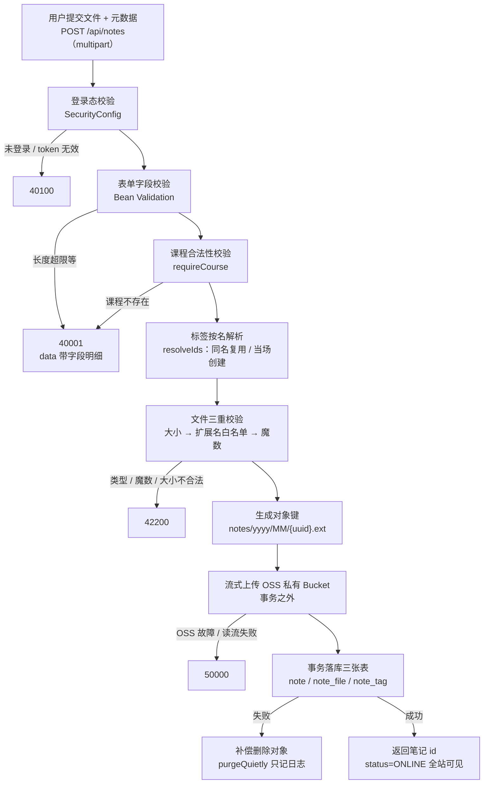

# 功能说明：笔记上传

> **接口**：`POST /api/notes` · **模块**：`note`（主）+ `storage` + `catalog`(标签)  
> **相关设计**：《概要设计》§6.1 上传流程、§5.4 接口、§3.2 表结构、§8.3 安全

---

## 1. 功能描述

已登录的用户提交一份文件与元数据（标题、简介、教师、课程、标签），服务端先做三重校验，再把文件**流式**写入 OSS 私有 Bucket，最后在一个事务里落 `note` / `note_file` / `note_tag` 三张表。提交即上架（`status=ONLINE`），全站立即可见。

### 1.1 请求

```
POST /api/notes
Authorization: Bearer <jwt>
Content-Type: multipart/form-data

title=期中复习提纲
summary=覆盖前三章
teacher=张老师
courseId=3
tags=高数
tags=期末
file=@笔记.pdf
```

### 1.2 处理流程



### 1.3 响应

成功（HTTP 200）：

```json
{ "code": 0, "message": "ok", "data": { "id": 123 } }
```

>只返回新笔记的 id，前端据此跳详情页。  
>失败错误码见《概要设计》§5.7：

### 1.4 涉及文件

| 层 | 文件 |
|---|---|
| 接口层 | `note/NoteController.java` · `note/dto/NoteUploadRequest.java` · `note/dto/NoteCreatedResponse.java` |
| 业务层 | `note/NoteService.java` |
| 准入策略 | `note/NoteFilePolicy.java` · `note/FileDecision.java` |
| 存储抽象 | `storage/StorageService.java` · `storage/OssStorageService.java` · `storage/Bucket.java` · `storage/StoredObject.java` |
| 上游依赖 | `catalog/TagService.java`（标签按名解析）· `catalog/CourseService.java`（课程校验） |
| 持久层 | `note/NoteMapper.java` · `note/NoteFileMapper.java` · `note/NoteTagMapper.java` |

---

## 2. 核心逻辑及说明

### 2.1 九步的先后顺序是刻意的，不是随手排的

`NoteService#upload`里三件事的顺序都有理由：

1. **课程校验、文件校验放在最前** —— 不合格就不碰 OSS。如果反过来先传对象再发现参数错，就只能靠补偿删除收场；把校验前置，这类补偿根本不发生。
2. **标签解析放在 OSS 之前** —— 它会往 `tag` 表写新标签。若标签集合本身超标（超过 10 个），异常在这里就抛出了，此时还没有对象产生。
3. **OSS 上传放在事务之外** —— 这是最关键的一条。

**为什么 OSS 上传不能圈进事务**：单文件可达 100MB。把一次上百 MB 的网络传输圈进数据库事务，会让一个数据库连接被占住整个上传时长——慢速网络下这可能是一分钟以上，连接池很快就被拖垮。所以事务边界只包住「写三张表」这一步，用 `TransactionTemplate` 显式控制（`NoteService.java:94-96`）：

```java
this.transactionTemplate = new TransactionTemplate(transactionManager);
```

代价是「对象已存、入库失败」这个窗口真实存在，由第 9 步的补偿删除兜住。

### 2.2 补偿删除：失败时不掩盖原始异常

`purgeQuietly`（`NoteService.java:375-381`）在入库失败时删掉刚上传的对象。注意它**只记日志、不再外抛**：

```java
private void purgeQuietly(String key) {
    try {
        storageService.delete(Bucket.NOTE, key);
    } catch (RuntimeException e) {
        log.error("补偿删除对象失败，可能残留孤儿对象 key={}", key, e);
    }
}
```

如果让「OSS 删不掉」的异常顶掉原始异常，排查者看到的会是存储错误，而真正的原因（比如唯一键冲突）被吞掉了。残留的孤儿对象由每日维护脚本按 `is_purged` 对账清理，不影响本次请求的成败判定。

### 2.3 用白名单而不是黑名单——这是预览型 XSS 的唯一防线

`NoteFilePolicy` 的类注释（`NoteFilePolicy.java:26-33`）把这件事说得很直白：图片 / PDF 预览响应的 `Content-Type` **不是**在读取时指定的，而是取自上传时写入对象元数据的服务端判定值。原因是阿里云 OSS 自 2025-01-20 起禁止在签名 URL 里覆盖 `response-content-type`。

这带来一个后果：**一旦放进来一个 svg 或 html，它就会被当作图片或 PDF 内联渲染在 OSS 域名下**——因为读取侧已经没有办法纠正类型了。所以这里必须是白名单，只有明确认识的扩展名才可能通过：

```java
Format format = FORMATS.get(extension);
if (format == null) {
    // 白名单之外：svg / html / js / exe 以及一切没列进来的类型都从这里出去
    throw new BusinessException(ErrorCode.FILE_INVALID, "不支持的文件类型：." + extension);
}
```

反过来说，这个判断的顺序也是「先便宜的、后昂贵的」：文件名与大小 → 扩展名白名单 → 魔数 → 只有 md/txt 才做全量 UTF-8 解码。

### 2.4 docx 与 zip 的魔数完全相同——所以类型只能由扩展名决定

这是这一层最容易写错的地方。`PK\x03\x04` 是 zip 的魔数，而 docx / xlsx / pptx 本质就是 zip 容器，**四者的文件头一模一样**，光看魔数区分不了（`NoteFilePolicy.java:38-41`）。

因此设计上做了一个明确的抉择：**`content_type` 一律由扩展名映射，魔数只负责确认「确实属于这一族」**。

```java
formats.put("docx", new Format("application/vnd...wordprocessingml.document", head -> startsWith(head, MAGIC_ZIP)));
formats.put("xlsx", new Format("application/vnd...spreadsheetml.sheet",     head -> startsWith(head, MAGIC_ZIP)));
formats.put("pptx", new Format("application/vnd...presentationml.presentation", head -> startsWith(head, MAGIC_ZIP)));
formats.put("zip",  new Format("application/zip", head -> startsWith(head, MAGIC_ZIP)));
```

如果反过来写成「按魔数推断类型」，docx 会被判成 zip，而且**测试还很难发现**——因为两者都能通过校验，只有下载时的文件名和类型是错的。

### 2.5 md / txt 没有魔数，降级为 UTF-8 全量校验

md 和 txt 没有可验的文件头，所以走另一条路（`NoteFilePolicy.java:242-294`）：整份内容必须是可解码的 UTF-8，且不含 NUL 字节。

这一步的目的**不是防 XSS**——`/raw` 代理接口固定返回 `text/plain` 并带 `nosniff`，本就不给浏览器解析的机会。它的目的是把「二进制文件改个 .txt 后缀」挡在门外，免得代理接口去流式转发一堆乱码。

实现上有两个细节值得记：

- **按块流式解码**而不是 `readAllBytes()`。100MB 的 .txt 也在允许范围内，一次性读进堆里不值当。
- **块边界会把多字节字符切开**（一个 UTF-8 字符最多 4 字节）。如果对每块单独解码，一个跨块的汉字就会被误判成非法编码。所以这里让 decoder 保持状态、以 `endOfInput=false` 解码，并把它**没有消费**的尾部字节留到下一块开头拼接：

```java
CoderResult result = decoder.decode(input, chars, eof);
if (result.isError()) { throw ... }
carry = Arrays.copyOfRange(batch, input.position(), batch.length);
```

decoder 遇到不完整的多字节序列时，正好会把位置停在序列首字节——这就是「留到下一块」能成立的原因。测试 `multibyteCharSplitAcrossChunkBoundaryIsAccepted` 专门盯这条。

### 2.6 对象键重命名 + 文件名清洗

**对象键不进数据库保存原始文件名**，而是重命名成 `notes/yyyy/MM/{uuid}.{ext}`（`NoteFilePolicy.java:194-196`）。理由：原始名可能重名、可能含 OSS 不接受的字符、也可能带路径。原始名另存为 `note_file.original_name`，下载时再还原。

文件名本身还要清洗（`NoteFilePolicy.java:215-231`）。**客户端是可控的**，`../../etc/passwd` 或 `C:\Users\x\笔记.pdf` 都可能被送上来：

```java
int separator = Math.max(name.lastIndexOf('/'), name.lastIndexOf('\\'));
if (separator >= 0) { name = name.substring(separator + 1); }
```

只留最后一段，落库的 `original_name` 与下载时还原的文件名都以清洗结果为准。

### 2.7 标签按名称提交，不是 tagId

`NoteUploadRequest` 里的 `tags` 是 `List<String>` 而非 id 列表（`NoteUploadRequest.java:18-21`）。原因是用户可以自由打标，输入框允许直接敲新词。名称到 id 的解析（含按名创建、同名复用）、以及**个数与长度上限**全部收在 `TagService#resolveIds` 一个方法里（`TagService.java:71-81`）——上限放两处必然不一致。

两个上限（`TagService.java:31-41`）：单标签 ≤ 32 字符（对齐 `tag.name VARCHAR(32)`），单篇 ≤ 10 个。10 这个数需求与设计文档都没定，是代码里补的护栏，注释里也写明了这一点。

### 2.8 计数列不显式赋值，交给 DDL 的 DEFAULT

`insertNote`（`NoteService.java:304-331`）里没有给 `view_count` / `download_count` / `favorite_count` / `is_purged` 赋值。MyBatis-Plus 默认跳过 null 字段，于是这些列由建表语句的 `DEFAULT 0` 填上。在 Java 侧再写一遍 `0`，只会多出一处可能与 DDL 不一致的地方。

另外两处细节：

- `trimToNull`（`NoteService.java:384-390`）把空白串归一为 null。简介与教师是可选字段，存空串与存 null 在查询和展示上要分两路处理，不如入库前就统一。
- `noteFile.setStorageKey(stored.key())` 用的是 storage **回传**的 key，而不是本地算出来那个变量。将来 storage 若对 key 做归一化，落库的必须是真正存进去的那个。

### 2.9 存储抽象让这一层可测

`StorageService` 只提供「存 / 读 / 签 / 删」四件原语，**不含任何业务策略**（`StorageService.java:11-13`）。对象键怎么拼、大小上限多少、扩展名白名单是什么，全部由调用方（note 模块）决定。

这样切分之后，`NoteServiceTest` 可以直接把 `StorageService` 换成 mock（`NoteServiceTest.java:88` 的 `@MockitoBean`），单测里能直接断言「存储层被调了几次、用什么 key 调的」，而不必碰 OSS SDK、也不需要网络。测试 `objectIsStoredUnderGeneratedKeyAndThatKeyIsPersisted` 就是这么验证对象键格式的。

---

## 4. 测试过程与结果

### 4.1 运行前置

| 项 | 值 |
|---|---|
| JDK | 21（`java.specification.version=21`） |
| 数据库 | **本机 MySQL 8.x**，测试激活 `local` profile，连 `application-local.yaml` 的库 |
| 建表与初始数据 | 随应用启动自动执行 `schema.sql` + `data.sql`（均幂等） |
| 网络 | 不需要（见 §4.4 关于 OSS 用例的说明） |

### 4.2 结果

```
Tests run: 118, Failures: 0, Errors: 0, Skipped: 0
BUILD SUCCESS（exit code 0）
```

**与上传功能直接相关的 39 条**，全部通过：

| 测试类 | 用例数 | 覆盖层次 |
|---|---|---|
| `NoteFilePolicyTest` | 26 | 准入判定与对象键（纯单元测试，无 Spring 上下文） |
| `NoteServiceTest` | 7 | 上传编排与事务边界（mock 掉存储层） |
| `NoteControllerTest` | 5 | 接口层（其中 5 条为上传相关） |
| `NoteMultipartConfigTest` | 1 | multipart 配置 |

### 4.3 用例明细

**A. 准入判定（`NoteFilePolicyTest`，26 条）**

| 分组 | 用例 |
|---|---|
| 合法类型 | `pdfIsAcceptedForInlinePreview` · `rasterImagesAreAcceptedForInlinePreview` · `jpegAliasIsAccepted` · `utf8TextIsAccepted` · `officeAndArchiveFilesAreDownloadOnlyAndKeepDistinctTypes` · `markdownAndTextGoThroughBackendProxy` |
| 伪装与不可注入 | `executableRenamedToPdfIsRejected` · `zipRenamedToPdfIsRejected` · `pngRenamedToJpgIsRejected` · `binaryMasqueradingAsTextIsRejected` · `unlistedExtensionsAreRejected` · `truncatedMagicIsRejected` |
| 大小 | `oversizedFileIsRejected` · `sizeExactlyAtLimitIsAccepted` · `emptyFileIsRejected` |
| 文件名 | `pathInFileNameIsStripped` · `overlongFileNameIsRejected` · `dotFileIsRejected` · `trailingDotIsRejected` · `missingExtensionIsRejected` · `extensionIsLowerCasedButOriginalNameKeepsItsCase` |
| 文本校验 | `textContainingNulByteIsRejected` · `truncatedMultibyteCharAtEofIsRejected` · `multibyteCharSplitAcrossChunkBoundaryIsAccepted` |
| 对象键 | `objectKeyFollowsDocumentedLayout` · `objectKeyIsUniquePerCall` |

**B. 上传编排（`NoteServiceTest`，7 条）**

| 用例 | 验证的规则 |
|---|---|
| `uploadPersistsNoteFileAndTags` | 三张表都落库；`status=ONLINE`、计数列为 0、`is_purged=0` |
| `objectIsStoredUnderGeneratedKeyAndThatKeyIsPersisted` | 对象键符合 `notes/yyyy/MM/{uuid}.pdf`，且落库的 key 与传给存储层的一致 |
| `unknownTagIsCreatedOnTheFly` | 不存在的标签当场创建 |
| `blankOptionalFieldsAreStoredAsNull` | 空的简介 / 教师存成 null 而不是空串 |
| `unknownCourseIsRejectedBeforeTouchingStorage` | 课程不存在 → 40001，且**存储层一次都没被调用** |
| `unacceptableFileIsRejectedBeforeTouchingStorage` | 文件不合法 → 42200，且**存储层一次都没被调用** |
| `objectIsPurgedWhenInsertFails` | 入库失败 → 补偿删除被调用，key 正确 |

后四条里 `verify(storageService, never()).upload(...)` 这种断言，正是 §3.1 和 §3.2 两条设计意图的可执行版本。

**C. 接口层（`NoteControllerTest`，上传相关 5 条）**

`uploadRequiresLogin` · `uploadCreatesNoteAndReturnsItsId` · `uploadRejectsBlankTitle` · `uploadRejectsUnsupportedFileType` · `uploadRejectsUnknownCourse`

**D. 配置（`NoteMultipartConfigTest`，1 条）**

`oversizedPartIsBufferedIntoTheDedicatedTempDirectory` —— 验证超过 `file-size-threshold` 的部件确实落到专用临时目录，而不是留在堆内存里。

### 4.4 未覆盖的部分（如实记录）

1. **真实 OSS 端到端不在默认套件内。** `OssStorageServiceTest`（5 条，含上传—签名—删除闭环）带 `@Tag("oss")`，pom 里通过 `excludedGroups=oss` **默认排除**，理由是它依赖网络与有效 AccessKey，离线或 CI 上必然失败。需要单独跑：

   ```bash
   ./mvnw test -DexcludedGroups= -Dgroups=oss
   ```

   注意两个参数必须同时给——JUnit 的排除优先于包含，只给 `-Dgroups=oss` 会一个都不跑。

   所以本功能**「文件真的传进 OSS 且能取回」这一段，默认套件没有覆盖**；默认套件覆盖的是「传之前校验对不对」和「传给谁、用什么 key 传」。

2. **`view_count` 等计数列的真实并发行为**没有测试。§3.3 的原子自增 `UPDATE note SET x = x + 1` 只有单线程验证。

3. **补偿删除的失败分支**（对象删不掉、留下孤儿对象）只验证了「正常删除被调用」，`purgeQuietly` 里 catch 住异常的那条路径没有用例。


