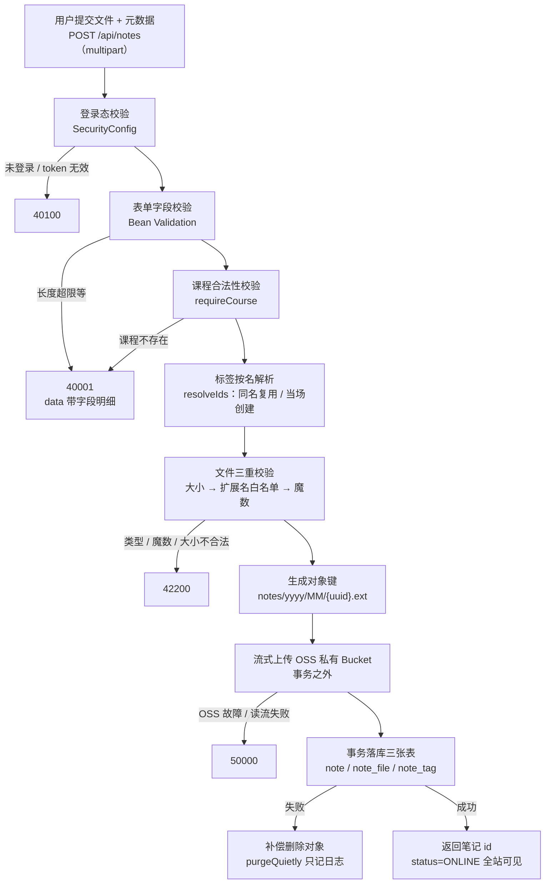

# 功能说明：笔记上传

> **接口**：`POST /api/notes` · **模块**：`note`（主）+ `storage` + `catalog`(标签)  
> **相关设计**：《概要设计》§6.1 上传流程、§5.4 接口、§3.2 表结构、§8.3 安全

---

## 1. 功能描述

已登录的用户提交一份文件与元数据（标题、简介、教师、课程、标签），服务端先做三重校验，再把文件**流式**写入 OSS 私有 Bucket，最后在一个事务里落 `note` / `note_file` / `note_tag` 三张表。提交即上架（`status=ONLINE`），全站立即可见。

### 1.1 请求

```
POST /api/notes
Authorization: Bearer <jwt>
Content-Type: multipart/form-data

title=期中复习提纲
summary=覆盖前三章
teacher=张老师
courseId=3
tags=高数
tags=期末
file=@笔记.pdf
```

### 1.2 处理流程



### 1.3 响应

成功（HTTP 200）：

```json
{ "code": 0, "message": "ok", "data": { "id": 123 } }
```

>只返回新笔记的 id，前端据此跳详情页。  
>失败错误码见《概要设计》§5.7：

### 1.4 涉及文件

| 层 | 文件 |
|---|---|
| 接口层 | `note/NoteController.java` · `note/dto/NoteUploadRequest.java` · `note/dto/NoteCreatedResponse.java` |
| 业务层 | `note/NoteService.java` |
| 准入策略 | `note/NoteFilePolicy.java` · `note/FileDecision.java` |
| 存储抽象 | `storage/StorageService.java` · `storage/OssStorageService.java` · `storage/Bucket.java` · `storage/StoredObject.java` |
| 上游依赖 | `catalog/TagService.java`（标签按名解析）· `catalog/CourseService.java`（课程校验） |
| 持久层 | `note/NoteMapper.java` · `note/NoteFileMapper.java` · `note/NoteTagMapper.java` |

---

## 2. 核心逻辑及说明

### 2.1 upload 方法
```java
public NoteCreatedResponse upload(Long uploaderId, NoteUploadRequest request) {
        MultipartFile file = request.getFile();
        requireCourse(request.getCourseId());
        List<Long> tagIds = tagService.resolveIds(request.getTags());

        FileDecision decision = inspect(file, uploaderId);
        StoredObject stored = store(file, decision, uploaderId);

        try {
            return transactionTemplate.execute(
                    status -> insertNote(uploaderId, request, decision, stored, tagIds)
            );
        } catch (RuntimeException e) {
            purgeQuietly(stored.key());
            throw e;
        }
    }
```

1. **课程校验、文件校验放在最前** —— 不合格就不碰 OSS。如果反过来先传对象再发现参数错，就只能靠补偿删除收场。
2. **标签解析放在 OSS 之前** —— 它会往 `tag` 表写新标签。若标签集合本身超标（超过 10 个），异常在这里就抛出了，此时还没有对象产生。
3. **OSS 上传放在事务之外** —— 单文件可达 100MB。把一次上百 MB 的网络传输圈进数据库事务，会让一个数据库连接被占住整个上传时长——慢速网络下这可能是一分钟以上，连接池很快就被拖垮。所以事务边界只包住「写三张表」这一步，用 `TransactionTemplate` 显式控制
```java
this.transactionTemplate = new TransactionTemplate(transactionManager);
```

>代价是可能发生：对象已存、入库失败，最后由补偿删除兜住。


### 2.2 `Content-Type` 由服务端按「扩展名查白名单表」判定

multipart 请求里浏览器会带一个 Content-Type 头，指定文件的类型。但客户端是可篡改的——把`.exe` 报成`image/png` ；而阿里云OSS自 2025-01-20 起禁止签名URL覆盖`response-content-type` ，意味着上传时写入对象元数据的值就是预览时浏览器拿到的最终值 ，读取侧无从纠正，放进来一个声称自己是图片的 html，它就会在 OSS 域名下被内联渲染（预览型 XSS）；所以类型必须在写入侧由服务端唯一裁决。

类型由扩展名查表确定：
```java
String extension = extensionOf(safeName);
Format format = FORMATS.get(extension);
if (format == null) {
    throw new BusinessException(ErrorCode.FILE_INVALID, "不支持的文件类型：." + extension);
}
```
查表通过后再靠魔数做一致性校验。

### 2.3 md/txt没有魔数，降级为UTF-8全量校验

md/txt没有可验的文件头，所以走另一条路：整份内容必须是可解码的UTF-8，且不含NUL字节（NUL是合法的UTF-8）。

这一步的目的**不是防 XSS**——`/raw` 代理接口固定返回 `text/plain` 并带 `nosniff`，本就不给浏览器解析的机会。它的目的是把「二进制文件改个 .txt 后缀」挡在门外，免得代理接口去流式转发一堆乱码。


### 2.4 存储抽象让这一层可测

`StorageService` 只提供「存 / 读 / 签 / 删」四件原语，**不含任何业务策略**。  
这样切分之后，`NoteServiceTest` 可以直接把 `StorageService` 换成 mock，而不碰 OSS SDK、也不需要网络。

---

## 4. 测试过程与结果

### 4.1 运行前置

| 项 | 值 |
|---|---|
| JDK | 21（`java.specification.version=21`） |
| 数据库 | **本机 MySQL 8.x**，测试激活 `local` profile，连 `application-local.yaml` 的库 |
| 建表与初始数据 | 随应用启动自动执行 `schema.sql` + `data.sql`（均幂等） |
| 网络 | 不需要（见 §4.4 关于 OSS 用例的说明） |

### 4.2 结果

```
Tests run: 118, Failures: 0, Errors: 0, Skipped: 0
BUILD SUCCESS（exit code 0）
```

**与上传功能直接相关的 39 条**，全部通过：

| 测试类 | 用例数 | 覆盖层次 |
|---|---|---|
| `NoteFilePolicyTest` | 26 | 准入判定与对象键（纯单元测试，无 Spring 上下文） |
| `NoteServiceTest` | 7 | 上传编排与事务边界（mock 掉存储层） |
| `NoteControllerTest` | 5 | 接口层（其中 5 条为上传相关） |
| `NoteMultipartConfigTest` | 1 | multipart 配置 |

### 4.3 用例明细

**A. 准入判定（`NoteFilePolicyTest`，26 条）**

| 分组 | 用例 |
|---|---|
| 合法类型 | `pdfIsAcceptedForInlinePreview` · `rasterImagesAreAcceptedForInlinePreview` · `jpegAliasIsAccepted` · `utf8TextIsAccepted` · `officeAndArchiveFilesAreDownloadOnlyAndKeepDistinctTypes` · `markdownAndTextGoThroughBackendProxy` |
| 伪装与不可注入 | `executableRenamedToPdfIsRejected` · `zipRenamedToPdfIsRejected` · `pngRenamedToJpgIsRejected` · `binaryMasqueradingAsTextIsRejected` · `unlistedExtensionsAreRejected` · `truncatedMagicIsRejected` |
| 大小 | `oversizedFileIsRejected` · `sizeExactlyAtLimitIsAccepted` · `emptyFileIsRejected` |
| 文件名 | `pathInFileNameIsStripped` · `overlongFileNameIsRejected` · `dotFileIsRejected` · `trailingDotIsRejected` · `missingExtensionIsRejected` · `extensionIsLowerCasedButOriginalNameKeepsItsCase` |
| 文本校验 | `textContainingNulByteIsRejected` · `truncatedMultibyteCharAtEofIsRejected` · `multibyteCharSplitAcrossChunkBoundaryIsAccepted` |
| 对象键 | `objectKeyFollowsDocumentedLayout` · `objectKeyIsUniquePerCall` |

**B. 上传编排（`NoteServiceTest`，7 条）**

| 用例 | 验证的规则 |
|---|---|
| `uploadPersistsNoteFileAndTags` | 三张表都落库；`status=ONLINE`、计数列为 0、`is_purged=0` |
| `objectIsStoredUnderGeneratedKeyAndThatKeyIsPersisted` | 对象键符合 `notes/yyyy/MM/{uuid}.pdf`，且落库的 key 与传给存储层的一致 |
| `unknownTagIsCreatedOnTheFly` | 不存在的标签当场创建 |
| `blankOptionalFieldsAreStoredAsNull` | 空的简介 / 教师存成 null 而不是空串 |
| `unknownCourseIsRejectedBeforeTouchingStorage` | 课程不存在 → 40001，且**存储层一次都没被调用** |
| `unacceptableFileIsRejectedBeforeTouchingStorage` | 文件不合法 → 42200，且**存储层一次都没被调用** |
| `objectIsPurgedWhenInsertFails` | 入库失败 → 补偿删除被调用，key 正确 |

后四条里 `verify(storageService, never()).upload(...)` 这种断言，正是 §3.1 和 §3.2 两条设计意图的可执行版本。

**C. 接口层（`NoteControllerTest`，上传相关 5 条）**

`uploadRequiresLogin` · `uploadCreatesNoteAndReturnsItsId` · `uploadRejectsBlankTitle` · `uploadRejectsUnsupportedFileType` · `uploadRejectsUnknownCourse`

**D. 配置（`NoteMultipartConfigTest`，1 条）**

`oversizedPartIsBufferedIntoTheDedicatedTempDirectory` —— 验证超过 `file-size-threshold` 的部件确实落到专用临时目录，而不是留在堆内存里。

### 4.4 未覆盖的部分（如实记录）

1. **真实 OSS 端到端不在默认套件内。** `OssStorageServiceTest`（5 条，含上传—签名—删除闭环）带 `@Tag("oss")`，pom 里通过 `excludedGroups=oss` **默认排除**，理由是它依赖网络与有效 AccessKey，离线或 CI 上必然失败。需要单独跑：

   ```bash
   ./mvnw test -DexcludedGroups= -Dgroups=oss
   ```

   注意两个参数必须同时给——JUnit 的排除优先于包含，只给 `-Dgroups=oss` 会一个都不跑。

   所以本功能**「文件真的传进 OSS 且能取回」这一段，默认套件没有覆盖**；默认套件覆盖的是「传之前校验对不对」和「传给谁、用什么 key 传」。

2. **`view_count` 等计数列的真实并发行为**没有测试。§3.3 的原子自增 `UPDATE note SET x = x + 1` 只有单线程验证。

3. **补偿删除的失败分支**（对象删不掉、留下孤儿对象）只验证了「正常删除被调用」，`purgeQuietly` 里 catch 住异常的那条路径没有用例。


