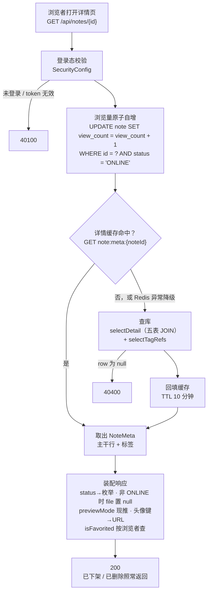

# 功能说明：笔记详情查询

> **接口**：`GET /api/notes/{id}` · **模块**：`note`（主）+ `favorite`（收藏态）+ `catalog`(课程/标签) + `config`(Redis 缓存)  
> **相关设计**：《概要设计》§5.4 详情接口、§4.1 状态可见性、§6.5 收藏与占位、§6.2 预览判定、§6.7 头像链路、§3.3 计数；《技术选型》§5（V2 缓存条目）

---

## 1. 功能描述

已登录的用户打开任意一篇笔记的详情页。服务端先对 `note` 行做一次**浏览量原子自增**（仅 `ONLINE` 生效），再取回「主干 + 标签」——这一步走 **Redis 读缓存**（`note:meta:{noteId}`，TTL 10 分钟）：命中即用，未命中才查库并回填，Redis 故障则**降级**直查库。最后装配响应：`status` 转枚举、非 `ONLINE` 时整个 `file` 置空、`previewMode` 由 `contentType` 现推、头像对象键拼成公网 URL、`isFavorited` 按**当前浏览者**查 `favorite` 表。

一个关键口径：**已下架 / 已删除的笔记同样返回 200**，元数据一条不少，只丢文件字段——详情页是「提示已下架」，不是「禁止访问」。全站只有 id 不存在才是 40400。这也使详情成为**唯一会把 `OFFLINE` 暴露给前端的接口**。

### 1.1 请求

```
GET /api/notes/12
Authorization: Bearer <jwt>
```

无请求体、无查询参数。路径上的 id 是唯一入参；**浏览者取自 JWT**，不接受客户端传入——它只用于填 `isFavorited`，若由客户端指定，任何人都能问出「别人收藏过这篇没有」。

### 1.2 处理流程



两点说明：

1. **自增在 404 判定之前**，但不会误计——那条 UPDATE 的 `WHERE id = ?` 匹配不到行，影响 0 行，无害。真正的「存在与否」由后面的 `loadMeta` 回答。
2. **自增不参与缓存**——它每次请求都要落库，缓存省下的只是后面那两条读。

### 1.3 响应

成功（HTTP 200）：

```json
{
  "code": 0,
  "message": "ok",
  "data": {
    "id": 12,
    "title": "第一章 绪论",
    "summary": "简介",
    "teacher": "张老师",
    "status": "ONLINE",
    "course": { "id": 3, "name": "离散数学" },
    "uploader": {
      "id": 7,
      "nickname": "小明",
      "avatarUrl": "https://jotang-avatar.oss-cn-chengdu.aliyuncs.com/avatars/7/abc.png",
      "collegeName": "计算机学院"
    },
    "tags": [
      { "id": 3, "name": "复习" },
      { "id": 8, "name": "期末" }
    ],
    "viewCount": 43,
    "downloadCount": 3,
    "favoriteCount": 5,
    "createdAt": "2026-10-01T10:00:00",
    "updatedAt": "2026-10-02T09:30:00",
    "file": {
      "originalName": "课件.pdf",
      "size": 1048576,
      "contentType": "application/pdf",
      "previewMode": "PDF_INLINE"
    },
    "isFavorited": true
  }
}
```

>非 `ONLINE` 时 `file` 整体为 `null`，其余字段照常返回。  
>`status` / `previewMode` 输出枚举名，`createdAt` / `updatedAt` 是 ISO-8601 无时区串。  
>**`viewCount` 含本次浏览这条语义，在缓存命中时不再成立**：回的是回填那一刻的快照（库里照常自增），直到 TTL 到期才「跳」到最新值。  
>失败错误码见《概要设计》§5.7：

### 1.4 涉及文件

| 层 | 文件 |
|---|---|
| 接口层 | `note/NoteController.java`（`detail`） |
| 业务层 | `note/NoteService.java`（`detail` · `loadMeta` · `fileInfoOf` · `avatarUrl`） |
| 缓存 | `note/NoteMeta.java`（缓存载荷）· `config/RedisConfig.java`（键 String / 值 JSON 的序列化） |
| 查询投影 | `note/NoteDetailRow.java` |
| 出参 | `note/dto/NoteDetailResponse.java` · `note/dto/UploaderResponse.java` · `catalog/dto/CourseResponse.java` · `catalog/dto/TagResponse.java` |
| 上游依赖 | `favorite/FavoriteService.java`（`isFavorited`）· `storage/StorageService.java`（头像键拼 URL）· `note/NoteStatus.java` · `note/PreviewMode.java` |
| 持久层 | `note/NoteMapper.java`（`incrementViewCount` · `selectDetail` · `selectTagRefs`）· `mapper/NoteMapper.xml` |
