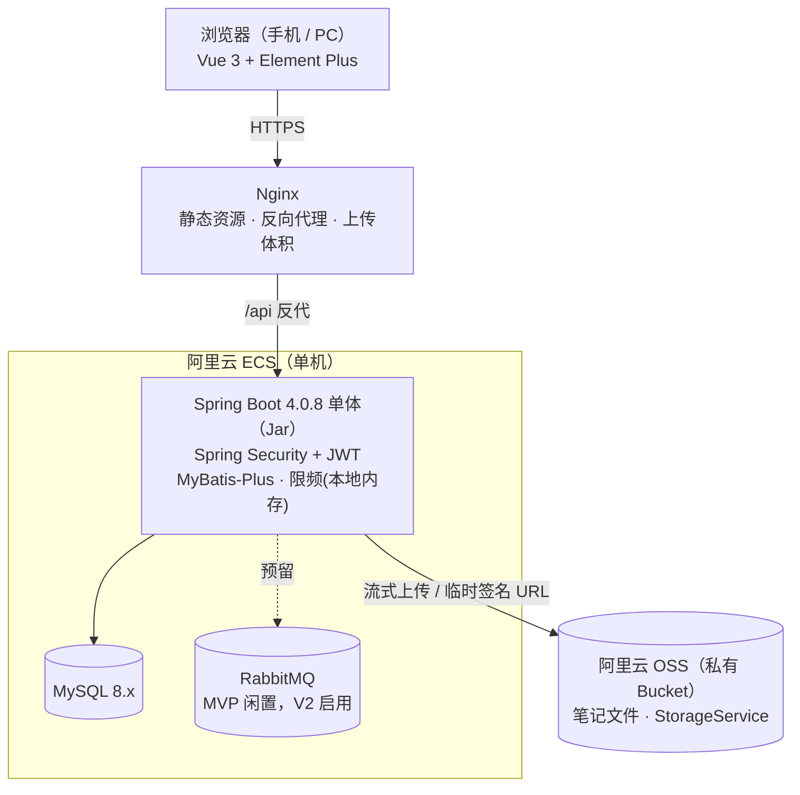

# Jotang Note 技术选型报告（MVP）

> 选型原则：单体优先、轻量运维，与「单台阿里云 ECS、数千注册用户」的规模匹配；同时为 V2（缓存、异步任务、对象存储）预留演进接口，不提前引入用不到的中间件。

## 1. 技术栈总览

| 分层 | 选型 | 说明 |
|---|---|---|
| 运行环境 | Java 21（LTS） | Spring Boot 4 的最低基线为 Java 17 |
| 后端框架 | Spring Boot 4.0.8 | 单体应用，controller/service/mapper 分层 |
| 构建工具 | Maven | 依赖管理与打包 |
| 安全框架 | Spring Security + JWT（jjwt） | 无状态登录态，接口统一鉴权 |
| 持久层 | MyBatis-Plus（基于 MyBatis） | 通用 CRUD + 分页插件，复杂 SQL 仍写 XML |
| 数据库 | MySQL 8.x（InnoDB / utf8mb4） | 模糊查询 + 索引分页满足 MVP 搜索 |
| 消息队列 | RabbitMQ | MVP **仅引入依赖、不启用**，预留给 V2 异步任务 |
| 缓存 | MVP 不引入 Redis | 登录限频用本地内存实现，V2 再上 Redis |
| 前端框架 | Vue 3 + Vite + TypeScript | Composition API，前后端分离 |
| UI 组件库 | Element Plus | 配合栅格/断点做移动端响应式，一套页面覆盖手机与 PC |
| 前端基础库 | Vue Router 4、Pinia、Axios | 路由、状态管理、HTTP 客户端 |
| 文件存储 | 阿里云 OSS（私有 Bucket） | 阿里云 OSS SDK for Java 读写，统一 StorageService 接口封装 |
| 文件预览 | 浏览器原生（PDF/图片/文本）+ marked/DOMPurify/highlight.js（Markdown） | 不支持 Office 在线预览，提示下载 |
| 邮件 | Spring Boot Mail + QQ 邮箱 SMTP | 用于密码找回 |
| 接口文档 | Apifox | 接口设计、文档维护与调试，通过 Apifox IDEA 插件从代码同步接口 |
| 部署 | Nginx + 可执行 Jar（systemd 托管） | Nginx 托管前端静态资源并反向代理后端 |

## 2. 后端选型

- **Spring Boot 4.0.8 + Java 21**：需求规模下单体足以承载，分层结构为 controller / service / mapper，不做微服务拆分。
- **MyBatis-Plus**：单表 CRUD、条件构造、分页由框架提供，减少样板代码；多表关联与复杂检索保留 MyBatis XML 手写，SQL 可控。
- **Spring Security + JWT**：
  - 登录成功签发 JWT，前端通过 `Authorization` 请求头携带；服务端无 Session，重启不丢登录态；
  - 无状态过滤链统一拦截「全部内容需登录」的接口，管理员角色（USER/ADMIN）走同一套鉴权；
  - 密码使用 BCrypt 加密存储。
- **Bean Validation**：入参校验（标题、文件大小等）注解化。
- **Spring Boot Mail**：对接 `30539981186@qq.com` 的 SMTP，发送密码找回邮件。
- **登录限频**：本地内存实现（按账号 + IP 双维度计数，失败 5 次锁定 10 分钟），不依赖额外中间件。
- **Apifox**：作为唯一的接口文档与联调工具，后端通过 Apifox IDEA 插件将接口定义自动同步到 Apifox 项目；前端按 Apifox 上的文档联调。

## 3. 前端选型

- **Vue 3 + Vite + TypeScript**：Composition API + 类型约束，Vite 承担开发热更新与生产构建。
- **Element Plus**：组件覆盖上传、列表、分页、详情、表单等全部页面场景；通过栅格与断点做响应式，移动端优先适配，不单独开发小程序/App。
- **Vue Router 4**：路由守卫在进入页面前校验登录态。
- **Pinia**：管理登录用户信息与 Token。
- **Axios**：统一请求拦截器注入 JWT，响应拦截器统一处理 401 跳转登录与错误提示。
- **预览能力**：
  - PDF、图片、文本：浏览器原生能力（iframe/object）直接渲染；
  - Markdown：marked 解析 + DOMPurify 防 XSS + highlight.js 代码高亮；
  - Office 文件：不做在线预览，提示下载查看。

## 4. 数据与检索

- 全部业务数据存 MySQL 8.x，领域模型即需求文档中的 USER / NOTE / NOTE_FILE / COURSE / TAG / FAVORITE 六张表。
- 搜索按标题、简介、课程名、教师、标签做 `LIKE` 模糊匹配 + 分页，配合索引即可达到 P95 < 500ms；**MVP 不引入 Elasticsearch**。
- 热门列表直接按浏览量/下载量排序查询，**MVP 不引入 Redis 等缓存**。
- 数据库每日 mysqldump 定时备份。

## 5. 中间件策略

- **RabbitMQ**：MVP不产生也不消费消息，暂不引入依赖，不部署强依赖的业务链路；V2 用于预览转码、消息通知等异步任务。
- **Redis**：MVP 不引入；V2 再用于按笔记 ID 缓存热点笔记、承接增删改后的缓存失效。
- 限流、锁定等单机状态用本地内存承载，因 MVP 仅一个应用实例，不存在多实例状态不一致问题。

## 6. 文件上传与存储

- 上传走后端 multipart 接口（前端直传后端，单文件 ≤ 100MB），Nginx 同步调大 `client_max_body_size`；后端三重校验通过后以流式上传 OSS，ECS 本地不落盘。
- 后端三重校验：扩展名白名单 + Content-Type + 文件魔数，拒绝伪装文件。
- 写入 OSS 前重命名对象键（不使用用户原始文件名），按日期分目录组织；下载时通过 `Content-Disposition` 还原原始文件名。
- Bucket 设为私有读写，存储操作全部收敛到 StorageService 接口（OSS 为默认实现），业务层不感知底层存储，后续可平替 MinIO 等。
- 预览与下载均走后端鉴权：后端校验登录态与笔记状态（含下架拦截）后，生成 OSS 临时签名 URL 返回前端，不暴露对象永久地址。

## 7. 部署形态

- 一台已有阿里云 ECS 上运行：Spring Boot Jar（systemd 托管）、MySQL、RabbitMQ（V2 启用）；笔记文件全部存阿里云 OSS。
- Nginx 负责：托管前端 Vite 构建产物（dist）、反向转发 `/api` 到后端、调大上传体积限制。
- 开发期可先用 IP 访问，域名备案完成后切换域名。

