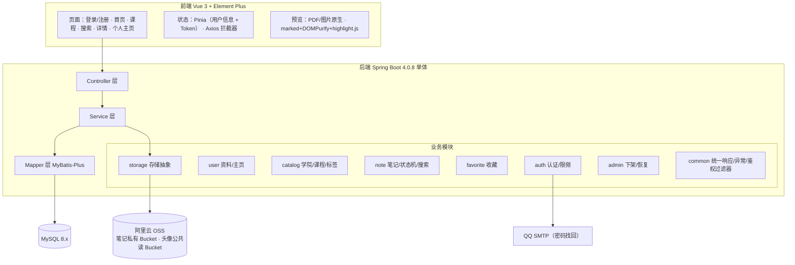
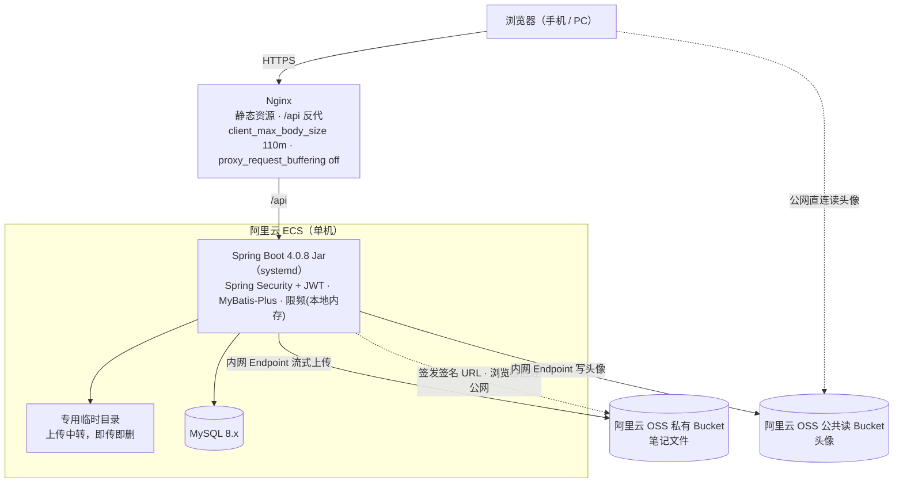
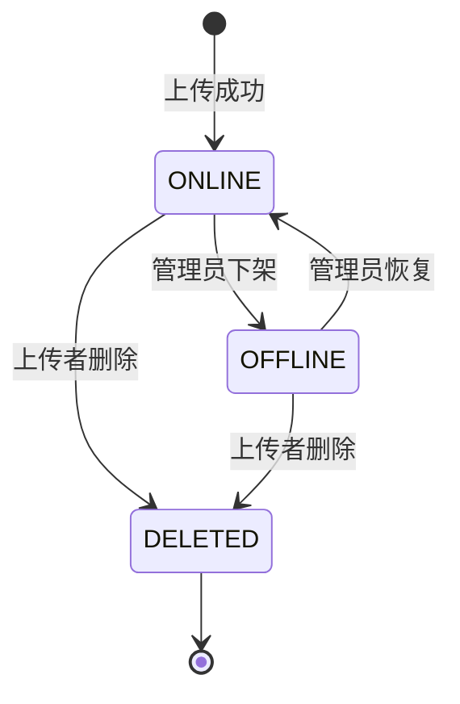
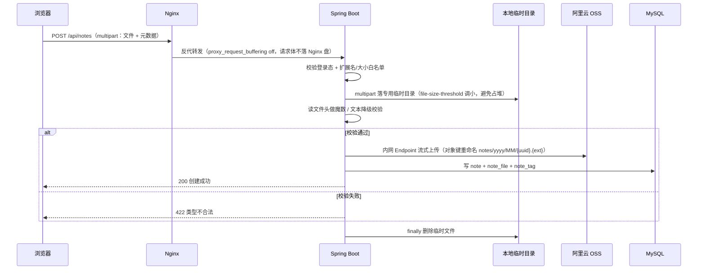
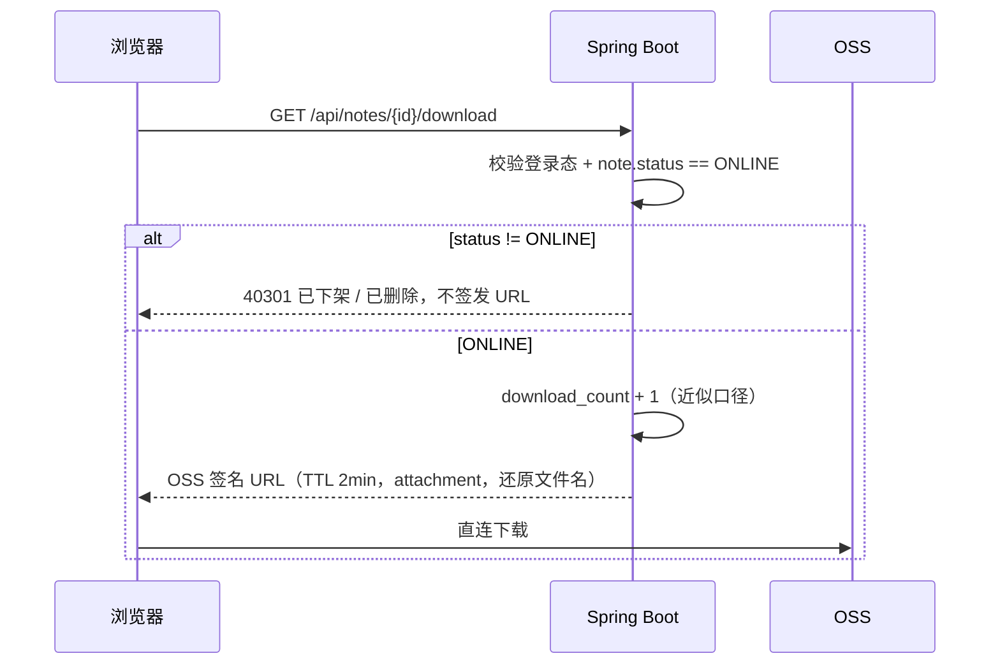
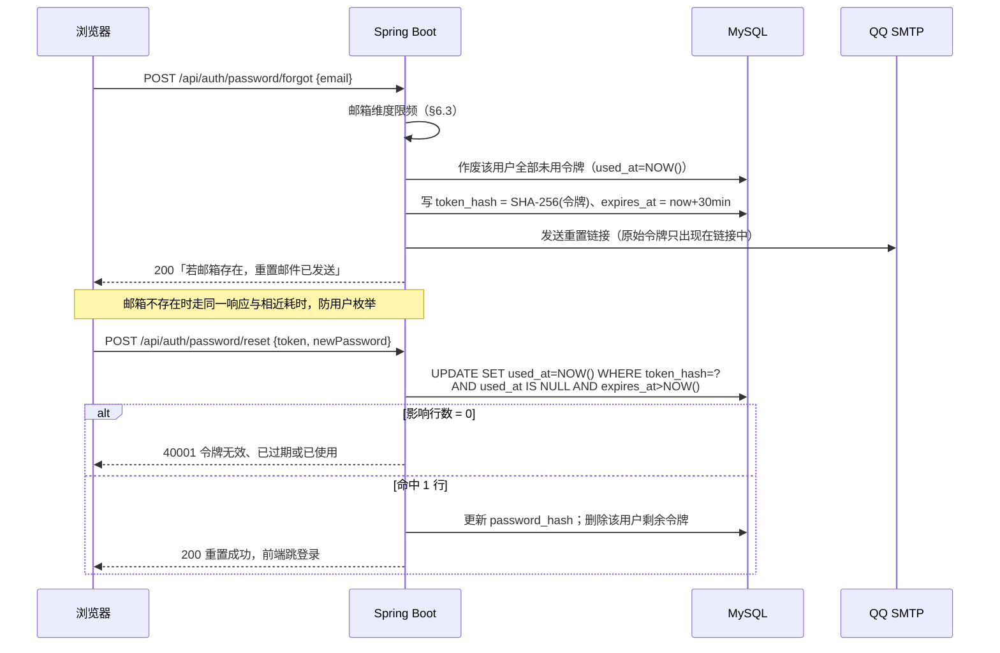

# Jotang Note 概要设计（MVP）

> 本文档承接《需求分析》与《技术选型》，定的是"**怎么落地**"：架构、模块、数据库、状态机、接口、关键流程与时序。
> **类设计、方法签名、SQL 明细以代码为权威**（建表脚本 `src/main/resources/schema.sql`，接口出入参见 Apifox，§9），本文档不重复；架构、模块、数据模型、状态机、接口清单与关键机制都在本文档内。

## 0. 本轮拍板的设计决策

| 编号 | 决策点 | 结论 | 影响 |
|---|---|---|---|
| D1 | 退出/改密后的 token 失效 | MVP **不做服务端即时失效**，改用短 TTL（2h）缓解；前端删 token 即退出 | 不引入 Redis；已知限制写入 §8.4 |
| D2 | 下载量口径 | **近似**：按"签发下载签名 URL 的次数"计 | 计数可能偏高，页面文案不做"精确"承诺 |
| D3 | 登录限频维度 | **仅账号维度**：5 次失败锁 10 分钟 | 避免误伤同校园网出口的整批用户 |
| D4 | 笔记删除 | **软删除**：`note.status` 扩展为 `ONLINE/OFFLINE/DELETED`，行不物理删除 | 收藏占位可渲染；外键永不悬空 |
| D5 | 标签关联 | 新增 `note_tag` 关联表（表数 6 → 7） | 修正"六张表"的说法 |
| D6 | 密码找回令牌 | **落库** `password_reset_token`（SHA-256 哈希、一次性消费、TTL 30 分钟），表数 7 → **8** | 应用重启不失效；不引入 Redis；限频与已知限制见 §6.6 / §8.4 |
| D7 | 头像访问 | 头像存**独立公共读 Bucket**（公共读 / 私有写），接口返回完整公网 URL | 免签名、浏览器直连 OSS、不占 ECS 出口；与笔记私有 Bucket 隔离，见 §6.7 |
| D8 | 学院归属 | 学院独立成表；`user.college_id` **必填**（注册时选定），`course` **去掉** `college` 列。笔记的学院 = **上传者的学院**，`note` 不冗余存，靠 JOIN `user` 推导；表数 8 → **9** | 上传表单只需选课程；改学院会**回溯改变**该用户全部历史笔记的归属；**不做按院隔离**，学院仅作分类维度，见 §3.3 |

## 1. 系统架构

### 1.1 分层与模块

- **模块边界**：Controller 只做参数校验与编排；业务规则全部落在 Service；跨表/复杂检索走 MyBatis XML，单表 CRUD 走 MyBatis-Plus。
- **跨模块访问**：不引用对方的 Mapper 接口与实体；跨模块的**业务操作**（校验、创建、修改）一律走对方 Service，如 `note` 上传时校验课程合法性走 `CourseService`。**但检索侧的多表 JOIN 不受此限**：模块共享同一个库，**列表 / 搜索 / 详情**都需匹配课程名 / 标签名 / 上传者，`NoteMapper.xml` 可直接 JOIN `course`、`tag`、`user`、`college`——这与 `note.course_id` 已有的外键约束是同一个依赖，并未新增耦合。判定依据是**读路径**而不是「接口名里有没有 search」：详情页读一篇笔记的展示数据，与列表页读一批，是同一类事，没有理由一个走 JOIN 而另一个为守边界付五次往返的代价（`GET /api/notes/{id}` 即按此办理，§5.4）。
- **存储抽象**：所有 OSS 操作（**流式上传、读取、生成签名 URL、删除对象**）收敛在 `StorageService` 接口，OSS 为首个实现，V2 可平替 MinIO。接口只提供这四件原语，**不含业务策略**——对象键怎么拼、TTL 多长、扩展名与魔数白名单一律由调用方（note / user）决定，因此 note 的单元测试可直接替换本接口，不必触碰 OSS SDK。「读取」只服务于 §6.2 的 MD / 文本代理预览；图片与 PDF 走签名 URL 直连，不经过它。
- **鉴权**：`common` 内的无状态 JWT 过滤器统一拦截，`admin` 模块通过角色规则保护。

### 1.2 部署拓扑

- **RabbitMQ 不部署**：MVP 无消息收发，依赖暂不引入（理由见《技术选型》§5）。
- **OSS 两个访问面**：ECS 与 OSS 同 Region，后端**上传、写头像**等数据操作一律走 `oss-<region>-internal.aliyuncs.com`（内网流量免费、不占公网出带宽、时延更低）；**签发给浏览器的签名 URL** 与**头像公网直读**走公网 Endpoint。
  - 二者必须是**两个客户端**，不能共用：**签名 URL 的主机名取自签发时所用客户端的 Endpoint**，用内网客户端签出来的 URL 指向内网域名，浏览器解析不了。该错误只在真发一次请求时才暴露，单元测试发现不了。
  - 「用哪个 Endpoint」是**环境差异而非代码差异**：本机开发不在阿里云内网（内网域名解析到 `100.64.0.0/10` 段，不可达），故开发期数据面也走公网，由 `application-local.yaml` 覆写；生产在 ECS 上仍走内网。
- **两个 Bucket**：笔记文件→私有 Bucket；头像→公共读 Bucket（§6.7）。
- 开发期可先用 IP 访问，但**JWT/密码为明文传输**，仅限自测。

## 2. 模块职责

| 模块 | 职责 | 关键类（示例） |
|---|---|---|
| auth | 注册、登录、退出、密码找回（令牌签发/校验/消费）、登录与找回限频 | `AuthController` / `AuthService` / `PasswordResetService` / `LoginAttemptLimiter` |
| user | 资料维护、头像上传（写公共读 Bucket）、个人主页统计 | `UserController` / `UserService` |
| catalog | 学院/课程查询、标签查询与**按名创建**。学院与课程是预置数据、应用内只读；标签例外——用户上传时可自由打标，`TagService` 因此带一条写路径（同名复用，见 §3.2） | `CatalogController` / `CollegeService` / `CourseService` / `TagService` |
| note | 笔记 CRUD、列表/热门/课程/标签聚合、搜索、状态机 | `NoteController` / `NoteService` / `NoteStateMachine` |
| favorite | 收藏/取消收藏、我的收藏（含占位） | `FavoriteController` / `FavoriteService` |
| storage | 流式上传、读取、签名 URL 签发、对象删除 | `StorageService` / `OssStorageService` |
| admin | 下架 / 恢复上架 | `AdminNoteController` |
| common | 统一响应体、全局异常、JWT 签发与校验、参数校验 | `ApiResponse` / `GlobalExceptionHandler` / `JwtAuthFilter` / `JwtTokenProvider` |

## 3. 数据库设计

统一约定：`InnoDB` + `utf8mb4`；主键 `BIGINT UNSIGNED` 自增；时间字段 `DATETIME`；**文本一律存原文，输出时转义**（修正"入库即转义"）。

### 3.1 表清单（9 张）

- **账号**：`user` · `college` · `password_reset_token`
- **内容**：`note` · `note_file` · `course` · `tag` · `note_tag`
- **互动**：`favorite`

### 3.2 表结构要点

**建表脚本以 `src/main/resources/schema.sql` 为唯一权威**，本节不复制 DDL——两份逐字相同的建表语句迟早会对不上。这里只记**读列定义读不出来的约束**：它们承载业务规则，改动前需连同 §3.3 一并回看。库表变更的迁移流程见 §7.4。

| 表 | 关键约束 | 要点 |
|---|---|---|
| `college` | `uk_name` | 预置数据，应用内只读；用户注册时必选（D8） |
| `user` | `uk_username`、`uk_email`；`college_id` **NOT NULL** + `fk_user_college` | `avatar` 存**对象键**而非完整 URL，对外由读取侧拼公网 URL（§6.7）；`status` 预留，MVP 不实现禁用 |
| `course` | `uk_name`；`is_other` | 预置数据 + 一条固定的「其他」；D8 后**不含 `college` 列**，同名课程不再分属不同学院 |
| `note` | `fk_note_uploader`、`fk_note_course`；`status` 三值；**`updated_at` 无 `ON UPDATE`**；6 个索引见下 | 软删除，行不物理删除（D4）；`deleted_at` 仅在 `status=DELETED` 时写入 |
| `note_file` | `uk_note_id`（一份笔记一个文件）、`uk_storage_key` | `storage_key` 格式 `notes/yyyy/MM/{uuid}.{ext}`；`is_purged=1` 表示对象已物理清理（§3.3） |
| `tag` | `uk_name` | 目录侧唯一的写路径：上传时按名复用或当场创建（§2 catalog） |
| `note_tag` | 复合主键 `(note_id, tag_id)` | **无顺序列**——上传时用户敲的标签顺序留不下来，读取按 `tag.id` 升序（§5.4） |
| `favorite` | `uk_user_note` | 重复收藏由它兜底（返回 409）；`note_id` 指向软删除的 `note`，外键永不悬空 |
| `password_reset_token` | `uk_token_hash`；`used_at IS NULL` 为一次性判据 | 只存 `SHA-256(令牌)`；`expires_at` = 签发 + 30 分钟（D6，§6.6） |

**`note` 的六个索引及其用途**——§8.2 的三种排序都走这些索引，**删掉任何一个都会让对应排序退化成 filesort**：

| 索引 | 支撑 |
|---|---|
| `idx_status_created` (`status`, `created_at`) | 最新发布 |
| `idx_status_updated` (`status`, `updated_at`) | 最近更新，即 `sort=latest` 的排序键 |
| `idx_status_view` (`status`, `view_count`) | 热门·浏览 |
| `idx_status_download` (`status`, `download_count`) | 热门·下载 |
| `idx_course_status` (`course_id`, `status`) | 课程页 |
| `idx_uploader_status` (`uploader_id`, `status`) | 我的上传 |

### 3.3 设计要点

- **软删除闭环（D4）**：`note` 行永不物理删除 → 收藏列表能读到 `status=DELETED` 渲染"笔记已删除"占位，也可以读到 `OFFLINE` 渲染"已下架"，外键不悬空。**无需**在 `favorite` 里存标题快照。
- **计数并发**：`view_count/download_count/favorite_count` 一律用 `UPDATE note SET x = x + 1 WHERE id = ?` 原子自增；收藏的重复性由 `uk_user_note` 兜底（重复收藏返回 409）。
- **浏览计数不包事务**：详情接口里那次自增与随后的读取**刻意不在同一个事务内**。圈进去的话，`note` 那一行的排他锁会一直持有到整个请求返回——中间还夹着标签查询、收藏查询与响应装配，而详情是最热的读接口。不圈则 UPDATE 立即提交、锁立即释放。代价是「自增」与「读取」之间可能插进别人的自增，返回值可能略大于自己那一次 +1；计数本身就没有去重（D2 对下载量是同一口径），多算一两次不改变它的性质。至于「只有 ONLINE 才计数」这条规则，由 `WHERE ... AND status = ?` 在语句内承担，不需要额外一次判断，也没有两次语句之间的竞态窗口。
- **`note.updated_at` 的语义是「用户最后编辑笔记的时间」，不是「这一行最后被写的时间」**。因此 `note` 表刻意**不带** `ON UPDATE CURRENT_TIMESTAMP`（`user.updated_at` 带，因为那边每一次 UPDATE 本来就是一次真实的资料修改：改昵称 / 改学院 / 换头像）。不摘掉的后果是：详情页的 `view_count + 1` 是全系统里唯一高频改写 `note` 行的语句，挂上 `ON UPDATE` 就变成「每被浏览一次，最后更新时间就刷新一次」——热度越高的笔记时间越新，而且从数据上完全看不出来。规矩：**只有编辑接口显式写 `updated_at = NOW()`**，浏览量自增、管理员的下架 / 恢复一律不碰它。守卫用例见 `NoteDetailServiceTest#viewingDoesNotTouchUpdatedAt`，它同时兼作迁移哨兵（见 §7）。
- **计数器一致性**：`favorite_count` 为派生值，提供一条离线校准 SQL（`UPDATE note SET favorite_count = (SELECT COUNT(*) FROM favorite WHERE note_id = note.id)`）用于对账，不进入主链路。
- **搜索策略**：MVP 用 `LIKE '%kw%'` 覆盖标题/简介/教师/课程名/标签，**接受全表扫描**并限制分页深度（最多 50 页 / 前 1000 条）；MySQL 的 B-Tree 索引对前导通配无效，故不承诺"索引即达标"。预留 `FULLTEXT ... WITH PARSER ngram` 作为 V2 优化开关。
- **分页深度上限对所有列表/搜索统一生效**：`page × size > 1000` 即报 40001（带 `field: page` 的字段明细），**不是截断成空页**——返回一页空白但 `total` 还写着很大的数，用户分不清是「翻得太深」还是「这一页恰好没数据」，前端也无从把「下一页」置灰。按默认 `size=20` 算，就是最多 50 页，与上一条的「50 页」是同一个数。单页大小另有守卫（`size ≤ 50`），那一条在参数校验上；**页码的上界只能在 Service 里查**，插件的 `maxLimit` 管不住页码（§8.2）。
- **OSS 物理清理**：用户删除笔记（→`DELETED`）后异步删除 OSS 对象并把 `note_file.is_purged=1`，**不可恢复**；管理员的"下架/恢复"只改 `status`，不动对象。
- **密码找回令牌（D6）**：只存 `SHA-256(令牌)`，明文令牌仅出现在邮件链接里；`used_at IS NULL` 为一次性判据；同一用户重新申请即作废其全部未用令牌（任意时刻至多一个有效令牌）。详见 §6.6。
- **头像对象键版本化（D7）**：`avatars/{userId}/{uuid}.{ext}`，换头像即换键，旧键不覆盖 → 可对公共读 Bucket 配长 `max-age` 强缓存而不会串图。详见 §6.7。
- **学院归属（D8）**：学院挂在 `user` 上而不是 `course` 上，`note` 也**不冗余存**——笔记的学院 = **上传者的学院**，读取时 JOIN `user` 推导。三处后果需明确接受：①**改学院会回溯改变该用户全部历史笔记的归属**（因为存的是推导关系而非快照）；②上传表单只需选课程，学院由登录态带出，不必做"先选学院再选课程"的级联；③学院**只作分类维度，不做按院隔离**——公共课（高数、大英等由数学/外语/马院开、全校都上的课）的笔记会归到上传者所在学院，这是刻意的。另：`course.name` 因此可以加 `uk_name` 唯一约束，不再是"同名课程分属不同学院"的多行。

## 4. 状态机

### 4.1 笔记状态（`note.status`）

| 状态 | 列表/搜索 | 详情页 | 预览/下载/收藏 | 我的上传 | 收藏列表 |
|---|---|---|---|---|---|
| ONLINE | 可见 | 正常 | 允许 | 正常 | 正常 |
| OFFLINE | 不可见 | 提示"已下架" | 禁止 | 可见并标注 | 占位"已下架" |
| DELETED | 不可见 | 提示"已删除" | 禁止 | 可见并标注 | 占位"已删除" |

- **恢复**只允许 `OFFLINE → ONLINE`；`DELETED` 是终态，无出边。
- 状态迁移只在 `NoteService` 内集中实现，禁止 Controller 直接改 status。
- **详情页对非 ONLINE 笔记照常返回 200，不抛 40301**。上表把「详情页」与「预览/下载/收藏」分成了两列，这个区别就落在这里：40301（§5.7）只属于后者，详情页的职责是**把状态带出去**让前端渲染提示，因此它是唯一会把 `OFFLINE` / `DELETED` 暴露给前端的接口。返回内容按「元数据照常、文件字段整体置空」处理——已下架笔记的文件名不该再从任何路径露出去，详见 §5.4。
- **浏览量只在 `ONLINE` 时 +1**。「已下架 / 已删除」的这次访问不算一次浏览（与上一条同一逻辑：非 ONLINE 的详情页不是一次正常展示）。递增本身仍走 §3.3 的原子 UPDATE，`WHERE` 子句里带上 `status = 'ONLINE'` 即同时完成守卫与计数。

### 4.2 用户角色

`USER` / `ADMIN` 二值，存 `user.role`，签发时写入 JWT claim。管理员账号通过初始化脚本创建（MVP 无后台，无自助提权）。

## 5. 接口设计

统一前缀 `/api`，统一响应体 `{ "code": 0, "message": "ok", "data": ... }`；鉴权走 `Authorization: Bearer <jwt>`。完整出入参与示例同步至 Apifox。

### 5.1 认证

| 方法 | 路径 | 说明 |
|---|---|---|
| POST | `/api/auth/register` | 注册（用户名/邮箱/密码/学院）；学院取自 `GET /api/colleges`，必填（D8） |
| POST | `/api/auth/login` | 登录，成功返回 JWT + 用户信息 |
| POST | `/api/auth/logout` | 退出（前端清 token；服务端空实现，见 §8.4） |
| GET | `/api/auth/me` | 当前登录用户 |
| POST | `/api/auth/password/forgot` | 发送重置邮件（邮箱维度限频；响应不区分邮箱是否存在，§6.6） |
| POST | `/api/auth/password/reset` | 凭邮件令牌重置密码（一次性、TTL 30 分钟，§6.6） |

### 5.2 用户与资料

| 方法 | 路径 | 说明 |
|---|---|---|
| GET | `/api/users/{id}` | 个人主页（昵称/学院/`avatarUrl`/上传数/累计浏览下载） |
| PUT | `/api/users/me` | 改昵称 / 改学院（改学院会回溯改变其全部历史笔记的归属，§3.3） |
| POST | `/api/users/me/avatar` | 上传头像（≤2MB，仅 jpg/png/webp，写公共读 Bucket，§6.7） |

### 5.3 课程与标签

| 方法 | 路径 | 说明 |
|---|---|---|
| GET | `/api/colleges` | 学院列表（注册表单与筛选的下拉数据源） |
| GET | `/api/courses` | 课程列表，支持按名称搜索 |
| GET | `/api/tags` | 标签列表 |

### 5.4 笔记

| 方法 | 路径 | 说明 |
|---|---|---|
| POST | `/api/notes` | 上传（multipart：文件 + 元数据）。标签按**名称**提交而非 id，由 `TagService` 同名复用或当场创建（§3.2）；校验后流式传 OSS 并落库（§6.1） |
| GET | `/api/notes` | 列表：`sort=latest\|hot_view\|hot_download`，`courseId`/`tagId` 筛选，分页 `page`/`size`。**只出 ONLINE**；超深分页报 40001 |
| GET | `/api/notes/search` | 关键词搜索（标题/简介/教师/课程名/标签） |
| GET | `/api/notes/{id}` | 详情。非 ONLINE 也返回 **200**（§4.1）；**仅 ONLINE 时浏览量 +1**，返回已含本次的值；`isFavorited` 如实查 `favorite` 表 |
| PUT | `/api/notes/{id}` | 编辑元数据（上传者本人） |
| DELETE | `/api/notes/{id}` | 软删除（上传者本人，`→DELETED`） |
| GET | `/api/notes/{id}/preview-url` | 图片/PDF 预览：返回 OSS 签名 URL（§6.2） |
| GET | `/api/notes/{id}/raw` | MD/文本预览：后端代理返回原文（§6.2） |
| GET | `/api/notes/{id}/download` | 返回下载签名 URL，`download_count+1`（近似口径 D2） |
| GET | `/api/users/me/notes` | 我的上传（含 OFFLINE/DELETED 标注） |

> 列表 / 搜索 / 详情 / 收藏等只要展示上传者信息，一律返回 **`avatarUrl`**（完整公网 URL，§6.7），**不返回 OSS 对象键**；前端直接 ``，无需二次请求签名或代理。

**详情响应体**（`NoteDetailResponse`）——一次请求读七个数据源：`note` / `note_file` / `course` / `user` / `college` 全是 to-one，一条 JOIN 出一行（§1.1 已把详情归入检索侧）；标签（`note_tag`⋈`tag`）与笔记成 to-many，另查一条；收藏是与**当前登录者**相关的旁路判断，走 `FavoriteService`。共三次查询。

- **非 ONLINE 时 `file` 整体为 `null`**，其余元数据一条不少（§4.1）。ONLINE 笔记必有且只有一个文件（`note_file` 的 `uk_note_id` 保证），所以 `file == null` 无歧义地表示「此刻没有可展示的文件」，前端一个 truthy 判断就能整块隐藏预览下载区。
- **不返回 `storageKey`**：对象键属于「东西存在哪」而非「东西是什么」，露出去只会诱使前端自己拼 URL 绕过 §6.2 的鉴权。`previewMode` 同理由读取侧从 `content_type` 现推（§6.2），不是库里的字段。
- **课程与标签都用 `{id, name}` 而非裸名字**：列表接口本就支持 `courseId` / `tagId` 筛选，带上 id 才能把它们渲染成可点的筛选入口。形状直接复用 §5.3 已发布的 `CourseResponse` / `TagResponse`——同一个东西在契约里声明两遍就成了同一规则的两份副本。
- **学院嵌在 `uploader` 下层而不是顶层**：它不是笔记的属性（`note` 表不存学院，读的是上传者的 `user.college_id`，D8）。放在这一层，等于把「改学院会回溯改变该用户全部历史笔记的归属」这个事实写进了契约。
- **标签按 `tag.id` 升序**。`note_tag` 只有 `(note_id, tag_id)` 两列，没有「第几个标签」这类顺序信息，上传时用户敲的顺序留不下来；id 升序至少是确定的，也与 `TagService#list` 的排序口径一致。按 `name` 排没有意义——默认排序规则对中文是按 Unicode 码点而非拼音。没有标签时返回**空数组**而不是 `null`，前端可以无条件遍历。
- `status` 与 `previewMode` 都按**枚举名**输出（`"ONLINE"` / `"PDF_INLINE"`），前端 `switch` 的就是这两个字面量；`createdAt` / `updatedAt` 是 ISO-8601 无时区串（`2026-10-01T10:00:00`）。

**列表响应体**（`PageResponse<NoteListItemResponse>`）——外壳固定四个字段 `items` / `total` / `page` / `size`；`total` 是**真实总数不封顶**（分页深度虽有上限，但这个数截断了会让「共 1000 篇」和「共 3421 篇」看起来一样）。列表项是详情项的真子集，比详情少 `status` / `summary` / `teacher` / `createdAt` / `file`。

- **一页固定四次数据库交互，与页大小无关**：主干分页查询 + MP 自动改写的 count + 标签批量查询 + 收藏批量查询。后两条都是对「这一页的 id」做一次 `IN`，**不是逐条查**——那会立刻退化成 N+1（一页 20 条就是 40 次往返）。
- **标签绝不能 JOIN 进分页查询**。这是列表接口最容易踩的坑，而且**分页会静默出错**：`LIMIT` 切的是 JOIN 之后的行，一篇带 3 个标签的笔记占掉 3 个名额，一页 20 条实际只回来七八篇，甚至某篇在页边界上被切成半条。注意区分——**筛选**用的 JOIN（`tag_id = ?` 等值）是安全的：`note_tag` 主键是 `(note_id, tag_id)`，给定 tag 每篇笔记至多匹配一行，不乘行。
- **`sort` 走白名单，全程不出现 `${}`**。`ORDER BY` 没法用 `#{}` 参数化，只能拼字符串，所以排序键必须来自 `NoteListQuery.Sort` 这个枚举，XML 里用 `<choose>` 把每个取值对应成一段写死的 SQL。非法取值在参数绑定阶段就被拦下（40001 + `field: sort`），流不到 SQL。
- **每个排序都带 `id DESC` 作次级键**。`view_count` / `download_count` 在大面积并列时（新站全是 0），只按它排的话 MySQL 不保证同分行的相对顺序稳定，翻页会看到重复或漏掉的笔记。InnoDB 二级索引叶子隐含主键 `id`，所以 `(status, updated_at)` 能直接支撑「status 等值 + `updated_at DESC, id DESC`」的倒扫，不需要 filesort。
- **列表只出 ONLINE**（§4.1），与详情页正相反：详情要把状态带出去让前端渲染提示，列表则根本不该让非 ONLINE 出现。`total` 同样是筛过的数，否则前端会算出一堆点进去是空的页。
- 列表项带 `isFavorited`，所以这个接口**必须知道「谁在看」**，`userId` 取自 JWT 而非请求参数。

### 5.5 收藏

| 方法 | 路径 | 说明 |
|---|---|---|
| POST | `/api/notes/{id}/favorite` | 收藏（仅 ONLINE；重复返回 409） |
| DELETE | `/api/notes/{id}/favorite` | 取消收藏 |
| GET | `/api/users/me/favorites` | 我的收藏（含占位项） |

### 5.6 管理员

| 方法 | 路径 | 说明 |
|---|---|---|
| POST | `/api/admin/notes/{id}/offline` | 下架（`ONLINE→OFFLINE`） |
| POST | `/api/admin/notes/{id}/online` | 恢复（`OFFLINE→ONLINE`） |

需 `role=ADMIN`；详情页对管理员显示"下架/恢复"按钮，前端依据 JWT 的 role 判断。

### 5.7 统一错误码

| code | 含义 | HTTP |
|---|---|---|
| 0 | 成功 | 200 |
| 40001 | 参数校验失败（`data` 携带字段级明细 `[{field, message}]`） | 400 |
| 40100 | 未登录 / token 无效或过期 | 401 |
| 40101 | 用户名或密码错误（登录表单内提示，**不跳转**——与 40100 区分） | 401 |
| 40300 | 无权限（非本人 / 非管理员） | 403 |
| 40301 | 笔记已下架或已删除（禁止预览 / 下载 / 收藏，§6.2） | 403 |
| 40400 | 资源不存在 | 404 |
| 40901 | 用户名已被占用 | 409 |
| 40902 | 重复收藏 | 409 |
| 40903 | 邮箱已被注册 | 409 |
| 42200 | 文件类型 / 大小不合法 | 422 |
| 42300 | 账号已锁定（`data` 携带剩余锁定秒数） | 423 |
| 50000 | 服务器内部错误 | 500 |

> **业务码与 HTTP 状态码非一一对应**：HTTP 状态码供传输层（浏览器 / Nginx / Axios 拦截器 / 监控告警）做粗粒度分流，业务码供应用层做精确分支。同一 HTTP 状态可承载多个业务码——如 `40300` / `40301` 同为 403、`40901` / `40902` 同为 409——前端据此区分，**无需解析 `message` 文案**（文案是给人看的，可改、可多语言）。

## 6. 关键机制设计

### 6.1 上传流程（后端中转 + 流式传 OSS）

**三重校验规则（修正后）**：

| 扩展名 | 魔数 / 判定 | 预览方式 |
|---|---|---|
| pdf | `%PDF-` | 签名 URL 内联 |
| jpg/png/gif/webp | `FF D8 FF` / `89 50 4E 47` / `GIF8` / `RIFF....WEBP` | 签名 URL 内联 |
| docx/xlsx/pptx | `PK\x03\x04`（与 zip 同族） | 仅下载 |
| zip/rar/7z | `PK\x03\x04` / `Rar!` / `37 7A BC AF 27 1C` | 仅下载 |
| md/txt | **无魔数** → 降级为「扩展名 + UTF-8 可解码 + 无 NUL 字节」 | 后端代理 |

- **拒绝 `svg`/`html`/`js`/可执行文件**（避免在 OSS 域上的存储型 XSS）。
- 魔数与扩展名不一致 → 拒绝。
- 表中「预览方式」一列是**类型的属性**而非行的状态，**不落库**；读取侧由 `content_type` 推导（§6.2）。
- 对象键重命名：`notes/yyyy/MM/{uuid}.{ext}`，不使用原始文件名；`original_name` 入库，下载时还原。
- **上传链路上的体积、缓冲与临时目录参数不在此处列值**，权威出处是 §7.1 配置基线。图里那句 `proxy_request_buffering off` 只是其中一条——注意 **Nginx 与后端的体积上限是一对有约束关系的值**，只改其中一个会让请求在中途被 413 拦下，改之前先看 §7.1 的说明列。

### 6.2 预览 / 下载鉴权

| 场景 | 方式 | 关键约束 |
|---|---|---|
| 图片预览 | 签名 URL，前端 `` 直出 | TTL **5min**；仅光栅图白名单；响应 `Content-Type` 取自对象元数据（上传时写入），读取时**不覆写**（见下） |
| PDF 预览 | 签名 URL（**方案待定**，见 §10） | 默认域名会强制下载，而 PDF 只能走 `<iframe>`，`` 那套绕不过去 |
| MD / 文本预览 | 后端代理 `/raw` | 响应头 `Content-Type: text/plain; charset=utf-8` + `X-Content-Type-Options: nosniff`；前端再走 marked+DOMPurify |
| 下载（全部类型） | 签名 URL | TTL **2min**；`response-content-disposition=attachment; filename*=UTF-8''...` |

- 所有入口先校验登录态与笔记状态，**下架/删除后不再签发新 URL**
- **预览方式（`previewMode`）由 `content_type` 推导，不落库**：图片 / PDF / 文本 / 仅下载这四种渲染意图是**类型的属性**，而 `note_file.content_type` 是上传时由服务端判定并钉死的值（见下一条），故读取侧用 `PreviewMode.of(contentType)` 现推，`note_file` 不另存一列——落库等于把函数值再抄一份，换不到什么，反倒多一处可能与 `content_type` 不一致的地方（`schema.sql` 的 `note_file` 建表里因此没有这一列）。该推导是**对 `content_type` 的全函数**：认不出来的一律落到「仅下载」，失败方向是「少一个内联预览」而不是「放行不该内联的类型」；且**不查写入侧白名单**（§6.1 的 `FORMATS` 表）——那是准入闸门，拿它做读取侧推导，会让将来从白名单里摘掉的类型读不出历史行。代价：新增受支持类型时须同步这条映射，漏改只降级为仅下载，不构成安全洞。
- **预览的 `Content-Type` 不通过签名 URL 覆写**：阿里云 OSS 自 **2025-01-20** 起禁止在签名请求中覆盖 `response-content-type`（错误码 `0017-00000902`，实测返回 `Can not override response header on content-type`）。这不是妥协，反而是更强的保证——类型在**上传时**就由服务端按魔数判定并写进对象元数据（§6.1），入口即钉死，读取方无从改变。代价是类型一旦入库便不可修改，要换类型只能删了重传（与 §4.1「不支持替换文件」一致）。下载用的 `response-content-disposition` 不受此限，仍按上表覆写以还原文件名。
- **默认域名强制下载（实测确认）**：OSS 默认域名（`*.aliyuncs.com`）会给图片、PDF 等类型的响应强制附加 `Content-Disposition: attachment` 与 `x-oss-force-download: true`（错误码 `0048-00000101`），**显式请求 `inline` 也压不过**。该策略只作用于「导航」场景——把 URL 直接粘进地址栏会变成下载；而浏览器加载 `` 这类子资源时会忽略此响应头，**故图片预览不受影响**。受影响的是必须走 `<iframe>` 的 PDF 预览。绑定自定义域名访问可完全绕开该策略。
- **已知限制**：URL 在其 TTL 内可被转发给未登录者，且下架前已签发的 URL 在到期前仍可用（见 §8.4）。

### 6.3 登录限频（D3）

- **仅账号维度**：`login:fail:{username}`，失败 +1，累计 5 次锁定 10 分钟；登录成功清零。避免误伤同校园网出口的整批用户。存储用本地内存（`ConcurrentHashMap` + 惰性过期，不引入中间件；如需可换 Caffeine）。
- 锁定返回 `42300` + 剩余秒数；已知限制：应用重启后锁定状态丢失（MVP 可接受）。
- **找回接口限频（新增）**：`/api/auth/password/forgot` 单独限频——同一邮箱 5 分钟 1 次，超限返回 `42300`。防止被用来轰炸他人邮箱、打爆 QQ SMTP 发送配额。存储同样用本地内存（§6.6）。

### 6.4 认证与 JWT（D1）

- 算法 HS256，密钥走环境变量；Claims：`sub(userId)`、`role`、`username`、`iat`、`exp`、`jti`。
- **TTL 2 小时**（短 TTL 缓解不可撤销问题）；前端存 Pinia + `localStorage`，Axios 拦截器注入、401 统一跳登录。
- **已知限制**：退出/改密/找回后，旧 token 在 TTL 内仍有效；服务端不维护失效名单。V2 引入 Redis 后可用 `jti` 黑名单或改 refresh token。
- 前端**禁止 `v-html` 渲染任何用户输入**；MD 预览必须经 DOMPurify。

### 6.5 收藏与占位（D4）

- 收藏前校验 `note.status == ONLINE`，否则拒绝。
- 收藏列表查询 `favorite JOIN note`，按 `note.status` 渲染：`ONLINE` 正常、`OFFLINE` 占位"已下架"、`DELETED` 占位"已删除"；`OFFLINE→ONLINE` 恢复后自动正常展示，计数不变。
- 占位项不可预览/下载，但**不解除收藏关系**。

### 6.6 密码找回（令牌落库，D6）

令牌**不放内存**：落 `password_reset_token` 表（§3.2），应用重启不失效，且能借助单条 UPDATE 原子保证一次性消费。

- **令牌生成**：`SecureRandom` 32 字节 → URL-safe Base64，放进邮件链接。高熵令牌只需 **SHA-256** 存哈希（BCrypt 是为低熵口令抗离线爆破，此处用不上，反而拖慢每次校验）。
- **一次性消费**：`used_at IS NULL` 是唯一判据，成败由上面**单条 UPDATE 的受影响行数**决定——两个并发请求只有一个能改到 1 行，天然抗重放，无需加锁。
- **TTL 30 分钟**；同一用户重新申请时作废其全部旧未用令牌，任意时刻至多一个有效令牌。
- **改密成功后**：该用户剩余未用令牌一并作废。
- **过期行清理**：不引入定时任务，随 §7.3 每日维护脚本执行 `DELETE FROM password_reset_token WHERE expires_at < NOW() - INTERVAL 7 DAY`。
- **限频**：见 §6.3（同一邮箱 5 分钟 1 次）。

### 6.7 头像访问链路（独立公共读 Bucket，D7）

笔记文件必须私有，头像则是"给所有人看"的公开资源，故独立成**第二个 Bucket：公共读、私有写**（复用私有 Bucket 的代价见本节末）。

| 项 | 设计 |
|---|---|
| Bucket | `jotang-avatar`（**公共读 / 私有写**），与笔记私有 Bucket 物理隔离；写对象需后端持有的 AccessKey |
| 对象键 | `avatars/{userId}/{uuid}.{ext}`——**版本化**，换头像即换键，不覆盖旧对象 |
| 上传 | 仍经后端 `POST /api/users/me/avatar`（≤2MB，仅 jpg/png/webp，服务端判定类型后经**内网 Endpoint** 写对象） |
| 读取 | 业务接口返回**完整公网 URL**（`https://{bucket}.{endpoint}/avatars/{userId}/{uuid}.{ext}`），浏览器 `` 直连 OSS |
| 对象元数据 | `Cache-Control: public, max-age=31536000, immutable`（键已版本化，可放心长缓存） |
| 安全 | 严格类型白名单，**拒绝 `svg`/`html` 等可注入类型**，避免 OSS 域上的存储型 XSS；`Content-Type` 以服务端判定为准 |

- 业务接口（个人主页 / 笔记列表 / 搜索 / 详情 / 收藏）统一返回 `avatarUrl` 字段，前端无需签名或代理。
- 后端**既不为读头像签发 URL，也不经 ECS 转发** → 头像读取完全不占 ECS 带宽（与 §8.1 一致）。
- **代价**：URL 永久公开、不可撤回，换头像后旧 URL 在对方缓存过期前仍可访问；头像是公开信息，MVP 接受（写入 §8.4）。
- **为何不用私有 Bucket + 代理/签名**：签名方案在列表页产生 N 次签名与 N 次后端往返，短 TTL 还会破坏浏览器缓存、翻页反复重取；代理方案虽可强缓存，但把头像流量压到 ECS 出口。

## 7. 部署与运维

### 7.1 配置基线

所有可调参数集中在此，别处只讲机制、不再重复列值。**改之前先读「说明」列**——其中几条之间是有约束关系的，不是各自独立的旋钮。

| 项 | 值 | 说明 |
|---|---|---|
| Nginx `client_max_body_size` | `110m` | **必须 ≥ 后端 `max-request-size`**：100MB 文件加上 multipart 边界与元数据必然超过 100MB，若取 `100m`，请求会在 Nginx 就被 413 拦下，后端那 110MB 形同虚设（§6.1） |
| Nginx `proxy_request_buffering` | `off` | 请求体不落 Nginx 临时盘 |
| Nginx `proxy_read_timeout` / `proxy_send_timeout` | 放宽 | 上传大文件耗时较长 |
| Spring `max-file-size` | `100MB` | 单文件上限，与《需求分析》一致 |
| Spring `max-request-size` | `110MB` | 与上一条 Nginx 体积上限配对的另一半 |
| Spring `file-size-threshold` | `1MB` | 超过即落专用临时目录，避免 100MB 请求占堆内存 |
| 上传临时目录 | 专用路径 + 定期清理残留 | 上传成功或失败的 `finally` 中删除（§6.1） |
| 笔记 Bucket | **私有读写** | 笔记文件，鉴权后签发签名 URL |
| 头像 Bucket | **公共读 / 私有写** | 免签名，浏览器直连（D7、§6.7） |
| OSS Endpoint（后端读写） | `oss-<region>-internal.aliyuncs.com` | 同 Region 内网，流量免费、不占公网出带宽 |
| OSS Endpoint（签名 URL / 头像直读） | 公网 Endpoint | **与上一条必须是两个客户端**：签名 URL 的主机名取自签发时所用客户端的 Endpoint，用内网客户端签出的 URL 浏览器解析不了（§1.2） |
| JWT 密钥 | 环境变量 | 不入库、不进仓库（§6.4） |

### 7.2 数据初始化

- **学院/课程/标签**：上线前用初始化脚本导入学院名单、课程名单与一批常用标签，并内置一条 `is_other=1` 的"其他"课程；管理员账号同脚本创建（`user.college_id` 非空，须一并指定）。学院与课程**只能**由脚本维护；标签是「脚本预置常用项 + 用户在打标时按名创建」并存（§2、§3.2），脚本里那批只是把常见标签的 id 提前固定下来，让首批笔记的标签不是散乱的同义名。

### 7.3 备份与日常维护

- **备份**：MySQL 每日 `mysqldump` 定时备份；OSS 侧可选生命周期规则（本项目因软删除不做自动过期）。
- **每日维护**：同一脚本顺带清理 `password_reset_token` 中 `expires_at < NOW() - INTERVAL 7 DAY` 的历史行（§6.6）。

### 7.4 库表变更要手工迁移

- 不引入 Flyway / Liquibase，建表脚本是 `src/main/resources/schema.sql`（§3.2），全部 `CREATE TABLE IF NOT EXISTS`——**对已存在的表是空操作**。所以任何 DDL 改动光改 `schema.sql` 不会生效，必须对已有库**手工执行对应的 `ALTER`**。
- 改列定义可以写成幂等形式（`MODIFY COLUMN` 重跑无害）；**加索引不能**——MySQL 8 没有 `ADD INDEX IF NOT EXISTS`，重跑报 1061 重复键名，跑前先查 `information_schema.STATISTICS` 更稳。
- 已发生两次：`note.updated_at` 摘掉 `ON UPDATE CURRENT_TIMESTAMP`（§3.3），以及新增 `idx_status_updated`（`sort=latest` 的排序键）。
- `NoteDetailServiceTest#viewingDoesNotTouchUpdatedAt` 兼作第一个迁移的哨兵——库没迁移时它会红，把「忘了 ALTER」挡在提交之前。

## 8. 非功能设计的落地

### 8.1 容量
容量同《需求分析》§7。**上传虽经 ECS 中转，但 ECS→OSS 走内网 Endpoint**（§1.2），不占公网出带宽，故**无需**按峰值上传规划公网出口，只需关注 ECS **公网入站**带宽与本地临时目录磁盘；下载与头像均由浏览器直连 OSS，**不经 ECS**。

### 8.2 性能
列表/搜索 P95 < 500ms 为**目标而非承诺**；搜索走全表扫并限制分页深度（§3.3）。列表的三种排序各有对应索引：`latest` → `idx_status_updated`、`hot_view` → `idx_status_view`、`hot_download` → `idx_status_download`。三者均已用 `EXPLAIN` 在 3000 行数据上实测，结果都是 `Backward index scan; Using index`——顺着索引倒扫且全程覆盖索引、**没有 filesort**。带 `id DESC` 次级键不影响这一点：InnoDB 二级索引的叶子节点隐含主键 `id`，所以「`status` 等值 + 排序列 DESC, `id` DESC」正好是索引的倒序。

### 8.3 安全
- BCrypt 存密码；无状态 JWT 统一鉴权；所有内容接口要求登录。
- 上传三重校验与对象键重命名见 §6.1；**输出转义**（非入库转义），MD 走 DOMPurify，下载强制 `attachment`，拒收可注入类型。
- **预览类型在入口钉死**：图片 / PDF 预览响应的 `Content-Type` 取自上传时写入对象元数据的服务端判定值，签名 URL 无法在读取时覆写（OSS 自 2025-01-20 起禁止，§6.2）。因此 §6.1 的「扩展名 + 魔数」白名单是预览型 XSS 的**唯一**防线，必须严格执行，不可放宽。
- 登录限频见 §6.3；密码找回令牌见 §6.6。
- 头像落公共读 Bucket，故类型白名单必须严格执行（拒收 `svg`/`html`，§6.7）。

### 8.4 已知限制（明确接受）
1. token 在 TTL 内无法即时失效（改密/退出后旧 token 仍可用）。
2. 已签发的签名 URL 在 TTL 内可绕过登录访问，且下架不即时生效（最长滞后 = URL TTL）。
3. 下载量为近似值。
4. 账号锁定状态在应用重启后丢失。
5. 搜索为全表扫描；列表与搜索的分页深度都限制在前 1000 条，超出报 40001（§3.3）。
6. 上传经 ECS 中转，单文件上限 100MB（Nginx 与后端体积限制已对齐，§6.1）；占用 ECS 公网**入站**带宽，依赖本地临时目录磁盘与清理。
7. 密码找回依赖 QQ SMTP 的发送配额与到达率；过期令牌行由每日维护脚本清理，不保证即时物理删除（§6.6）。
8. 头像 Bucket 公共读：头像 URL 永久公开、不可撤回，换头像后旧 URL 在其缓存有效期内仍可访问（§6.7）。

## 9. 接口与本文档的交付衔接

- 本文档 §5 的接口清单为**契约基线**，详细出入参同步至 Apifox；后端通过 Apifox IDEA 插件从代码反向同步。
- 前端按 Apifox 契约联调，`ApiResponse` 与错误码由 `common` 统一产出。

## 10. 待确认项

- **PDF 预览怎么落地？** 默认域名对该类型强制下载（§6.2），而 PDF 只能走 `<iframe>`/`<embed>`，不像图片能用 `` 绕过。三条候选：①把面向浏览器的签名 URL 改走已绑定的自定义域名（`jotang-note.cn-chengdu.taihangztn.cn`，需域名已完成 ICP 备案且 DNS 生效，此路可同时解决且不增加后端负担）；②前端改用 pdf.js 渲染——它用 fetch 取文件，不受导航类响应头影响，但需给 Bucket 配 CORS；③后端代理转发，代价是大流量压到 ECS 公网出口，与 §8.1、§6.7 的取舍相悖。**图片预览不受此问题影响，已可用。**
- 笔记列表/搜索要不要支持按**学院**筛选（`collegeId`）？学院已能从上传者推导，加这一条筛选成本很低，但本轮未列入契约（D8 只定了归属，没定筛选），待定。
- 公开侵权投诉邮箱建议与 SMTP 发件邮箱解耦（避免垃圾邮件与通道耦合）。
- `note.summary` 长度上限（现定 512）与前端展示截断策略。
- 重置邮件链接的有效期文案与前端倒计时展示（后端 TTL 已定 30 分钟）。
