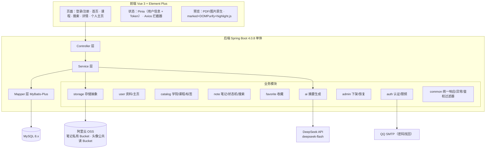
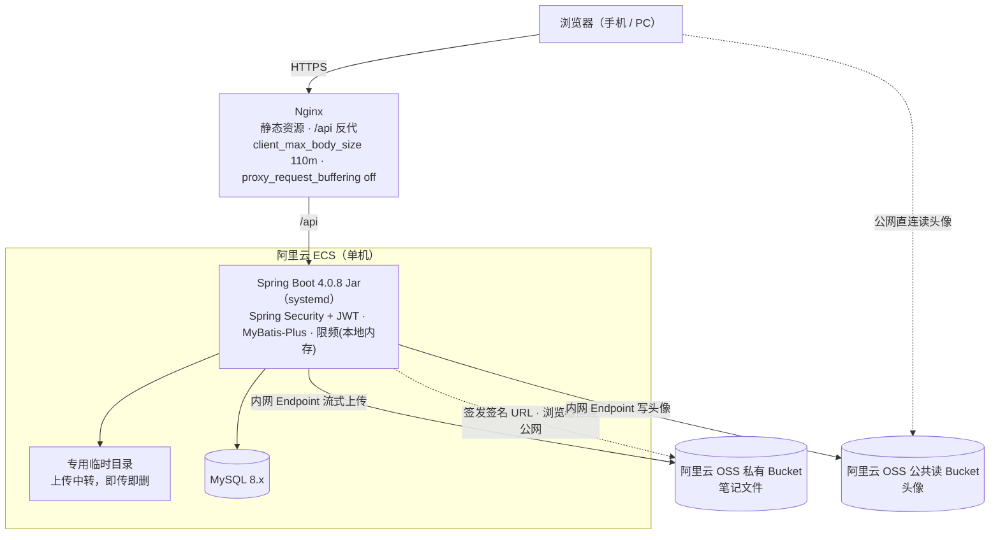
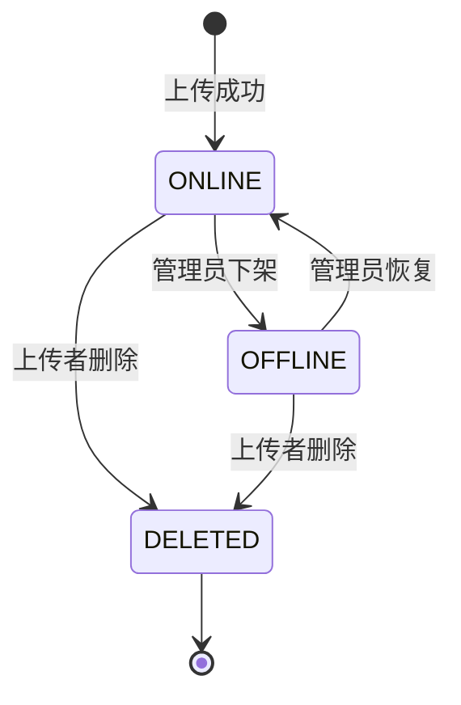
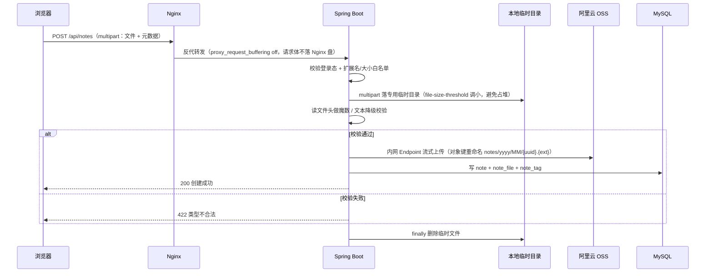
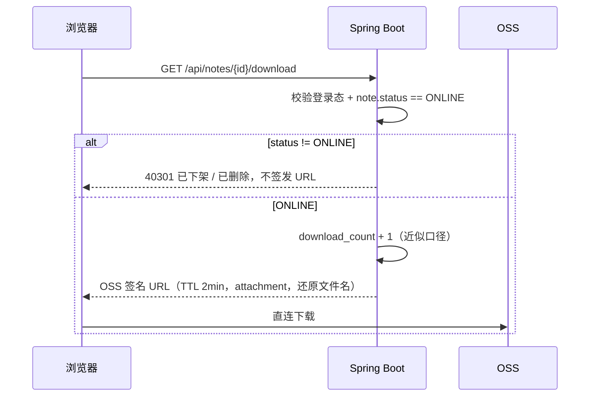
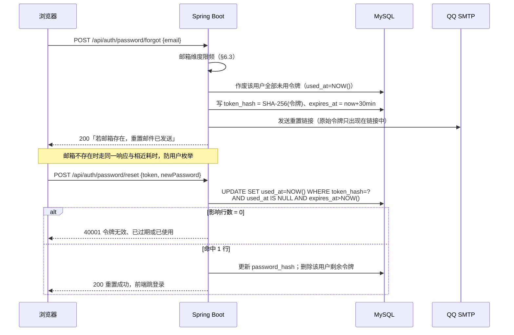
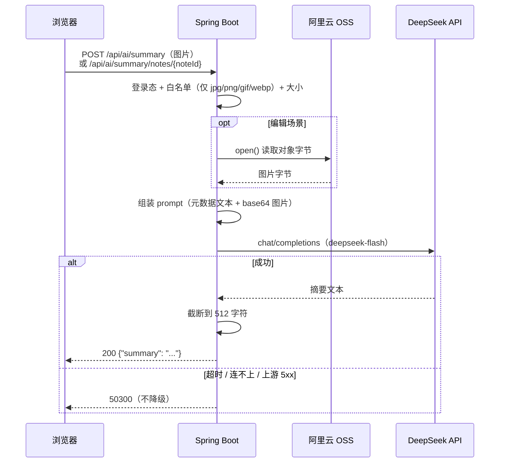

# Jotang Note 概要设计（MVP）

> 本文档承接《需求分析》与《技术选型》，定的是"**怎么落地**"：架构、模块、数据库、状态机、接口、关键流程与时序。
> **类设计、方法签名、SQL 明细以代码为权威**（建表脚本 `src/main/resources/schema.sql`，接口出入参见 Apifox，§9），本文档不重复；架构、模块、数据模型、状态机、接口清单与关键机制都在本文档内。

## 0. 本轮拍板的设计决策

| 编号 | 决策点 | 结论 | 影响 |
|---|---|---|---|
| D1 | 退出/改密后的 token 失效 | MVP **不做服务端即时失效**，改用短 TTL（2h）缓解；前端删 token 即退出 | 不引入 Redis；已知限制写入 §8.4 |
| D2 | 下载量口径 | **近似**：按"签发下载签名 URL 的次数"计 | 计数可能偏高，页面文案不做"精确"承诺 |
| D3 | 登录限频维度 | **仅账号维度**：5 次失败锁 10 分钟 | 避免误伤同校园网出口的整批用户 |
| D4 | 笔记删除 | **软删除**：`note.status` 扩展为 `ONLINE/OFFLINE/DELETED`，行不物理删除 | 收藏占位可渲染；外键永不悬空 |
| D5 | 标签关联 | 新增 `note_tag` 关联表（表数 6 → 7） | 修正"六张表"的说法 |
| D6 | 密码找回令牌 | **落库** `password_reset_token`（SHA-256 哈希、一次性消费、TTL 30 分钟），表数 7 → **8** | 应用重启不失效；不引入 Redis；限频与已知限制见 §6.6 / §8.4 |
| D7 | 头像访问 | 头像存**独立公共读 Bucket**（公共读 / 私有写），接口返回完整公网 URL | 免签名、浏览器直连 OSS、不占 ECS 出口；与笔记私有 Bucket 隔离，见 §6.7 |
| D8 | 学院归属 | 学院独立成表；`user.college_id` **必填**（注册时选定），`course` **去掉** `college` 列。笔记的学院 = **上传者的学院**，`note` 不冗余存，靠 JOIN `user` 推导；表数 8 → **9** | 上传表单只需选课程；改学院会**回溯改变**该用户全部历史笔记的归属；**不做按院隔离**，学院仅作分类维度，见 §3.3 |
| D9 | AI 摘要的范围与形态 | **只做「用户点按 → 读图片 → 生成摘要填入简介框」**：仅图片类笔记（jpg/png/gif/webp）、同步一次性 JSON、用户可改且**不自动保存**、结果**不落库** | 新增 `ai` 模块与 2 个接口（§5.8）；`deepseek-flash` 的多模态只收光栅图，文档类须先抽文本故列为 V2；不引入 chat-memory，见 §6.8 |

## 1. 系统架构

### 1.1 分层与模块

- **模块边界**：Controller 只做参数校验与编排；业务规则全部落在 Service；跨表/复杂检索走 MyBatis XML，单表 CRUD 走 MyBatis-Plus。
- **跨模块访问**：跨模块的**业务操作**（校验、创建、修改）优先走对方 Service，如 `note` 上传时校验课程合法性走 `CourseService`。**但检索侧的多表 JOIN 不受此限**：模块共享同一个库，**列表 / 搜索 / 详情**都需匹配课程名 / 标签名 / 上传者，`NoteMapper.xml` 可直接 JOIN `course`、`tag`、`user`、`college`——这与 `note.course_id` 已有的外键约束是同一个依赖，并未新增耦合。判定依据是**读路径**而不是「接口名里有没有 search」：详情页读一篇笔记的展示数据，与列表页读一批，是同一类事，没有理由一个走 JOIN 而另一个为守边界付五次往返的代价（`GET /api/notes/{id}` 即按此办理，§5.4）。
- **跨模块写对方单表列的条件**（本节的既有例外补记为规则）：若没有对方的 Service 能承接这个写——对方模块压根没有该入口，**或注入它会形成构造器循环依赖**——则允许直接注入对方的 Mapper，用它的单表语句写。两处实例：`AuthService` 直接注入 `UserMapper`（注册即往 `user` 表插行，`UserService` 没有建用户的入口）；`FavoriteService` 直接注入 `NoteMapper` 维护 `note.favorite_count`（`NoteService` 已注入 `FavoriteService`，反向注入即是循环依赖）。这类引用**必须在类注释里写明理由**，免得被当成疏漏照抄。`com.wlf.entity` 是共享包，引用实体不算跨模块。
- **判定的口径**：「不引用对方的 Mapper **接口与实体**」只对**读**收紧到「走 JOIN 或走对方 Service」，对**写**则以上一条为准。之所以不能反过来——让 favorite 为了守边界去注入 `NoteService`——是因为依赖方向已经被详情页的 `isFavorited` 定死了，再反向一条就是环。
- **`ai` 读笔记只经 `NoteService`，不注入 `NoteMapper`**（本节的第三个实例，落在**读**那一侧）：它要的是「这篇笔记的附件在 OSS 的哪个键，以及当前用户能不能读」，是纯粹的读路径，按上面的口径走对方 Service，不适用写侧那条例外。依赖方向是单向的 `AiSummaryService → NoteService`：AI 的入口在 `AiSummaryController` 而不是 `NoteController`，`note` 不反向依赖 `ai`，因此**不构成构造器循环依赖**——这一点是和 `FavoriteService → NoteMapper` 那个例外的关键区别（那边正是因为反向注入会成环才走的 Mapper）。
- **存储抽象**：所有 OSS 操作（**流式上传、读取、生成签名 URL、删除对象**）收敛在 `StorageService` 接口，OSS 为首个实现，V2 可平替 MinIO。接口只提供这四件原语，**不含业务策略**——对象键怎么拼、TTL 多长、扩展名与魔数白名单一律由调用方（note / user）决定，因此 note 的单元测试可直接替换本接口，不必触碰 OSS SDK。「读取」只服务于 §6.2 的 MD / 文本代理预览；图片与 PDF 走签名 URL 直连，不经过它。
- **鉴权**：`common` 内的无状态 JWT 过滤器统一拦截，`admin` 模块通过角色规则保护。

### 1.2 部署拓扑

- **RabbitMQ 不部署**：MVP 无消息收发，依赖暂不引入（理由见《技术选型》§5）。
- **OSS 两个访问面**：ECS 与 OSS 同 Region，后端**上传、写头像**等数据操作一律走 `oss-<region>-internal.aliyuncs.com`（内网流量免费、不占公网出带宽、时延更低）；**签发给浏览器的签名 URL** 与**头像公网直读**走公网 Endpoint。
  - 二者必须是**两个客户端**，不能共用：**签名 URL 的主机名取自签发时所用客户端的 Endpoint**，用内网客户端签出来的 URL 指向内网域名，浏览器解析不了。该错误只在真发一次请求时才暴露，单元测试发现不了。
  - 「用哪个 Endpoint」是**环境差异而非代码差异**：本机开发不在阿里云内网（内网域名解析到 `100.64.0.0/10` 段，不可达），故开发期数据面也走公网，由 `application-local.yaml` 覆写；生产在 ECS 上仍走内网。
- **两个 Bucket**：笔记文件→私有 Bucket；头像→公共读 Bucket（§6.7）。
- 开发期可先用 IP 访问，但**JWT/密码为明文传输**，仅限自测。

## 2. 模块职责

| 模块 | 职责 | 关键类（示例） |
|---|---|---|
| auth | 注册、登录、退出、密码找回（令牌签发/校验/消费）、登录与找回限频 | `AuthController` / `AuthService` / `PasswordResetService` / `LoginAttemptLimiter` |
| user | 资料维护、头像上传（写公共读 Bucket）、个人主页统计 | `UserController` / `UserService` |
| catalog | 学院/课程查询、标签查询与**按名创建**。学院与课程是预置数据、应用内只读；标签例外——用户上传时可自由打标，`TagService` 因此带一条写路径（同名复用，见 §3.2） | `CatalogController` / `CollegeService` / `CourseService` / `TagService` |
| note | 笔记 CRUD、列表/热门/课程/标签聚合、搜索、状态机 | `NoteController` / `NoteService` / `NoteStateMachine` |
| favorite | 收藏/取消收藏、我的收藏（含占位） | `FavoriteController` / `FavoriteService` |
| storage | 流式上传、读取、签名 URL 签发、对象删除 | `StorageService` / `OssStorageService` |
| ai | AI 摘要：读笔记图片、调 DeepSeek 生成一段建议文本。**只读不写——不碰任何库表**（§6.8） | `AiSummaryController` / `AiSummaryService` |
| admin | 下架 / 恢复上架 | `AdminNoteController` |
| common | 统一响应体、全局异常、JWT 签发与校验、参数校验 | `ApiResponse` / `GlobalExceptionHandler` / `JwtAuthFilter` / `JwtTokenProvider` |

## 3. 数据库设计

统一约定：`InnoDB` + `utf8mb4`；主键 `BIGINT UNSIGNED` 自增；时间字段 `DATETIME`；**文本一律存原文，输出时转义**（修正"入库即转义"）。

### 3.1 表清单（9 张）

- **账号**：`user` · `college` · `password_reset_token`
- **内容**：`note` · `note_file` · `course` · `tag` · `note_tag`
- **互动**：`favorite`

### 3.2 表结构要点

**建表脚本以 `src/main/resources/schema.sql` 为唯一权威**，本节不复制 DDL——两份逐字相同的建表语句迟早会对不上。这里只记**读列定义读不出来的约束**：它们承载业务规则，改动前需连同 §3.3 一并回看。库表变更的迁移流程见 §7.4。

| 表 | 关键约束 | 要点 |
|---|---|---|
| `college` | `uk_name` | 预置数据，应用内只读；用户注册时必选（D8） |
| `user` | `uk_username`、`uk_email`；`college_id` **NOT NULL** + `fk_user_college` | `avatar` 存**对象键**而非完整 URL，对外由读取侧拼公网 URL（§6.7）；`status` 预留，MVP 不实现禁用 |
| `course` | `uk_name`；`is_other` | 预置数据 + 一条固定的「其他」；D8 后**不含 `college` 列**，同名课程不再分属不同学院 |
| `note` | `fk_note_uploader`、`fk_note_course`；`status` 三值；**`updated_at` 无 `ON UPDATE`**；6 个索引见下 | 软删除，行不物理删除（D4）；`deleted_at` 仅在 `status=DELETED` 时写入 |
| `note_file` | `uk_note_id`（一份笔记一个文件）、`uk_storage_key` | `storage_key` 格式 `notes/yyyy/MM/{uuid}.{ext}`；`is_purged=1` 表示对象已物理清理（§3.3） |
| `tag` | `uk_name` | 目录侧唯一的写路径：上传时按名复用或当场创建（§2 catalog） |
| `note_tag` | 复合主键 `(note_id, tag_id)` | **无顺序列**——上传时用户敲的标签顺序留不下来，读取按 `tag.id` 升序（§5.4） |
| `favorite` | `uk_user_note` | 重复收藏由它兜底（返回 409）；`note_id` 指向软删除的 `note`，外键永不悬空 |
| `password_reset_token` | `uk_token_hash`；`used_at IS NULL` 为一次性判据 | 只存 `SHA-256(令牌)`；`expires_at` = 签发 + 30 分钟（D6，§6.6） |

**`note` 的六个索引及其用途**——§8.2 的三种排序都走这些索引，**删掉任何一个都会让对应排序退化成 filesort**：

| 索引 | 支撑 |
|---|---|
| `idx_status_created` (`status`, `created_at`) | 最新发布 |
| `idx_status_updated` (`status`, `updated_at`) | 最近更新，即 `sort=latest` 的排序键 |
| `idx_status_view` (`status`, `view_count`) | 热门·浏览 |
| `idx_status_download` (`status`, `download_count`) | 热门·下载 |
| `idx_course_status` (`course_id`, `status`) | 课程页 |
| `idx_uploader_status` (`uploader_id`, `status`) | 我的上传 |

### 3.3 设计要点

- **软删除闭环（D4）**：`note` 行永不物理删除 → 收藏列表能读到 `status=DELETED` 渲染"笔记已删除"占位，也可以读到 `OFFLINE` 渲染"已下架"，外键不悬空。**无需**在 `favorite` 里存标题快照。
- **计数并发**：`view_count/download_count/favorite_count` 一律用 `UPDATE note SET x = x + 1 WHERE id = ?` 原子自增；收藏的重复性由 `uk_user_note` 兜底（重复收藏返回 409）。
- **浏览计数不包事务**：详情接口里那次自增与随后的读取**刻意不在同一个事务内**。圈进去的话，`note` 那一行的排他锁会一直持有到整个请求返回——中间还夹着标签查询、收藏查询与响应装配，而详情是最热的读接口。不圈则 UPDATE 立即提交、锁立即释放。代价是「自增」与「读取」之间可能插进别人的自增，返回值可能略大于自己那一次 +1；计数本身就没有去重（D2 对下载量是同一口径），多算一两次不改变它的性质。至于「只有 ONLINE 才计数」这条规则，由 `WHERE ... AND status = ?` 在语句内承担，不需要额外一次判断，也没有两次语句之间的竞态窗口。
- **`note.updated_at` 的语义是「用户最后编辑笔记的时间」，不是「这一行最后被写的时间」**。因此 `note` 表刻意**不带** `ON UPDATE CURRENT_TIMESTAMP`（`user.updated_at` 带，因为那边每一次 UPDATE 本来就是一次真实的资料修改：改昵称 / 改学院 / 换头像）。不摘掉的后果是：详情页的 `view_count + 1` 是全系统里唯一高频改写 `note` 行的语句，挂上 `ON UPDATE` 就变成「每被浏览一次，最后更新时间就刷新一次」——热度越高的笔记时间越新，而且从数据上完全看不出来。规矩：**只有编辑接口显式写 `updated_at = NOW()`**，浏览量自增、管理员的下架 / 恢复一律不碰它。守卫用例见 `NoteDetailServiceTest#viewingDoesNotTouchUpdatedAt`，它同时兼作迁移哨兵（见 §7）。
- **计数器一致性**：`favorite_count` 为派生值，提供一条离线校准 SQL（`UPDATE note SET favorite_count = (SELECT COUNT(*) FROM favorite WHERE note_id = note.id)`）用于对账，不进入主链路。
- **搜索策略**：MVP 用 `LIKE '%kw%'` 覆盖标题/简介/教师/课程名/标签，**接受全表扫描**并限制分页深度（最多 50 页 / 前 1000 条）；MySQL 的 B-Tree 索引对前导通配无效，故不承诺"索引即达标"。预留 `FULLTEXT ... WITH PARSER ngram` 作为 V2 优化开关。
- **分页深度上限对所有列表/搜索统一生效**：`page × size > 1000` 即报 40001（带 `field: page` 的字段明细），**不是截断成空页**——返回一页空白但 `total` 还写着很大的数，用户分不清是「翻得太深」还是「这一页恰好没数据」，前端也无从把「下一页」置灰。按默认 `size=20` 算，就是最多 50 页，与上一条的「50 页」是同一个数。单页大小另有守卫（`size ≤ 50`），那一条在参数校验上；**页码的上界只能在 Service 里查**，插件的 `maxLimit` 管不住页码（§8.2）。
- **OSS 物理清理**：用户删除笔记（→`DELETED`）后清理 OSS 对象并把 `note_file.is_purged=1`，**不可恢复**；管理员的"下架/恢复"只改 `status`，不动对象。
  - **在数据库事务提交之后同步做，不是异步**。原方案写的是"异步"，但这个项目里没有任何异步执行器（`src/main` 里没有 `@Async` / `@EnableAsync` / `@Scheduled`，pom 也无调度依赖），§6.6 又明写「不引入定时任务」——那个词描述的是**目标**而不是机制。目标有三条，同步在提交后做全部满足：① 网络调用不跨事务边界（§6.1 给上传定了同样的规矩）；② 清理失败不让删除失败——用户要的是「这篇别在站内出现了」，而 §6.2 保证 `status=DELETED` 之后不再签发任何 URL，已签发的按 §8.4 最长 2 分钟失效，所以清理只影响存储回收；③ 失败时 `is_purged` 保持 0，留下可对账的凭据。
  - **顺序是先删对象、后置标记，不能反**：先置 1 再删，一旦删除失败这一行就谎称"已清理"，而对账的判据正是这一列，救不回来。先删后标最坏只是"对象删了、标记没写上"，重跑一次即可（`StorageService#delete` 对不存在的对象是 no-op）。
  - **重复删除会补做清理**：幂等 200 不等于什么都不做——上一次清理失败留下的 `is_purged = 0`，在下一次删除时会再试一次。这让兜底不必只依赖 §7.3 那个尚未落地的脚本。
  - **删除不碰**：`note.updated_at`（只有编辑接口写它）、`favorite_count` 与 `favorite` 行（§6.5 不解除收藏关系）、`note_tag` 行。
- **密码找回令牌（D6）**：只存 `SHA-256(令牌)`，明文令牌仅出现在邮件链接里；`used_at IS NULL` 为一次性判据；同一用户重新申请即作废其全部未用令牌（任意时刻至多一个有效令牌）。详见 §6.6。
- **头像对象键版本化（D7）**：`avatars/{userId}/{uuid}.{ext}`，换头像即换键，旧键不覆盖 → 可对公共读 Bucket 配长 `max-age` 强缓存而不会串图。详见 §6.7。
- **学院归属（D8）**：学院挂在 `user` 上而不是 `course` 上，`note` 也**不冗余存**——笔记的学院 = **上传者的学院**，读取时 JOIN `user` 推导。三处后果需明确接受：①**改学院会回溯改变该用户全部历史笔记的归属**（因为存的是推导关系而非快照）；②上传表单只需选课程，学院由登录态带出，不必做"先选学院再选课程"的级联；③学院**只作分类维度，不做按院隔离**——公共课（高数、大英等由数学/外语/马院开、全校都上的课）的笔记会归到上传者所在学院，这是刻意的。另：`course.name` 因此可以加 `uk_name` 唯一约束，不再是"同名课程分属不同学院"的多行。

## 4. 状态机

### 4.1 笔记状态（`note.status`）

| 状态 | 列表/搜索 | 详情页 | 预览/下载/收藏 | 编辑 | 我的上传 | 收藏列表 |
|---|---|---|---|---|---|---|
| ONLINE | 可见 | 正常 | 允许 | 允许 | 正常 | 正常 |
| OFFLINE | 不可见 | 提示"已下架" | 禁止 | **允许**（改完仍是下架） | 可见并标注 | 占位"已下架" |
| DELETED | 不可见 | 提示"已删除" | 禁止 | 禁止 | **不可见** | 占位"已删除" |

- **恢复**只允许 `OFFLINE → ONLINE`；`DELETED` 是终态，无出边。
- 状态迁移的合法性集中在 `NoteStateMachine` 判（`requireTransition(from, to)`，表驱动覆盖上面四条边），业务代码只做调用方；**禁止 Controller 直接改 status**。四条边一次写全：删除用其中两条，管理员的"下架/恢复"用另外两条，不必分两次定形状。
- **详情页对非 ONLINE 笔记照常返回 200，不抛 40301**。上表把「详情页」与「预览/下载/收藏 / 编辑」分成了两列，这个区别就落在这里：40301（§5.7）属于后者，详情页的职责是**把状态带出去**让前端渲染提示，因此它会把 `OFFLINE` / `DELETED` 当正常业务值返回。「我的收藏」列表同理（§5.5，它要渲染占位项），这两个是仅有的两处。返回内容按「元数据照常、文件字段整体置空」处理——已下架笔记的文件名不该再从任何路径露出去，详见 §5.4。
- **编辑不是一次状态迁移，因此上面的图对它没有任何约束**——它不产生新边，也不走 `NoteStateMachine`。它的状态门只是一个前置判断：`DELETED` 才拒（40301），`OFFLINE` 放行。**「非 ONLINE 一律拒」在编辑这一列上是错的**，它与预览 / 下载 / 收藏的口径不同，理由见 §5.4。
- **「我的上传」对 `DELETED` 是「不可见」，对 `OFFLINE` 是「可见并标注」。** 早先这一列对 `DELETED` 写的是「可见并标注」，已按实测口径改过。这份列表的语义是「我还留着的笔记」——软删除的保留是为了收藏关系与外键不悬空（§3.3），不是为了让用户在自己的列表里回看已删的条目。注意它与「收藏列表」刻意相反：那边 `DELETED` 要渲染占位，因为收藏关系不因删除而解除（§6.5）。差别不在实现而在问题本身：「我还在维护哪些」与「我曾经收藏过什么」。
- **浏览量只在 `ONLINE` 时 +1**。「已下架 / 已删除」的这次访问不算一次浏览（与上一条同一逻辑：非 ONLINE 的详情页不是一次正常展示）。递增本身仍走 §3.3 的原子 UPDATE，`WHERE` 子句里带上 `status = 'ONLINE'` 即同时完成守卫与计数。

### 4.2 用户角色

`USER` / `ADMIN` 二值，存 `user.role`，签发时写入 JWT claim（§5.6 的管理员接口据此判权限）。

**MVP 无后台，无自助提权**，所以管理员账号只能预先造好。原计划是「通过初始化脚本创建」，但 `data.sql` 目前只播了学院 / 课程 / 标签，**没有管理员账号**——要让 §5.6 的两个接口真正可用，这一步得补上，见 §10。当前的实际做法是手工改库（`UPDATE user SET role='ADMIN' WHERE ...`），改完之后该用户重新登录一次即可（权限来自 JWT claim，旧 token 仍是 `USER`）。

## 5. 接口设计

统一前缀 `/api`，统一响应体 `{ "code": 0, "message": "ok", "data": ... }`；鉴权走 `Authorization: Bearer <jwt>`。完整出入参与示例同步至 Apifox。

### 5.1 认证

| 方法 | 路径 | 说明 |
|---|---|---|
| POST | `/api/auth/register` | 注册（用户名/邮箱/密码/学院）；学院取自 `GET /api/colleges`，必填（D8） |
| POST | `/api/auth/login` | 登录，成功返回 JWT + 用户信息 |
| POST | `/api/auth/logout` | 退出（前端清 token；服务端空实现，见 §8.4） |
| GET | `/api/auth/me` | 当前登录用户 |
| POST | `/api/auth/password/forgot` | 发送重置邮件（邮箱维度限频；响应不区分邮箱是否存在，§6.6） |
| POST | `/api/auth/password/reset` | 凭邮件令牌重置密码（一次性、TTL 30 分钟，§6.6） |

### 5.2 用户与资料

| 方法 | 路径 | 说明 |
|---|---|---|
| GET | `/api/users/{id}` | 个人主页（昵称/学院/`avatarUrl`/上传数/累计浏览下载） |
| PUT | `/api/users/me` | 改昵称 / 改学院，**PUT 全量替换**（两字段都必填）。出参 `ApiResponse<UserInfo>` 即更新后的资料；改学院会回溯改变其全部历史笔记的归属（§3.3） |
| POST | `/api/users/me/avatar` | 上传头像（≤2MB，仅 jpg/png/webp，写公共读 Bucket，§6.7）。出参 `ApiResponse<UserInfo>` 即更新后的资料 |

**改资料接口**（`PUT /api/users/me`）——只改 `user` 表的两列，**不级联写任何东西**：

- **`note` 不冗余存学院，所以「改学院回溯改变历史笔记归属」没有任何级联代码**（D8、§3.3）。这一条 UPDATE 之后，归属**自然**就变了——读取时 JOIN `user` 推导。写入方只有两列，影响面却覆盖全部历史笔记，这个不对称是推导关系本身带来的。
- **列清单钉死为 `nickname` / `college_id` 两列**，`username` / `email` / `password_hash` / `avatar` / `role` / `status` / `created_at` / `updated_at` 一个都不能出现。写成「把查出来的实体整体写回」会连带重写这些列并覆盖并发改动（头像切片上线后尤其危险），而且因为 `updated_at` 被显式赋值，MySQL 的 `ON UPDATE` 会被抑制——此后**真实修改也不再推进它**。守卫用例见 `UserProfileServiceTest#updatedAtAdvancesWhenAValueChanges`，它是唯一能抓住这种写法的一条（其余断言都因「写回的是同一个值」而照常通过，已实测）。
- **`updated_at` 不手写**，交给 `user.updated_at` 的 `ON UPDATE`——§3.3 明说这对 `user` 表是对的。两列都没变时它不推进，而「提交了和现状一样的资料」本来就不算一次真实修改。
- **出参回显资源，与 `PUT /api/notes/{id}` 回 `data:null` 不同**：前端拿到后要立刻覆盖 Pinia 里的昵称与学院（昵称在列表页到处显示），而笔记编辑之后详情页本就要重开一次，那份响应没什么可带回来的。出参复用 `auth` 模块的 `UserInfo`——它就是「当前登录用户的对外视图」，登录与 `GET /api/auth/me` 已经在发这个形状；跨模块复用 DTO 在 `favorite/dto/FavoriteItemResponse` 已有先例。
- **`UserInfo` 只给 `collegeId`、不给 `collegeName`**（D8 的既有口径）：前端本来就有 `GET /api/colleges` 的 id→name 映射。
- **`UserInfo.avatarUrl`** 由 `user.avatar` 那个对象键现拼成公共读 Bucket 的公网 URL（§6.7），没设过头像时为 `null`。装配收口在 `UserInfo.from(User, StorageService)`，注册 / 登录 / 取当前用户与改资料四个调用点都经它——**刻意不保留一个不带 `StorageService` 的重载**，否则会留下一条静默产出 `null` 的路径。
- **本接口不失效详情缓存**，用户可见的后果见 §8.4 第 9 条。

**头像接口**（`POST /api/users/me/avatar`）——multipart 单文件，只写 `user.avatar` 一列：

- **出参回显整个 `UserInfo`**，理由与改资料不同但结论一致：头像是服务端生成的对象键，前端**推不出** URL，必须拿回去；而它本就在 Pinia 里存着整个 `UserInfo`，回同一形状让前端「一把覆盖」，不必为这一个字段单写一条赋值分支。
- **只在 `user.avatar` 一列上写**，与改资料同一规矩（把实体整体 `updateById` 会覆盖并发改动并抑制 `ON UPDATE`）。守卫用例见 `UserAvatarServiceTest#onlyAvatarColumnIsWritten` 与 `#updatedAtAdvancesWhenAvatarChanges`。
- **旧头像对象不删**：键是版本化的，旧对象留在桶里、旧 URL 在缓存过期前仍可访问（§8.4 第 8 条）。清理挂在 §7.3 的维护脚本，不在请求链路上做——在这里删会让「换头像」多一次可能失败、且失败后无从补救的网络写。
- **更新失败要补偿删除**刚传上去的对象（`UserAvatarCompensationTest`）。对象已存、更新失败这个窗口与 §6.1 的上传同形。

### 5.3 课程与标签

| 方法 | 路径 | 说明 |
|---|---|---|
| GET | `/api/colleges` | 学院列表（注册表单与筛选的下拉数据源） |
| GET | `/api/courses` | 课程列表，支持按名称搜索 |
| GET | `/api/tags` | 标签列表 |

### 5.4 笔记

| 方法 | 路径 | 说明 |
|---|---|---|
| POST | `/api/notes` | 上传（multipart：文件 + 元数据）。标签按**名称**提交而非 id，由 `TagService` 同名复用或当场创建（§3.2）；校验后流式传 OSS 并落库（§6.1） |
| GET | `/api/notes` | 列表：`sort=latest\|hot_view\|hot_download`，`courseId`/`tagId` 筛选，分页 `page`/`size`。**只出 ONLINE**；超深分页报 40001 |
| GET | `/api/notes/search` | 关键词搜索（标题/简介/教师/课程名/标签） |
| GET | `/api/notes/{id}` | 详情。非 ONLINE 也返回 **200**（§4.1）；**仅 ONLINE 时浏览量 +1**，返回已含本次的值；`isFavorited` 如实查 `favorite` 表 |
| PUT | `/api/notes/{id}` | 编辑元数据（上传者本人，**JSON 而非 multipart**）。**全量替换**：`title` / `courseId` 必填，`summary` / `teacher` / `tags` 传 `null` 即**清空**。请求体里**没有文件字段**——附件在编辑时不可增删（§4.1）。`OFFLINE` 放行、`DELETED` 报 40301；非本人 40300、id 不存在 40400。出参 `{"code":0,"message":"ok","data":null}`（无数据的成功，同删除） |
| DELETE | `/api/notes/{id}` | 软删除（上传者本人，`→DELETED`）。笔记不存在 40400、非本人 40300（**管理员也不行**——§5.6 给他的是下架/恢复）；**已删除时幂等 200**；`OFFLINE` 亦可删（§4.1 的边）。出参 `{"code":0,"message":"ok","data":null}`（无数据的成功，同退出登录） |
| GET | `/api/notes/{id}/preview-url` | 图片/PDF 预览：返回 OSS 签名 URL（§6.2） |
| GET | `/api/notes/{id}/raw` | MD/文本预览：后端代理返回原文（§6.2） |
| GET | `/api/notes/{id}/download` | 返回下载签名 URL，`download_count+1`（近似口径 D2） |
| GET | `/api/users/me/notes` | 我的上传，按上传时间倒序分页。**只出 ONLINE / OFFLINE，`DELETED` 无条件排除**（§4.1）；已下架靠 `status` 标注。不含 `uploader` 与 `isFavorited`（前者恒等于自己，后者在本场景无意义） |

> 列表 / 搜索 / 详情 / 收藏等只要展示上传者信息，一律返回 **`avatarUrl`**（完整公网 URL，§6.7），**不返回 OSS 对象键**；前端直接 ``，无需二次请求签名或代理。

**详情响应体**（`NoteDetailResponse`）——一次请求读七个数据源：`note` / `note_file` / `course` / `user` / `college` 全是 to-one，一条 JOIN 出一行（§1.1 已把详情归入检索侧）；标签（`note_tag`⋈`tag`）与笔记成 to-many，另查一条；收藏是与**当前登录者**相关的旁路判断，走 `FavoriteService`。共三次查询。

- **非 ONLINE 时 `file` 整体为 `null`**，其余元数据一条不少（§4.1）。ONLINE 笔记必有且只有一个文件（`note_file` 的 `uk_note_id` 保证），所以 `file == null` 无歧义地表示「此刻没有可展示的文件」，前端一个 truthy 判断就能整块隐藏预览下载区。
- **不返回 `storageKey`**：对象键属于「东西存在哪」而非「东西是什么」，露出去只会诱使前端自己拼 URL 绕过 §6.2 的鉴权。`previewMode` 同理由读取侧从 `content_type` 现推（§6.2），不是库里的字段。
- **课程与标签都用 `{id, name}` 而非裸名字**：列表接口本就支持 `courseId` / `tagId` 筛选，带上 id 才能把它们渲染成可点的筛选入口。形状直接复用 §5.3 已发布的 `CourseResponse` / `TagResponse`——同一个东西在契约里声明两遍就成了同一规则的两份副本。
- **学院嵌在 `uploader` 下层而不是顶层**：它不是笔记的属性（`note` 表不存学院，读的是上传者的 `user.college_id`，D8）。放在这一层，等于把「改学院会回溯改变该用户全部历史笔记的归属」这个事实写进了契约。
- **标签按 `tag.id` 升序**。`note_tag` 只有 `(note_id, tag_id)` 两列，没有「第几个标签」这类顺序信息，上传时用户敲的顺序留不下来；id 升序至少是确定的，也与 `TagService#list` 的排序口径一致。按 `name` 排没有意义——默认排序规则对中文是按 Unicode 码点而非拼音。没有标签时返回**空数组**而不是 `null`，前端可以无条件遍历。
- `status` 与 `previewMode` 都按**枚举名**输出（`"ONLINE"` / `"PDF_INLINE"`），前端 `switch` 的就是这两个字面量；`createdAt` / `updatedAt` 是 ISO-8601 无时区串（`2026-10-01T10:00:00`）。

**列表响应体**（`PageResponse<NoteListItemResponse>`）——外壳固定四个字段 `items` / `total` / `page` / `size`；`total` 是**真实总数不封顶**（分页深度虽有上限，但这个数截断了会让「共 1000 篇」和「共 3421 篇」看起来一样）。列表项是详情项的真子集，比详情少 `status` / `summary` / `teacher` / `createdAt` / `file`。

- **一页固定四次数据库交互，与页大小无关**：主干分页查询 + MP 自动改写的 count + 标签批量查询 + 收藏批量查询。后两条都是对「这一页的 id」做一次 `IN`，**不是逐条查**——那会立刻退化成 N+1（一页 20 条就是 40 次往返）。
- **标签绝不能 JOIN 进分页查询**。这是列表接口最容易踩的坑，而且**分页会静默出错**：`LIMIT` 切的是 JOIN 之后的行，一篇带 3 个标签的笔记占掉 3 个名额，一页 20 条实际只回来七八篇，甚至某篇在页边界上被切成半条。注意区分——**筛选**用的 JOIN（`tag_id = ?` 等值）是安全的：`note_tag` 主键是 `(note_id, tag_id)`，给定 tag 每篇笔记至多匹配一行，不乘行。
- **`sort` 走白名单，全程不出现 `${}`**。`ORDER BY` 没法用 `#{}` 参数化，只能拼字符串，所以排序键必须来自 `NoteListQuery.Sort` 这个枚举，XML 里用 `<choose>` 把每个取值对应成一段写死的 SQL。非法取值在参数绑定阶段就被拦下（40001 + `field: sort`），流不到 SQL。
- **每个排序都带 `id DESC` 作次级键**。`view_count` / `download_count` 在大面积并列时（新站全是 0），只按它排的话 MySQL 不保证同分行的相对顺序稳定，翻页会看到重复或漏掉的笔记。InnoDB 二级索引叶子隐含主键 `id`，所以 `(status, updated_at)` 能直接支撑「status 等值 + `updated_at DESC, id DESC`」的倒扫，不需要 filesort。
- **列表只出 ONLINE**（§4.1），与详情页正相反：详情要把状态带出去让前端渲染提示，列表则根本不该让非 ONLINE 出现。`total` 同样是筛过的数，否则前端会算出一堆点进去是空的页。
- 列表项带 `isFavorited`，所以这个接口**必须知道「谁在看」**，`userId` 取自 JWT 而非请求参数。

**编辑接口**（`PUT /api/notes/{id}`）——只改元数据与标签，**整条链路不碰 OSS，也不碰 `note_file`**。它是 note 模块里唯一一个「事务边界内没有任何网络调用」的写接口。

- **请求体是 JSON 而不是 multipart**，与上传恰好相反。这个差别不是随手定的：编辑不能新增也不能删除附件，请求里根本没有文件部分，用 `@ModelAttribute` 反而是在暗示「这里也能传文件」。
- **是 PUT 全量替换，不是 PATCH 局部更新**。没传的字段等于**清空**：`summary` / `teacher` 传 `null` 抹掉，`tags` 传 `null` 或空数组**清空全部标签**。前端编辑表单本就该回填全部字段再整体提交，与上传是同一套语义。这处最容易误用——当成 PATCH 的话，用户改个标题就会莫名其妙丢掉全部标签。若日后要改成「只改传了的字段」，那是一次契约变更，不是实现调整。
- **回显复用现成的 `GET /api/notes/{id}`，不为编辑单开查询接口**。详情响应是编辑表单所需字段的超集：`title` / `summary` / `teacher` 直接用，课程取 `course.id`，标签取 `tags[].name`，附件用 `file` 做只读展示（编辑不可增删，所以它在表单里永远是 disabled 的），`status` 决定编辑按钮是否可用。整条链路就是「详情回填 → 用户改 → `PUT`」。
- **回显必须完整——这不是体验优化，是全量替换的功能前提**。正因「没传 = 清空」，表单必须把详情返回的**全部**可编辑字段填进去。最危险的是 `tags`：表单若漏了回填，用户只改个标题点保存，标签就会全没。
- **有两处形状在「读」与「写」之间不对称，前端必须做映射**，这是本接口最容易踩的坑：`tags` 详情出的是 `[{id, name}]`，而 `PUT` 收的是**名称数组**（把整个对象数组传上来会 400）；`course` 详情出的是 `{id, name}`，而 `PUT` 收的是 `courseId`。这个不对称是刻意的——标签按名称提交，理由与上传相同（§3.2）：用户在编辑时同样应当能当场敲出一个新标签名。
- **「该不该显示编辑按钮」由前端判断**。详情接口对任何登录用户都返回 200（连 `OFFLINE` / `DELETED` 都返回，§4.1），所以前端要拿 `uploader.id` 与登录态里的用户 id 比对，并看 `status` 是否为 `DELETED`。后端只在真正提交时用 40300 / 40301 兜底：前端控可见性、后端控可行性。但前端不能把「详情读到了」当成「我能编辑」。

**我的上传**（`GET /api/users/me/notes`）——本人传过的笔记，按上传时间倒序分页。路径在 `/api/users/me` 下但实现在 `note` 模块的 Controller 里，与「我的收藏」在 `favorite` 模块同例：前缀归 users，资源归各自的模块。

- **只出 `ONLINE` 与 `OFFLINE`，`DELETED` 无条件排除**（§4.1 的表里这一列对它是「不可见」）。这份列表的语义是「我还留着的笔记」，与「我的收藏」刻意相反：那边三种状态都要取回来渲染占位，因为收藏关系不因下架 / 删除而解除（§6.5）。
- **排除落在 SQL，不在 Service 里过滤**。放 Service 的话列表看着是对的，但分页插件回填的 `total` 会把被排除的也数进去，前端据此算出一堆点进去是空的页。这与公开列表「只出 `ONLINE`」是同一条理由。要排除的状态由调用方传入，不写死在 SQL 里（与其余状态守卫同规矩）。
- **已下架照常返回，靠 `status` 标注**。它是变量而不是常量，所以本列表的响应体**必须带 `status`**——这正是不复用 `NoteListItemResponse` 的原因：那边 `status` 恒为 `ONLINE`，故刻意不给。一个恒为常量、一个是变量，两者不该共用一个形状。
- **不含 `uploader`**：本列表里上传者恒等于当前登录用户，昵称 / 头像 / 学院三项全是不变的常量。顺带的好处是这条查询连 `user` / `college` 都不用 JOIN，比公开列表还便宜。「恒等于一个值的字段不给」与公开列表省略 `status` 是同一口径。
- **不含 `isFavorited`**：这是管理自己笔记的列表，卡片上的动作是「编辑 / 删除」，收藏自己的笔记语义上说不通；不给也省掉一次 `favorite` 的批量查询。公开列表与详情页带它，是因为那里看的是别人的笔记。
- **排序固定 `created_at DESC`，不开放 `sort` 参数**：本列表只有一种合理顺序（最近传的在最前）。加 `sort` 就得再配一份 `ORDER BY` 白名单，而这里没有第二种需求——与「我的收藏」固定按收藏时间倒序同理。次级键 `id DESC` 仍是必需的：`created_at` 是秒精度，批量上传或脚本造数据时同秒并列很常见，没有确定的次级键时翻页会重复或漏项。
- **响应体只给 `createdAt`，不给 `updatedAt`**：排序键是上传时间，卡片上要显示的自然也是「上传于」。这与 `CourseResponse` 不加 `isOther` 的取舍一致——响应体多一个字段是非破坏性变更，加上再拿掉是破坏性的，所以宁可从窄。
- **一个后果需明确接受**：删除后笔记从本列表消失，而这是唯一的「我的」列表，所以用户再也没有入口能看到自己删过的笔记——详情页对 `DELETED` 虽然照常返回 200，但需要手输 id 才够得着。这是刻意的：软删除的保留是为了收藏关系与外键不悬空，不是为了让用户在自己的列表里回看已删条目。
- **`tags` 全量替换落在 `note_tag` 上就是「先删净再插回」**，而不是算差异。关联表只有主键两列、没有「打标时间」这类业务列，而单篇上限 10 个标签——差异计算的复杂度换不来任何东西。删的是**关联**不是标签本身：`tag` 表只增不删（§3.2），一篇笔记不再用「期末复习」不代表别的笔记不用。
- **`updated_at` 是全系统唯一由本接口写入的时间戳**（§3.3）。那条 UPDATE 的列清单钉死为 `title / summary / teacher / course_id / updated_at`，`status`、三个计数、`created_at`、`deleted_at` 一个都不能出现。反过来说，这里若漏写 `updated_at`，`sort=latest` 的列表顺序就再也不动，而这一点从数据上完全看不出来。
- **`OFFLINE` 允许编辑，是与预览 / 下载 / 收藏刻意不同的口径**（§4.1 的表里「编辑」是独立一列）。编辑不迁移状态——写语句里根本没有 `status` 这一列，改完仍是下架，不会让它重新可见。而禁止编辑的后果是上传者只能删了重传：`note.id` 变了，浏览与收藏数清零，别人收藏列表里的关系全断。删除那条链路本来就允许 `OFFLINE`（§4.1 有 `OFFLINE→DELETED` 这条边），编辑没理由比删除更严。
- **状态门用普通比较判 `DELETED`，不走 `NoteStateMachine`**：状态机回答的是「能不能从 A 迁到 B」，而编辑根本不发生迁移——拿它判门是误用，它不知道自己的答案会被用来决定「能不能写元数据」。
- **「锁行 → 读归属与状态 → 再写」三步同事务**，与删除同构，复用 `NoteMapper#selectOwnershipForUpdate`（该语句原先只服务删除，两条路线需要的列一字不差，故改中性名共用）。锁序仍是 note 在前，第二张表是 `tag`。
- **标签解析放在事务内**，与上传刻意放在事务外正相反：上传是因为它后面还跟着一次上百 MB 的 OSS 传输，不能让事务被网络等待占住；这里没有 OSS，放进来反而让「本次编辑顺手新建的标签」跟着编辑一起回滚。
- **出参是「无数据的成功」**，与删除同款。前端要的是「成了没有」这一个事实，而编辑之后那篇笔记的详情页照常打开，想拿最新值自己再查一次即可。

### 5.5 收藏

| 方法 | 路径 | 说明 |
|---|---|---|
| POST | `/api/notes/{id}/favorite` | 收藏。仅 ONLINE（否则 40301）；重复 40902；笔记不存在 40400。出参 `{favoriteCount}` |
| DELETE | `/api/notes/{id}/favorite` | 取消收藏。**幂等**：没收藏过也回 200 与当前计数，只有笔记不存在才是 40400。**非 ONLINE 也放行**（§6.5）。出参同 `{favoriteCount}` |
| GET | `/api/users/me/favorites` | 我的收藏，分页 `page`/`size`，按**收藏时间倒序**，含占位项。只查登录者自己的 |

- **两个写接口都回最新 `favoriteCount`**，前端据此刷新卡片而不是本地 ±1：本地加在并发与连点下会漂移，且漂移之后没有任何一次请求会把它纠正回来。读值与自增在同一个事务内、且该行已被排他锁住，故不会回旧值。
- **取消收藏与收藏的状态规则刻意不对称**：收藏只允许 ONLINE，取消不限制。理由见 §6.5——占位项若连取消都不允许，用户就永远清不掉收藏列表里的「已下架 / 已删除」。
- **重复收藏报 409 而不是静默成功**：按钮本该已是「已收藏」态，报错反而暴露了前端状态没同步，比静默吞掉有用。
- **「我的收藏」的占位项保留 `title` 与 `course`，其余为空**：用户的收藏关系不因笔记下架/删除而消失（§6.5），而只剩「笔记已删除」五个字的条目让用户认不出自己当初收藏了什么。所以保留的是**身份**（什么课、叫什么名字），隐去的是**内容**（上传者、标签、三个计数、`updatedAt`）。`favoritedAt` 照常返回——它是「我什么时候收藏的」，属于用户自己的关系，不是笔记的内容。三个计数用可空类型而非 `long`：`0` 是合法计数，表达不了「不可用」。
- **排序键是 `favorite.created_at`，次级键 `favorite.id`**：`idx_user_created (user_id, created_at)` 支撑索引倒扫。次级键必须是它——`created_at` 是秒精度的 `DATETIME`，同一秒内收藏的几篇会并列，没有确定的次级键时翻页会看到重复或漏掉的项。
- **本列表的过滤条件只有 `favorite.user_id`，不含 `note.status`**：三种状态都要取回来渲染占位（§6.5），在 SQL 里筛掉非 ONLINE 等于把「不解除收藏关系」做成了「解除」。过滤条件全部落在 `favorite` 自己身上还有个附带好处：count 语句的语义不依赖分页插件如何去留那几条 JOIN。分页深度上限与其他列表一致（§3.3）。

### 5.6 管理员

| 方法 | 路径 | 说明 |
|---|---|---|
| POST | `/api/admin/notes/{id}/offline` | 下架（`ONLINE→OFFLINE`）。**幂等**：已是 `OFFLINE` 时返回 200 且不写库；笔记已删除报 40301、不存在报 40400。出参 `{"code":0,"message":"ok","data":null}` |
| POST | `/api/admin/notes/{id}/online` | 恢复（`OFFLINE→ONLINE`）。规则与下架完全对称。**不能复活已删除的笔记**——`DELETED` 是终态（§4.1），且它的 OSS 对象已按 §3.3 物理清理，恢复它需要把对象变回来，而那是不可逆的 |

需 `role=ADMIN`；详情页对管理员显示"下架/恢复"按钮，前端依据 JWT 的 role 判断。

- **鉴权在过滤器链上判，不在 Controller 里**：`SecurityConfig` 给 `/api/admin/**` 配 `hasRole("ADMIN")`。`JwtAuthFilter` 早已把 JWT 的 `role` claim 包成 `ROLE_` 前缀的权限，`hasRole` 正好对上；未登录走 `AuthenticationEntryPoint` 出 40100，已登录但非管理员走 `AccessDeniedHandler` 出 40300（§5.7）。在 Controller 或 Service 里再判一次是同一规则的第二份副本，而两份副本迟早不一致。
- **这两个动作不做归属校验**：管理员下架的是**别人的**笔记。这是 note 模块唯一一处如此——`NoteService` 其余写方法一律要求「本人」，所以这两个方法名带了 `admin` 前缀，让「这里没有 40300」在调用点就看得见。
- **只改 `status` 一列，不动 OSS 对象，也不碰 `updated_at`**（§3.3）。对象必须留着，否则恢复之后笔记就打不开了——这与删除那个不可逆的操作正相反。`updated_at` 的语义是「用户最后编辑笔记的时间」，下架不是用户编辑；下架过的笔记不该因为被下架而排到「最近更新」的最前面。
- **三种边界在服务层各自收口，一个都不丢给 `NoteStateMachine`**：不存在 → 40400、已删除 → 40301、已在目标状态 → 幂等 200 不写库。后两种若丢给状态机都会变成 50000——`DELETED` 在它的迁移表里是空集，`from == to` 也在它的非法之列，而它抛的是 `IllegalStateException`。它的注释里预留着这条警告：那个异常不是被承诺的契约，调用方要先读状态、把自己认识的情形处理掉。三支收掉之后，走到状态机的必然是一次真实的 `ONLINE ↔ OFFLINE` 迁移，`requireTransition` 于是退化成一道纯粹的安全网——它再抛异常就一定是代码缺陷，而不是某个用户的动作。
- **重复点击幂等，与删除、取消收藏同口径**：前端连点两次不该有一次报错，两个人同时操作也不该让后者撞上异常。
- **不记录操作者**：下架之后除 `status` 变了，什么都不留——`note` 表没有 `offlined_by` / `offlined_at`，§3.2 也没有定义审计表。这是当前已知的缺口，见 §10。
- **本组同时是「下架」这一状态第一次变得可达**：在此之前没有任何接口能产生 `OFFLINE`，所有涉及它的路径（编辑放行 `OFFLINE`、我的上传标注 `OFFLINE`、详情页提示已下架）只能靠直接改库验证。

### 5.7 统一错误码

| code | 含义 | HTTP |
|---|---|---|
| 0 | 成功 | 200 |
| 40001 | 参数校验失败（`data` 携带字段级明细 `[{field, message}]`） | 400 |
| 40100 | 未登录 / token 无效或过期 | 401 |
| 40101 | 用户名或密码错误（登录表单内提示，**不跳转**——与 40100 区分） | 401 |
| 40300 | 无权限（非本人 / 非管理员） | 403 |
| 40301 | 笔记已下架或已删除（禁止预览 / 下载 / 收藏，§6.2）。**编辑只在此列的一半上用它**——`DELETED` 报 40301，`OFFLINE` 放行（§4.1、§5.4） | 403 |
| 40400 | 资源不存在 | 404 |
| 40901 | 用户名已被占用 | 409 |
| 40902 | 重复收藏 | 409 |
| 40903 | 邮箱已被注册 | 409 |
| 42200 | 文件类型 / 大小不合法 | 422 |
| 42300 | 账号已锁定（`data` 携带剩余锁定秒数） | 423 |
| 42900 | 摘要生成过于频繁（按用户限频，§6.8） | 429 |
| 50000 | 服务器内部错误 | 500 |
| 50300 | AI 摘要服务暂不可用（模型超时 / 上游失败，§6.8） | 503 |

> **业务码与 HTTP 状态码非一一对应**：HTTP 状态码供传输层（浏览器 / Nginx / Axios 拦截器 / 监控告警）做粗粒度分流，业务码供应用层做精确分支。同一 HTTP 状态可承载多个业务码——如 `40300` / `40301` 同为 403、`40901` / `40902` 同为 409——前端据此区分，**无需解析 `message` 文案**（文案是给人看的，可改、可多语言）。

### 5.8 AI 辅助摘要（D9）

> 本节编号排在错误码之后是**刻意的**：它比 §5.7 晚加入，而 §5.7 已被全仓引用（`ErrorCode`、`GlobalExceptionHandler`、`SecurityConfig` 的类注释都指向「§5.7 统一错误码表」）。重编号会把那些引用全部指错——新增一节比改动既有编号便宜得多。

| 方法 | 路径 | 说明 |
|---|---|---|
| POST | `/api/ai/summary` | **上传场景**。multipart，字段 `file`（图片），可选 `title` / `teacher` 作为上下文。返回生成的摘要文本 |
| POST | `/api/ai/summary/notes/{noteId}` | **编辑场景**。文件已在 OSS，服务端自取，前端不必重传。仅**上传者本人**（否则 40300）；`DELETED` 报 40301、`OFFLINE` 放行（与 §5.4 编辑同一口径）；id 不存在 40400 |

出参统一为 `{"code":0,"message":"ok","data":{"summary":"..."}}`。

- **为什么是两个接口而不是一个**：两条链路的**文件位置不同**。上传时对象还不存在（§6.1 的顺序是校验 → 传 OSS → 落库），文件只在前端手里；编辑时对象早已在 OSS。一个接口同时收 multipart 与 JSON，`@ModelAttribute` / `@RequestBody` 只能二选一，而且「既传了 `file` 又传了 `noteId`」这种组合没有意义却要额外判错。两个接口各自一种输入，语义没有重叠。
- **一次「生成摘要」+ 一次「提交」，图片各上行一次，合计两次**——是**两个用户动作各一次**，不是同一下里传两遍。此刻它既不在 OSS 也不在库里，**只在前端手上**：点「自动生成摘要」时进本接口（读字节 → base64 → 调模型），点「提交」时进 `POST /api/notes`（才真正写 OSS + 落库）。本接口收到的那份**读完即弃**——不落 OSS、不落库、不留任何持久化痕迹，所以它是个纯函数（文件进、文本出）。
- **为什么不让「提交」复用 AI 那趟传上来的文件**（那样能省掉第二次上行）：那需要在两次点击之间把文件**留在服务器上**——引入一个暂存区与 `uploadToken`，并让 `POST /api/notes` 多收一种输入（token 代替 file）。换来的是**一类新的中间态**要有过期与孤儿清理，而 §7.3 那套对账脚本**至今尚未落地**；收益却只有一次 ≤10MB 的上行，且**并不减少总时长**——提交迟早要传这个文件，只是把同一次传输挪到了更早。§6.1 整节的意图正是不制造中间态（校验 → 传 OSS → 落库，唯一窗口靠补偿删除兜住），故接受这两次上行。
- **为什么不反过来「先建笔记再按 id 生成」**：那样确实只上行一趟，但点「自动生成摘要」就变成**先真的上传一份笔记**，于是得引入 `DRAFT` 状态、草稿的清理与孤儿对象对账，还要改 §4.1 的状态机。为省一次上行（而图片本就被 §7.1 的 10MB 上限压着）不值得，也违背用户预期——他点按钮要的是「帮我写段简介」，不是「先把笔记传上去」。
- **AI 请求里的图照样先过 Spring 的 multipart 解析**：超过 `file-size-threshold`（1MB）先落临时目录，然后才轮到本接口的 10MB 判断。所以传一张 50MB 的图是**先缓冲再拒**而不是提前拦——与 §6.7 头像那条「2MB 策略在外、100MB 容器在内」完全同形。
- **白名单只有四种光栅图**（jpg / jpeg / png / gif / webp），是 §6.1 那张 `FORMATS` 表的**子集**；字节判定复用 `common/FileMagic`，与 §6.7 头像同一分工——「收哪些类型」各持一份，「字节是什么类型」全站共用。非图片（pdf / docx / 压缩包等）一律 42200。
- **`summary` 是建议不是结果**：接口**不写任何库表**，只把文本交给前端填进简介输入框；用户可改可弃，存不存由随后那次 `POST /api/notes` 或 `PUT /api/notes/{id}` 决定。所以本接口不需要事务，也不可能与笔记落库不一致。
- **上传场景的文件校验复用 `NoteFilePolicy` 的扩展名 + 魔数两步**（`inspect`），但**不沿用它的 100MB 上限**——AI 另设一个更小的上限，理由见 §6.8 与 §7.1。
- **`OFFLINE` 放行是刻意的**，与 §4.1 的表里「编辑」列一致：都下架了还能改元数据，自然也该能用 AI 帮着写简介；`DELETED` 则是终态，没有任何理由为它再读一次 OSS。

## 6. 关键机制设计

### 6.1 上传流程（后端中转 + 流式传 OSS）

**三重校验规则（修正后）**：

| 扩展名 | 魔数 / 判定 | 预览方式 |
|---|---|---|
| pdf | `%PDF-` | 签名 URL 内联 |
| jpg/png/gif/webp | `FF D8 FF` / `89 50 4E 47` / `GIF8` / `RIFF....WEBP` | 签名 URL 内联 |
| docx/xlsx/pptx | `PK\x03\x04`（与 zip 同族） | 仅下载 |
| zip/rar/7z | `PK\x03\x04` / `Rar!` / `37 7A BC AF 27 1C` | 仅下载 |
| md/txt | **无魔数** → 降级为「扩展名 + UTF-8 可解码 + 无 NUL 字节」 | 后端代理 |

- **拒绝 `svg`/`html`/`js`/可执行文件**（避免在 OSS 域上的存储型 XSS）。
- 魔数与扩展名不一致 → 拒绝。
- 表中「预览方式」一列是**类型的属性**而非行的状态，**不落库**；读取侧由 `content_type` 推导（§6.2）。
- 对象键重命名：`notes/yyyy/MM/{uuid}.{ext}`，不使用原始文件名；`original_name` 入库，下载时还原。
- **上传链路上的体积、缓冲与临时目录参数不在此处列值**，权威出处是 §7.1 配置基线。图里那句 `proxy_request_buffering off` 只是其中一条——注意 **Nginx 与后端的体积上限是一对有约束关系的值**，只改其中一个会让请求在中途被 413 拦下，改之前先看 §7.1 的说明列。

### 6.2 预览 / 下载鉴权

| 场景 | 方式 | 关键约束 |
|---|---|---|
| 图片预览 | 签名 URL，前端 `` 直出 | TTL **5min**；仅光栅图白名单；响应 `Content-Type` 取自对象元数据（上传时写入），读取时**不覆写**（见下） |
| PDF 预览 | 签名 URL（**方案待定**，见 §10） | 默认域名会强制下载，而 PDF 只能走 `<iframe>`，`` 那套绕不过去 |
| MD / 文本预览 | 后端代理 `/raw` | 响应头 `Content-Type: text/plain; charset=utf-8` + `X-Content-Type-Options: nosniff`；前端再走 marked+DOMPurify |
| 下载（全部类型） | 签名 URL | TTL **2min**；`response-content-disposition=attachment; filename*=UTF-8''...` |

- 所有入口先校验登录态与笔记状态，**下架/删除后不再签发新 URL**
- **预览方式（`previewMode`）由 `content_type` 推导，不落库**：图片 / PDF / 文本 / 仅下载这四种渲染意图是**类型的属性**，而 `note_file.content_type` 是上传时由服务端判定并钉死的值（见下一条），故读取侧用 `PreviewMode.of(contentType)` 现推，`note_file` 不另存一列——落库等于把函数值再抄一份，换不到什么，反倒多一处可能与 `content_type` 不一致的地方（`schema.sql` 的 `note_file` 建表里因此没有这一列）。该推导是**对 `content_type` 的全函数**：认不出来的一律落到「仅下载」，失败方向是「少一个内联预览」而不是「放行不该内联的类型」；且**不查写入侧白名单**（§6.1 的 `FORMATS` 表）——那是准入闸门，拿它做读取侧推导，会让将来从白名单里摘掉的类型读不出历史行。代价：新增受支持类型时须同步这条映射，漏改只降级为仅下载，不构成安全洞。
- **预览的 `Content-Type` 不通过签名 URL 覆写**：阿里云 OSS 自 **2025-01-20** 起禁止在签名请求中覆盖 `response-content-type`（错误码 `0017-00000902`，实测返回 `Can not override response header on content-type`）。这不是妥协，反而是更强的保证——类型在**上传时**就由服务端按魔数判定并写进对象元数据（§6.1），入口即钉死，读取方无从改变。代价是类型一旦入库便不可修改，要换类型只能删了重传——上传之后**没有任何接口能替换文件**，编辑接口只改元数据（§5.4）。下载用的 `response-content-disposition` 不受此限，仍按上表覆写以还原文件名。
- **默认域名强制下载（实测确认）**：OSS 默认域名（`*.aliyuncs.com`）会给图片、PDF 等类型的响应强制附加 `Content-Disposition: attachment` 与 `x-oss-force-download: true`（错误码 `0048-00000101`），**显式请求 `inline` 也压不过**。该策略只作用于「导航」场景——把 URL 直接粘进地址栏会变成下载；而浏览器加载 `` 这类子资源时会忽略此响应头，**故图片预览不受影响**。受影响的是必须走 `<iframe>` 的 PDF 预览。绑定自定义域名访问可完全绕开该策略。
- **已知限制**：URL 在其 TTL 内可被转发给未登录者，且下架前已签发的 URL 在到期前仍可用（见 §8.4）。

### 6.3 登录限频（D3）

- **仅账号维度**：`login:fail:{username}`，失败 +1，累计 5 次锁定 10 分钟；登录成功清零。避免误伤同校园网出口的整批用户。存储用本地内存（`ConcurrentHashMap` + 惰性过期，不引入中间件；如需可换 Caffeine）。
- 锁定返回 `42300` + 剩余秒数；已知限制：应用重启后锁定状态丢失（MVP 可接受）。
- **找回接口限频（新增）**：`/api/auth/password/forgot` 单独限频——同一邮箱 5 分钟 1 次，超限返回 `42300`。防止被用来轰炸他人邮箱、打爆 QQ SMTP 发送配额。存储同样用本地内存（§6.6）。

### 6.4 认证与 JWT（D1）

- 算法 HS256，密钥走环境变量；Claims：`sub(userId)`、`role`、`username`、`iat`、`exp`、`jti`。
- **TTL 2 小时**（短 TTL 缓解不可撤销问题）；前端存 Pinia + `localStorage`，Axios 拦截器注入、401 统一跳登录。
- **已知限制**：退出/改密/找回后，旧 token 在 TTL 内仍有效；服务端不维护失效名单。V2 引入 Redis 后可用 `jti` 黑名单或改 refresh token。
- 前端**禁止 `v-html` 渲染任何用户输入**；MD 预览必须经 DOMPurify。

### 6.5 收藏与占位（D4）

- 收藏前校验 `note.status == ONLINE`，否则拒绝（40301）。
- 收藏列表查询 `favorite JOIN note`，按 `note.status` 渲染：`ONLINE` 正常、`OFFLINE` 占位"已下架"、`DELETED` 占位"已删除"；`OFFLINE→ONLINE` 恢复后自动正常展示，计数不变。
- 占位项不可预览/下载，但**不解除收藏关系**。
- **取消收藏不限制状态，且幂等**。与「不解除收藏关系」并不矛盾：那条说的是**系统不自动断链**，这里说的是**用户主动清理**可以。若连取消都拦，占位项就在收藏列表里只增不减。幂等的含义是「没收藏过也返回 200 与当前计数」，不是 40400——DELETE 本就是这个语义，前端不必「先查再删」，连点两次不该有一次报错；只有笔记本身不存在才是 40400。
- **计数维护落在 `NoteMapper`，由 `FavoriteService` 直接注入它**。`favorite_count` 是 `note` 的列，与 `NoteMapper#incrementViewCount` 是同一类东西，放在一起才是同质的位置；而 `NoteService` 已经注入 `FavoriteService`（详情页填 `isFavorited`），反向注入 `NoteService` 就是构造器循环依赖。这是 §1.1 允许的「跨模块写对方单表列」的一个实例。
- **锁序：收藏与取消收藏都先锁 `note` 行，再碰 `favorite`**。这不是顺手加的，是唯一的死锁防线——InnoDB 在检查 `fk_fav_note` 时会对父行 `note` 取隐式**共享**锁，所以直觉写法（先 `INSERT favorite` 再 `UPDATE note`）在两个用户同时收藏同一篇笔记时会这样死锁：双方各持 S(note)，随后各自要把它升级成 X(note)，互等。热门笔记被多人收藏正是最现实的争用场景。取消收藏一并先锁，是为了让两个操作的锁序一致——否则收藏（note→favorite）与取消收藏（favorite→note）并发作用于同一 `(user, note)` 时同样会死锁。
- **计数器的三处不变量**：重复收藏不多加（靠 `uk_user_note` 兜底 + 事务回滚）；取消两次不多减（`deleted > 0` 才减）；计数漂移成 0 时不减成负数（`AND favorite_count > 0`，因为 `favorite_count` 是派生值，靠 §3.3 的离线校准 SQL 对账）。

### 6.6 密码找回（令牌落库，D6）

令牌**不放内存**：落 `password_reset_token` 表（§3.2），应用重启不失效，且能借助单条 UPDATE 原子保证一次性消费。

- **令牌生成**：`SecureRandom` 32 字节 → URL-safe Base64，放进邮件链接。高熵令牌只需 **SHA-256** 存哈希（BCrypt 是为低熵口令抗离线爆破，此处用不上，反而拖慢每次校验）。
- **一次性消费**：`used_at IS NULL` 是唯一判据，成败由上面**单条 UPDATE 的受影响行数**决定——两个并发请求只有一个能改到 1 行，天然抗重放，无需加锁。
- **TTL 30 分钟**；同一用户重新申请时作废其全部旧未用令牌，任意时刻至多一个有效令牌。
- **改密成功后**：该用户剩余未用令牌一并作废。
- **过期行清理**：不引入定时任务，随 §7.3 每日维护脚本执行 `DELETE FROM password_reset_token WHERE expires_at < NOW() - INTERVAL 7 DAY`。
- **限频**：见 §6.3（同一邮箱 5 分钟 1 次）。

### 6.7 头像访问链路（独立公共读 Bucket，D7）

笔记文件必须私有，头像则是"给所有人看"的公开资源，故独立成**第二个 Bucket：公共读、私有写**（复用私有 Bucket 的代价见本节末）。

| 项 | 设计 |
|---|---|
| Bucket | `jotang-avatar`（**公共读 / 私有写**），与笔记私有 Bucket 物理隔离；写对象需后端持有的 AccessKey |
| 对象键 | `avatars/{userId}/{uuid}.{ext}`——**版本化**，换头像即换键，不覆盖旧对象 |
| 上传 | 仍经后端 `POST /api/users/me/avatar`（≤2MB，仅 jpg/png/webp，服务端判定类型后经**内网 Endpoint** 写对象） |
| 读取 | 业务接口返回**完整公网 URL**（`https://{bucket}.{endpoint}/avatars/{userId}/{uuid}.{ext}`），浏览器 `` 直连 OSS |
| 对象元数据 | `Cache-Control: public, max-age=31536000, immutable`（键已版本化，可放心长缓存） |
| 安全 | 严格类型白名单，**拒绝 `svg`/`html` 等可注入类型**，避免 OSS 域上的存储型 XSS；`Content-Type` 以服务端判定为准 |

- **`Cache-Control` 经 `StorageService#upload` 的 `cacheControl` 参数写入对象元数据**，存储层不内置任何缓存策略（§1.1）：头像传 `public, max-age=31536000, immutable`，笔记对象传 `null`（它靠短 TTL 签名 URL 读取，是另一套策略）。
- **体积上限是两层，且外层先执行**：策略层的 2MB 在控制器里判，但请求体要先被 Spring 的 multipart 解析完（§7.1 的 `max-file-size` 100MB），所以一个远超 2MB 的上传仍会先落临时目录再被拒。这是全站上传共有的性质（笔记上传同形），MVP 接受；要按路径收紧得在容器层做。
- **类型白名单各持一份，「字节是什么类型」共用**：头像收 jpg/jpeg/png/webp，note 收 15 种，是两张不同的表；但「jpg 的头是 `FF D8 FF`」这类事实抽在 `common/FileMagic`，两个策略共用——§8.3 说魔数校验是预览型 XSS 的唯一防线，这里不能有副本。顺带一条约束：**头像白名单是 note 那张表的子集**，gif / pdf 在笔记里合法、在头像里不合法。
- 业务接口（个人主页 / 笔记列表 / 搜索 / 详情 / 收藏）统一返回 `avatarUrl` 字段，前端无需签名或代理。
- 后端**既不为读头像签发 URL，也不经 ECS 转发** → 头像读取完全不占 ECS 带宽（与 §8.1 一致）。
- **代价**：URL 永久公开、不可撤回，换头像后旧 URL 在对方缓存过期前仍可访问；头像是公开信息，MVP 接受（写入 §8.4）。
- **为何不用私有 Bucket + 代理/签名**：签名方案在列表页产生 N 次签名与 N 次后端往返，短 TTL 还会破坏浏览器缓存、翻页反复重取；代理方案虽可强缓存，但把头像流量压到 ECS 出口。

### 6.8 AI 摘要调用（D9）

本项目**第一次调用外部付费服务**——此前的外部依赖只有 OSS（自己买的存储）与 QQ SMTP（自己配的邮箱）。因此超时、失败、限频、密钥、费用五件事都得现定，不复用 §6.3 的登录限频，也不复用 §6.6 的邮件链路。

- **同步、一次性 JSON，不做流式**（D9）。用户点按钮后等几秒到几十秒拿到整段文本，前端转圈即可。SSE 的收益只在长文本的「感知等待」上，而摘要是 512 字以内的短文本，为它单开一套流式协议与错误处理不划算。
- **图片走 base64 内联，不走 §6.2 的签名 URL**。签名 URL 要交给 DeepSeek 去主动拉取，等于把私有 Bucket 的对象地址连同一个 TTL 一起交给第三方；base64 只传内容，地址不外流。代价是请求体膨胀约 4/3，故 AI 的图片大小上限必须显著小于 §6.1 的 100MB——§7.1 另给一个值。
- **编辑场景复用 `StorageService#open` 读回字节**。该原语此前只服务 §6.2 的 `/raw` 文本代理，这里直接复用、不新增存储层方法：AI 与 `/raw` 是同一类需求——后端要拿到对象字节。
- **prompt 里除图片外，还带上用户已填的 `title` / `teacher`**：图片可能只是板书照片、没有标题信息，这几项元数据能显著改善摘要的可用性；都没填也照常生成。
- **超时必须显式写出来**（`spring.ai.openai.chat.timeout`，§7.1）。它的默认值本就是 60s，写出来只是为了让这个值出现在配置文件里、能被看见和调整。**要修正一处设计**：本节最初写的是「连接超时与读取超时分别设定」，实测发现 starter 只暴露**一条** request timeout（`Duration`，默认 60s），**没有独立的连接超时开关**——想单独限制握手耗时得自定义 SDK client，MVP 不做。所以「连不上」也只能等这条超时兜底，这正是实测改口径的一处。
- **上游失败报 `50300`，不是 `50000`**。两者含义不同：`50300` 是「上游不可用，稍后重试可能有救」，`50000` 是「我们的代码出了没预料到的错」。混成一个码，前端就只能给用户一句笼统的「服务器错误」，也无从区分该不该重试。超时、连接失败、上游 4xx/5xx 一律归 `50300`。
- **不做降级**。文档类那种「抽不出正文就退回用元数据」的兜底是 V2 的事（《需求分析》§4.2）；MVP 白名单里只有图片，图片要么能读要么报错，没有中间态。
- **按用户限频，超出报 `42900`**。每次调用都真金白银地花钱，这是本接口最需要防的一件事——比 §6.3 的登录限频更硬：那边防的是撞库，这边直接烧钱。实现沿用 `LoginAttemptLimiter` 的本地内存做法（`ConcurrentHashMap` + 惰性过期），MVP 单实例，理由与 §6.3 完全相同；具体值见 §7.1。
- **输出截断到 `note.summary` 的列宽 512**。prompt 里会要求模型不超过 512 字，但**不能指望模型守约**：一旦超了，用户点保存就撞上 §5.4 的 `@Size(max = 512)`，收到一个「简介不超过 512 个字符」的 40001——而那段字根本不是他自己打的。服务端截断一次，把这个问题挡在回程。
- **结果不落库、也不缓存**。接口只回一段建议文本（§5.8）。要缓存就得按**图片内容**做键，而 MVP 没有内容哈希；按 `noteId` 缓存则在上传场景根本没有 id。记入 §10。
- **starter 会把六种模态全注册，必须显式关掉用不到的五个**。`spring-ai-starter-model-openai` 的自动配置覆盖 chat / embedding / image / audio-speech / audio-transcription / moderation；每一种加不加载由 `spring.ai.model.<模态>` 决定，而**默认值都是 `openai`（`matchIfMissing = true`）**。后果不是「多几个没用的 Bean」这么轻：那五个模态**每一种都在启动时构造一个 OpenAI 客户端，且客户端构造时就校验凭据**——没配 key 直接抛 `At least one credential source must be specified`，**整个应用起不来，与 AI 毫无关系的 note / 收藏 / 搜索也一并起不来**。取值只能是 `openai` / `none`，写 `false` 之类不生效、自动配置照样加载。`application.yaml` 已按此关掉五个（§7.1）。
- **chat 这一条不同：它不在启动时校验凭据**。实测——key 传**空串**时 chat 客户端照样构造成功，只有真去请求才会失败。所以把那五个模态关掉之后，**完全没有 key 也能正常启动**：AI 这个可选功能不会拖着全站陪葬。代价是「没配 key」从启动期错误变成了运行期错误——表现为点「自动生成摘要」报 50300，而不是服务起不来。
- **API Key 走环境变量，但带空默认值**（`${JOTANG_AI_API_KEY:}`，§7.1），与 `jwt.secret`、OSS AccessKey 那种**无默认值**的写法刻意不同：那几个功能没有就整个用不了（谁也别想登录、文件也没处存），AI 摘要没有只是少一个可选功能。**这个默认值不能省**——完全不给这个属性时占位符无法解析，反而会在启动期报错，等于把可选功能又变成了硬依赖。本机要用该功能，在 `application-local.yaml`（已被 `.gitignore` 忽略）里配上即可。**变量取名 `JOTANG_AI_API_KEY` 而非通用的 `OPENAI_API_KEY`**——后者是各家 SDK 的事实标准名，机器上一旦存在同名变量就会被静默采用，用错凭据却不报任何错，与 §7.1 给 OSS 加 `JOTANG_` 前缀是同一个理由。

## 7. 部署与运维

### 7.1 配置基线

所有可调参数集中在此，别处只讲机制、不再重复列值。**改之前先读「说明」列**——其中几条之间是有约束关系的，不是各自独立的旋钮。

| 项 | 值 | 说明 |
|---|---|---|
| Nginx `client_max_body_size` | `110m` | **必须 ≥ 后端 `max-request-size`**：100MB 文件加上 multipart 边界与元数据必然超过 100MB，若取 `100m`，请求会在 Nginx 就被 413 拦下，后端那 110MB 形同虚设（§6.1） |
| Nginx `proxy_request_buffering` | `off` | 请求体不落 Nginx 临时盘 |
| Nginx `proxy_read_timeout` / `proxy_send_timeout` | 放宽 | 上传大文件耗时较长 |
| Spring `max-file-size` | `100MB` | 单文件上限，与《需求分析》一致 |
| Spring `max-request-size` | `110MB` | 与上一条 Nginx 体积上限配对的另一半 |
| Spring `file-size-threshold` | `1MB` | 超过即落专用临时目录，避免 100MB 请求占堆内存 |
| 上传临时目录 | 专用路径 + 定期清理残留 | 上传成功或失败的 `finally` 中删除（§6.1） |
| 笔记 Bucket | **私有读写** | 笔记文件，鉴权后签发签名 URL |
| 头像 Bucket | **公共读 / 私有写** | 免签名，浏览器直连（D7、§6.7） |
| OSS Endpoint（后端读写） | `oss-<region>-internal.aliyuncs.com` | 同 Region 内网，流量免费、不占公网出带宽 |
| OSS Endpoint（签名 URL / 头像直读） | 公网 Endpoint | **与上一条必须是两个客户端**：签名 URL 的主机名取自签发时所用客户端的 Endpoint，用内网客户端签出的 URL 浏览器解析不了（§1.2） |
| JWT 密钥 | 环境变量 | 不入库、不进仓库（§6.4） |
| AI API Key | 环境变量 `JOTANG_AI_API_KEY`，**可留空**（`${JOTANG_AI_API_KEY:}`） | 与 `jwt.secret` / OSS AccessKey **不同，不是必填**：留空时应用照常启动，只有 AI 接口调用会失败（50300）。**但默认值不能省**，否则属性缺失反而在启动期报错（§6.8）；不入库、不进仓库；**刻意不用通用的 `OPENAI_API_KEY`**，避免被机器上同名变量静默顶替 |
| AI base-url | `https://api.deepseek.com` | DeepSeek 的 OpenAI 兼容入口 |
| AI 模型 | `spring.ai.openai.chat.model` = `deepseek-flash` | 同时收文本与光栅图；旧的 `deepseek-v4-flash-vision-exp` 已下线，其请求由本模型承接 |
| 启用的 AI 模态 | `spring.ai.model.chat` = `openai`，其余五个 = `none` | starter 默认把六种模态的自动配置**全加载**，每种都会在启动时构造一个 OpenAI 客户端且各自要求凭据；不关掉用不到的五个就是凭空多五个客户端（§6.8） |
| AI 请求超时 | `spring.ai.openai.chat.timeout` = `60s`（即框架默认值） | **全项目只有这一个超时**。原先按「连接 5s + 读取 60s」设计，实测发现 starter 只暴露这一条 request timeout、**没有独立的连接超时开关**，故改为单值（§6.8） |
| AI 摘要图片大小上限 | `10MB`（建议值，待实测） | **显著小于 §6.1 的 100MB**：base64 会膨胀约 4/3，且模型侧请求体有上限（§6.8） |
| AI 摘要限频 | 每用户 `10 次 / 小时`（建议值，待实测） | 每次调用都计费，防连点与刷（§6.8） |

### 7.2 数据初始化

- **学院/课程/标签**：上线前用初始化脚本导入学院名单、课程名单与一批常用标签，并内置一条 `is_other=1` 的"其他"课程；管理员账号同脚本创建（`user.college_id` 非空，须一并指定）。学院与课程**只能**由脚本维护；标签是「脚本预置常用项 + 用户在打标时按名创建」并存（§2、§3.2），脚本里那批只是把常见标签的 id 提前固定下来，让首批笔记的标签不是散乱的同义名。

### 7.3 备份与日常维护

- **备份**：MySQL 每日 `mysqldump` 定时备份；OSS 侧可选生命周期规则（本项目因软删除不做自动过期）。
- **每日维护**：同一脚本顺带清理 `password_reset_token` 中 `expires_at < NOW() - INTERVAL 7 DAY` 的历史行（§6.6）。
- **孤儿对象对账**：同一脚本还要扫 `status = 'DELETED' AND note_file.is_purged = 0` 的行，删除对应 OSS 对象并置 `is_purged = 1`（§3.3）。这一项此前只是 `NoteService#purgeQuietly` 注释里的一句承诺，**项目里从没有过对应的代码或脚本**——所以删除接口的重试路径（§3.3）不依赖它。**该脚本本身尚未落地**：仓库里没有它，运维侧建立之前，这一项与上面那条同样只是约定。
- **旧头像清理**：换头像即换键，旧对象不再被 `user.avatar` 引用（§6.7）。删除动作刻意不放在请求链路上（那会给「换头像」多一次可能失败、且失败后无从补救的网络写），由本脚本扫头像桶：列出 `avatars/` 下的对象，删掉那些前缀对应的用户当前 `avatar` 值之外的键。**同样尚未落地**，与上一条同属「先记在运维约定里」。

### 7.4 库表变更要手工迁移

- 不引入 Flyway / Liquibase，建表脚本是 `src/main/resources/schema.sql`（§3.2），全部 `CREATE TABLE IF NOT EXISTS`——**对已存在的表是空操作**。所以任何 DDL 改动光改 `schema.sql` 不会生效，必须对已有库**手工执行对应的 `ALTER`**。
- 改列定义可以写成幂等形式（`MODIFY COLUMN` 重跑无害）；**加索引不能**——MySQL 8 没有 `ADD INDEX IF NOT EXISTS`，重跑报 1061 重复键名，跑前先查 `information_schema.STATISTICS` 更稳。
- 已发生两次：`note.updated_at` 摘掉 `ON UPDATE CURRENT_TIMESTAMP`（§3.3），以及新增 `idx_status_updated`（`sort=latest` 的排序键）。
- `NoteDetailServiceTest#viewingDoesNotTouchUpdatedAt` 兼作第一个迁移的哨兵——库没迁移时它会红，把「忘了 ALTER」挡在提交之前。

## 8. 非功能设计的落地

### 8.1 容量
容量同《需求分析》§7。**上传虽经 ECS 中转，但 ECS→OSS 走内网 Endpoint**（§1.2），不占公网出带宽，故**无需**按峰值上传规划公网出口，只需关注 ECS **公网入站**带宽与本地临时目录磁盘；下载与头像均由浏览器直连 OSS，**不经 ECS**。

### 8.2 性能
列表/搜索 P95 < 500ms 为**目标而非承诺**；搜索走全表扫并限制分页深度（§3.3）。列表的三种排序各有对应索引：`latest` → `idx_status_updated`、`hot_view` → `idx_status_view`、`hot_download` → `idx_status_download`。三者均已用 `EXPLAIN` 在 3000 行数据上实测，结果都是 `Backward index scan; Using index`——顺着索引倒扫且全程覆盖索引、**没有 filesort**。带 `id DESC` 次级键不影响这一点：InnoDB 二级索引的叶子节点隐含主键 `id`，所以「`status` 等值 + 排序列 DESC, `id` DESC」正好是索引的倒序。

### 8.3 安全
- BCrypt 存密码；无状态 JWT 统一鉴权；所有内容接口要求登录。
- 上传三重校验与对象键重命名见 §6.1；**输出转义**（非入库转义），MD 走 DOMPurify，下载强制 `attachment`，拒收可注入类型。
- **预览类型在入口钉死**：图片 / PDF 预览响应的 `Content-Type` 取自上传时写入对象元数据的服务端判定值，签名 URL 无法在读取时覆写（OSS 自 2025-01-20 起禁止，§6.2）。因此 §6.1 的「扩展名 + 魔数」白名单是预览型 XSS 的**唯一**防线，必须严格执行，不可放宽。
- 登录限频见 §6.3；密码找回令牌见 §6.6。
- 头像落公共读 Bucket，故类型白名单必须严格执行（拒收 `svg`/`html`，§6.7）。

### 8.4 已知限制（明确接受）
1. token 在 TTL 内无法即时失效（改密/退出后旧 token 仍可用）。
2. 已签发的签名 URL 在 TTL 内可绕过登录访问，且下架不即时生效（最长滞后 = URL TTL）。
3. 下载量为近似值。
4. 账号锁定状态在应用重启后丢失。
5. 搜索为全表扫描；列表与搜索的分页深度都限制在前 1000 条，超出报 40001（§3.3）。
6. 上传经 ECS 中转，单文件上限 100MB（Nginx 与后端体积限制已对齐，§6.1）；占用 ECS 公网**入站**带宽，依赖本地临时目录磁盘与清理。
7. 密码找回依赖 QQ SMTP 的发送配额与到达率；过期令牌行由每日维护脚本清理，不保证即时物理删除（§6.6）。
8. 头像 Bucket 公共读：头像 URL 永久公开、不可撤回，换头像后旧 URL 在其缓存有效期内仍可访问（§6.7）。
9. 改昵称 / 改学院之后，笔记详情缓存 `note:meta:{noteId}` 最长 10 分钟内仍返回**旧的上传者信息**——它缓存的是 `NoteDetailRow`，里面含上传者的昵称、头像对象键与学院名（`NoteMeta`）。这是「写路径一律不失效缓存」的直接后果（同 §5.4 编辑 / 删除 / 下架 / 恢复的那条），用户可见而非理论边界：改学院的归属回溯因此不是即时的，滞后自该笔记缓存回填起算，最长 ≤ 10 分钟（§3.3、D8）。
10. **AI 摘要每次调用都产生费用，且没有总量预算**。§6.8 的限频只约束「次数 / 时间」，不约束「一共花了多少」；结果也不缓存，同一张图重复点按钮就重复计费。另外模型输出质量不受控——它可能给出与图片无关的、或事实上错误的摘要，而这段文本会被当作「AI 生成的建议」填进简介框。故接口的定位始终是**建议**，落库前必须经用户自己确认（§5.8）。

## 9. 接口与本文档的交付衔接

- 本文档 §5 的接口清单为**契约基线**，详细出入参同步至 Apifox；后端通过 Apifox IDEA 插件从代码反向同步。
- 前端按 Apifox 契约联调，`ApiResponse` 与错误码由 `common` 统一产出。

## 10. 待确认项

- **管理员的下架 / 恢复没有审计**。做完之后除 `note.status` 变了，**什么都不留**——没有「谁下的、什么时候、为什么」。`deleted_at` 是删除专用的，`note` 表也没有 `offlined_at` / `offlined_by`，§3.2 没定义审计表。用户量小的时候这不是问题，但「笔记被下架了，作者来问是谁下的」是迟早会发生的场景，届时只能靠应用日志（而日志不保证留得住）。三个候选：①`note` 上加两列（一篇文章只被下架一次的话够用，但反复下架/恢复就只能留最后一次）；②一张 `note_status_log` 表（完整，代价是每次状态变更多一次写）；③不落库、只记结构化日志，接受它查不了历史。
- **PDF 预览怎么落地？** 默认域名对该类型强制下载（§6.2），而 PDF 只能走 `<iframe>`/`<embed>`，不像图片能用 `` 绕过。三条候选：①把面向浏览器的签名 URL 改走已绑定的自定义域名（`jotang-note.cn-chengdu.taihangztn.cn`，需域名已完成 ICP 备案且 DNS 生效，此路可同时解决且不增加后端负担）；②前端改用 pdf.js 渲染——它用 fetch 取文件，不受导航类响应头影响，但需给 Bucket 配 CORS；③后端代理转发，代价是大流量压到 ECS 公网出口，与 §8.1、§6.7 的取舍相悖。**图片预览不受此问题影响，已可用。**
- 笔记列表/搜索要不要支持按**学院**筛选（`collegeId`）？学院已能从上传者推导，加这一条筛选成本很低，但本轮未列入契约（D8 只定了归属，没定筛选），待定。
- 公开侵权投诉邮箱建议与 SMTP 发件邮箱解耦（避免垃圾邮件与通道耦合）。
- `note.summary` 长度上限（现定 512）与前端展示截断策略。
- 重置邮件链接的有效期文案与前端倒计时展示（后端 TTL 已定 30 分钟）。
- **AI 摘要的 prompt 与参数未定稿**。prompt 的具体措辞、是否 few-shot、要不要让模型输出多个候选，都还没试过；§7.1 里那几项（超时、图片上限、限频）目前是**建议值**，需按真实调用的耗时与费用实测后钉死。
- **图片的 token 上限两处口径不一致**：新闻稿称「一张图片最多 384 tokens」，官方 `vision.md` 却写「上限 1024」。二者对成本估算的影响差近三倍，**以官方文档为准，待实测后确定**，别照搬任何一个数字。
- **Spring AI 2.0.1 跑在 Boot 4.0.8 上，本质是「降级运行」**。实测结论：编译通过、上下文能起、全量测试 275/276 通过（唯一失败项是本机 Redis 未启动，与本次改动无关），**当前可用**。但 `spring-ai-starter-model-openai` 声明的依赖是 `spring-boot-starter-webclient` / `restclient` 的 **4.1.1**，而本项目 parent 的 dependencyManagement 把它们压回了 **4.0.8**——Spring AI 实际跑在比自己预期更旧的 Boot 组件上。启动链路已验证，**HTTP 客户端在真实调用下的行为（超时、重试、异常映射）尚未验证**。两条路：保持现状（已验证够用），或把 Boot 升到 4.1.1 对齐（影响全项目，需另跑一轮回归）。
- **AI 摘要没有结果缓存**（§6.8）。要加的话得先有「图片内容 → 摘要」的键，即需要一个内容哈希列或按 `note_file.storage_key` 做键；上传场景因为还没有 id，只能落在编辑场景。收益是省重复调用的钱。
