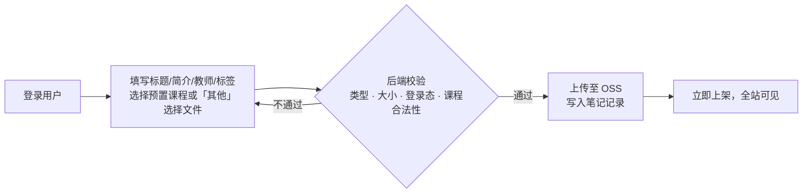
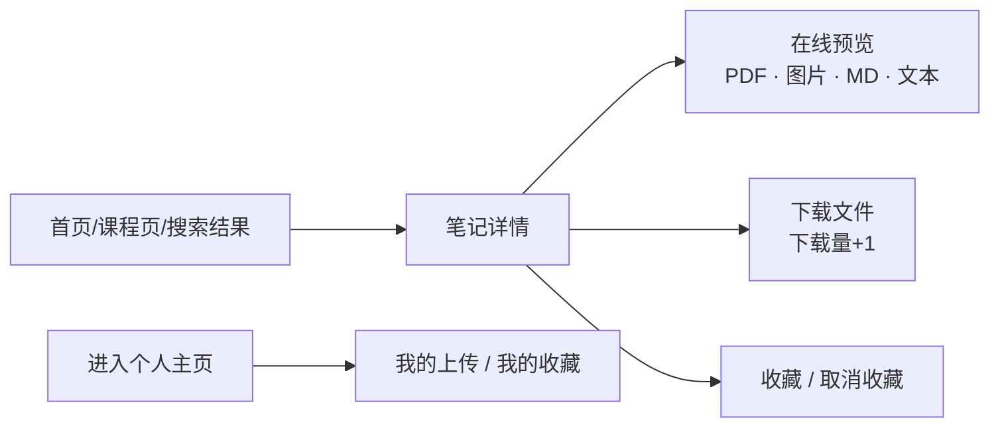
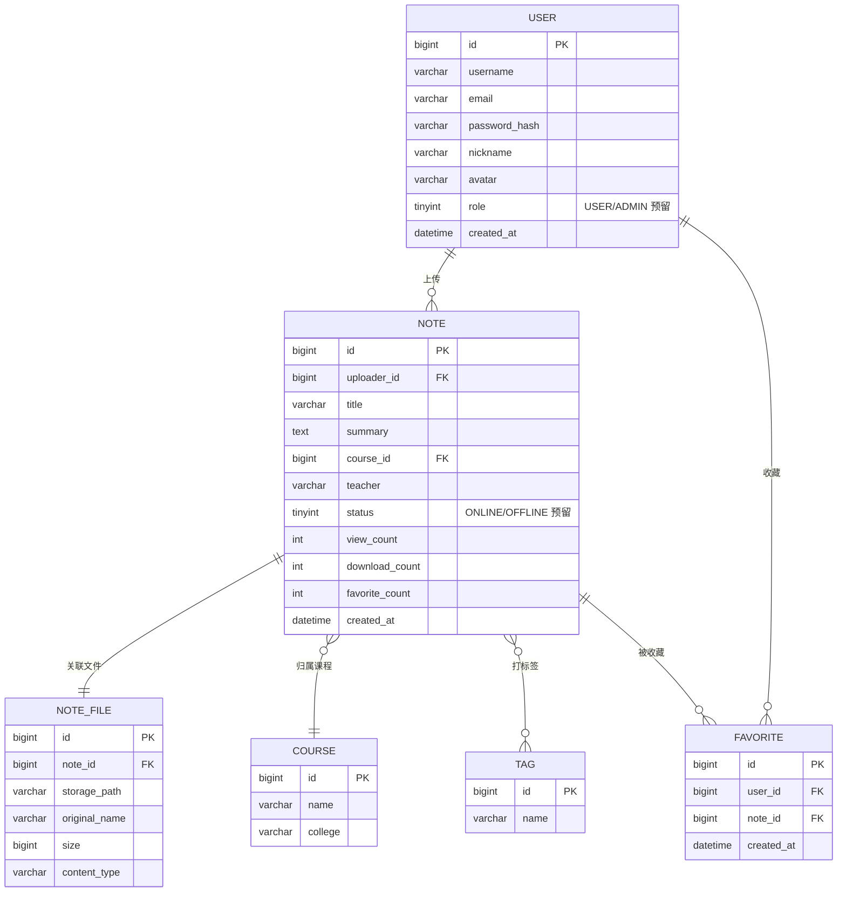
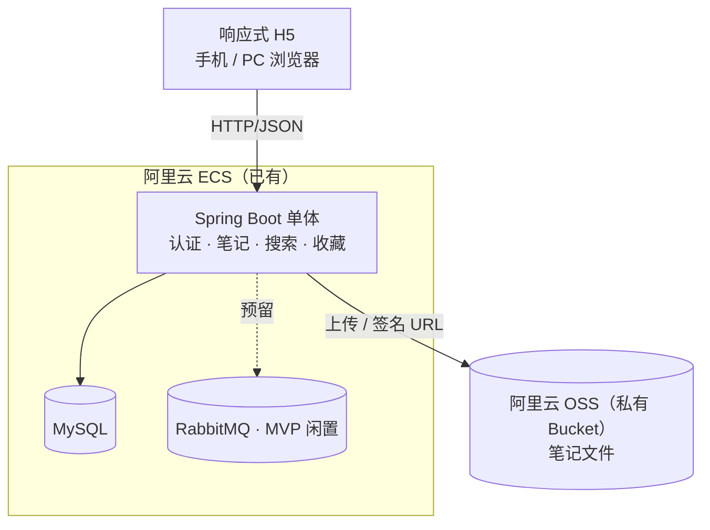

# Jotang Note 笔记托管平台 · 需求分析（MVP）

## 1. 项目背景与目标

- **一句话定位**：面向学生的课程笔记文件托管与分享网站——学生上传笔记，其他人登录后浏览、预览、下载、收藏。
- **解决的问题**：优质笔记散落在群文件/网盘/朋友圈，难以按课程沉淀和检索；考完即丢，后人无法复用。
- **MVP 目标**：
  - 跑通「上传 → 被找到 → 预览/下载 → 收藏」的完整闭环；
  - 支撑数千注册用户、数百日活、数万份以内文件（单机即可承载的量级）；

## 2. 关键决策记录

| 决策点 | 选择 | 备注/代价 |
|---|---|---|
| 产品形态 | 文件托管分享为主 | 不做在线编辑器，开发量可控 |
| 注册方式 | 开放注册 | 无法保证都是本校学生；靠「全部内容需登录」降低公开外泄 |
| 内容审核 | 不设审核与举报，管理员可下架/恢复 | 侵权投诉走邮件、人工下架（见 §8） |
| 游客权限 | 全部内容需登录 | 分享链接也需登录才能看 |
| 前端载体 | 响应式 Web/H5 | 一套页面覆盖手机和 PC 浏览器 |
| 文件限制 | 常见文档类型，单文件 ≤100MB | PDF/Office/图片/MD/压缩包 |
| 课程分类 | 预置课程表，上传时选择或选「其他」 | 课程数据初始化导入，用户不能自建课程 |
| MVP 互动功能 | 仅收藏 + 个人主页 | 评论、评分、积分榜单全部后置 |
| 登录防护 | 做登录限频，不做图形验证码 | 按账号 + IP 限制连续失败次数，防暴力破解（见 §7） |
| 部署资源 | 已有阿里云 ECS，单体部署 | 域名与备案待落实，开发期可先用 IP 访问 |
| 文件存储 | 阿里云 OSS（MVP 即使用，私有 Bucket） | 后端校验后上传，鉴权后用临时签名 URL 预览/下载，见 §7 |

## 3. 用户角色

- **游客**：只能看到登录/注册页，不能浏览任何笔记内容。
- **普通用户（学生）**：上传、浏览、搜索、预览、下载、收藏、维护自己的内容和主页。
- **管理员（你自己）**：拥有笔记下架/恢复权限。MVP 不做管理后台页面，只提供**管理员鉴权的下架/恢复接口**；为方便日常使用，在笔记详情页对管理员显示「下架 / 恢复」按钮（复用现有页面，不单独建后台）。无审核流程、无举报系统。

## 4. 功能范围

### 4.1 MVP 包含

1. **账号**：注册、登录、退出、基本资料（昵称、头像）、密码找回。
2. **上传**：填写标题/简介/教师/标签/课程，上传单文件，提交后立即对所有人可见。
3. **浏览与发现**：
   - 首页：最新上传、热门（按下载/浏览量）；
   - 课程页：按预置课程聚合浏览
   - 标签筛选。
4. **搜索**：按关键词匹配标题、简介、课程名、教师、标签。
5. **笔记详情**：元数据展示、在线预览、下载、收藏、浏览量/下载量计数。
6. **收藏与个人主页**：收藏/取消收藏、我的收藏、我的上传；主页展示昵称、头像、上传数量、累计浏览/下载量。**收藏的笔记被删除或下架时，收藏列表中保留占位（显示「笔记已删除」/「已下架」），不自动解除收藏关系**，占位项不可预览和下载；被恢复上架后自动恢复正常展示。
7. **我的内容管理**：编辑笔记元数据、删除自己的笔记（不支持替换文件，需要改文件就删了重传）。
8. **管理员下架（最小管理能力）**：
   - 页面公布侵权投诉邮箱：`30539981186@qq.com`
   - 管理员鉴权接口：下架、恢复上架；详情页对管理员显示对应按钮，不做后台页面；
   - 下架后：笔记不出现在首页/课程页/搜索结果中；详情页对普通用户（含收藏者）提示「该笔记已下架」，禁止预览、下载、收藏；
   - 上传者本人在「我的上传」中仍可见该笔记并标注「已下架」状态；管理员可随时恢复，恢复后各项计数不变；

### 4.2 MVP 明确不做（V2 候选）

- 评论、评分、点赞、关注/粉丝、私信
- 积分体系、贡献排行榜、消息通知
- 站内举报、审核工作流、运营管理后台（MVP 仅下架接口 + 详情页按钮）
- 课程的增删改管理（MVP 课程表只通过初始化数据/脚本维护）
- 在线富文本/Markdown 编辑器、多人协同
- Office 文件在线预览（MVP 仅支持 PDF/图片/Markdown/文本预览，Office 提示下载查看）
- 微信小程序、校园统一认证对接
- 全文检索引擎（MVP 用 MySQL 模糊查询即可）

## 5. 核心业务流程

### 5.1 上传流程

### 5.2 浏览 / 下载 / 收藏

> 所有节点都要求登录态；预览和下载均走后端鉴权，由后端签发 OSS 临时签名 URL，不暴露对象永久地址。

## 6. 领域模型（初步）

要点：

- 课程（COURSE）为预置数据：上线前用初始化脚本导入学校课程名单（课程名、开课学院），并内置一条固定的「其他」课程；用户上传只能选择已有课程，不能自建。课程数量较多时，选择控件做按名称/学院搜索。
- MVP 一份笔记一个文件，独立出 NOTE_FILE 是为后续「一份笔记多个附件」留余地。
- `status=ONLINE/OFFLINE` 由管理员下架/恢复接口维护，MVP 无任何审核流代码。

## 7. 非功能需求

- **容量假设**：约 2~4 万在校生规模，MVP 按数千注册、日活数百、笔记总量数万份估算；单份均 5~10MB，OSS 存储空间按 200~500GB 规划，ECS 本地不承载笔记文件。
- **性能**：常规列表/搜索接口 P95 < 500ms（数据量小，MySQL 索引 + 分页即可，不引入 ES/缓存）。
- **兼容性**：主流手机浏览器与 PC 浏览器
- **安全**：
  - 密码 bcrypt 存储；登录态用服务端 Session 或 JWT；
  - 上传三重校验：扩展名白名单 + Content-Type + 文件魔数，拒绝伪装文件；
  - 上传文件重命名存储（不保留用户原始文件名作为路径），下载时再还原文件名；
  - 所有内容接口登录鉴权，防越权下载；
  - 防 XSS（简介等文本入库即转义）。
  - 登录限频：同一账号连续登录失败 5 次后锁定 10 分钟（按账号 + IP 双维度计数，内存/Redis 实现均可，技术方案阶段定）；不做图形验证码。
- **存储与备份**：
  - MVP 文件存阿里云 OSS（私有读写 Bucket），上传经后端三重校验后流式写入 OSS，对象键重命名并按日期分目录，不使用用户原始文件名；
  - 预览/下载经后端鉴权后生成 OSS 临时签名 URL，不暴露对象永久地址，下载时通过响应头还原原始文件名；
  - MySQL 每日定时 dump；
  - 存储层封装统一 StorageService 接口，OSS 为首个实现，后续可平替 MinIO 等存储。
- **可维护性**：单体 Spring Boot 分层（controller/service/mapper）；RabbitMQ 已在依赖中，MVP 不使用，预留给 V2 的预览转码、通知等异步任务。

### 7.1 部署形态（目标）

## 8. V2 及以后方向

用Redis根据笔记id查询笔记 -> 把增删改操作放进MQ -> 站内举报 → 评论评分
